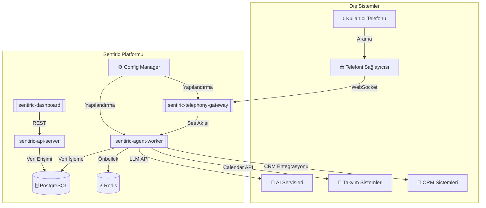
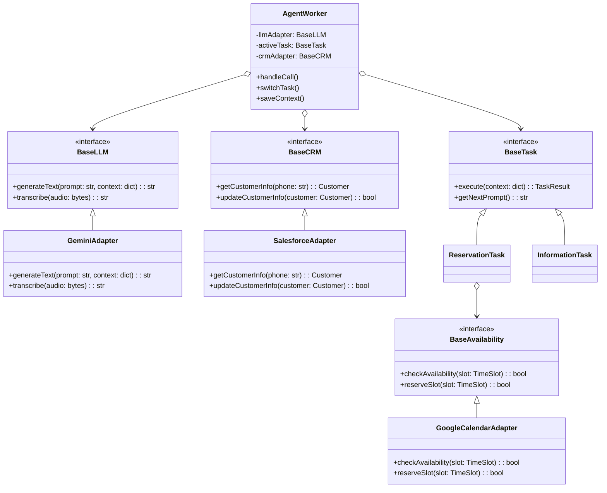
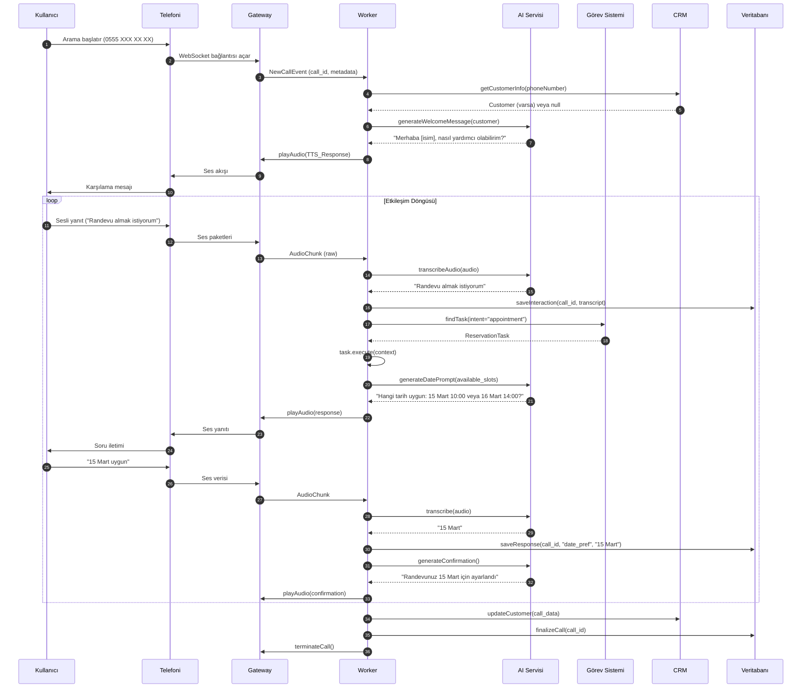

# 🏗️ Sentiric: Kapsamlı Mimari Dokümanı

## 1. Mimari Vizyon ve Temel Prensipler
**"Tak-Çıkar Lego Seti" Felsefesi:**
- Her bileşen belirli bir sorumluluğa odaklanır
- Bileşenler arası iletişim kesinlikle arayüzler üzerinden yapılır
- Yeni adaptörler çalışma zamanında yüklenebilir
- Sistem konfigürasyonla davranış değiştirebilir

## 2. Tam Mimari Şeması (Geliştirilmiş Versiyon)



## 3. Genişletilmiş ve Detaylı Lego Mimarisi



**Anahtar Özellikler:**
1. **Dinamik Adaptör Yönetimi:**
```python
def load_adapter(adapter_type: str, adapter_class: str, config: dict):
    if adapter_type == "LLM":
        self.llm_adapter = import_class(adapter_class)(config)
    elif adapter_type == "CRM":
        self.crm_adapter = import_class(adapter_class)(config)
```

2. **Görev Yaşam Döngüsü:**
   - Görev bulucu (Task Finder) → Görev başlatma → Context yönetimi → Sonlandırma

## 4. Tam Arama Akışı (Detaylı Sequence Diagram)



## 5. Bileşen Detayları ve Sürüm Yönetimi

| Bileşen                  | Sürüm  | Açıklama                          | Bağımlılıklar                 |
|--------------------------|--------|----------------------------------|-------------------------------|
| telephony-gateway        | v2.2.0 | Çoklu protokol desteği            | WebSocket, SIP, RTMP          |
| agent-worker            | v3.1.0 | Akıllı görev orkestrasyonu        | Python 3.10+, Redis           |
| api-server              | v1.5.2 | REST API ve yönetim arayüzü       | FastAPI, JWT Auth             |
| task-framework          | v2.3.0 | Standart görev kütüphanesi        | BaseInterfaces v1.4+          |
| llm-adapters            | v1.2.0 | Çoklu AI sağlayıcı desteği        | Gemini, Whisper, OpenAI       |

## 6. Konfigürasyon Yönetimi (Örnek)

```yaml
# config/production.yaml
telephony:
  active_adapter: "Twilio"
  params:
    account_sid: "ACXXXXXX"
    auth_token: "YYYYYY"

ai:
  primary: 
    adapter: "GeminiPro"
    params:
      api_key: "ZZZZZZ"
      model: "gemini-1.5"
  fallback: "OpenAI"

tasks:
  enabled:
    - "Reservation"
    - "Information"
    - "Complaint"
  
  reservation:
    calendar_adapter: "GoogleCalendar"
    min_advance_hours: 24
```

## 7. Hata Senaryoları ve Kurtarma Mekanizmaları

**Senaryo 1: AI Servis Kesintisi**
1. Worker primary AI'dan 3 saniye yanıt alamazsa
2. Otomatik olarak fallback adaptöre geçer
3. Olayı monitoring sistemine kaydeder
4. Sağlıklı adaptör dönünce otomatik geri geçer

**Senaryo 2: Telefoni Bağlantı Kopması**
1. Gateway 10 saniye içinde yeniden bağlanmaya çalışır
2. Başarısız olursa çağrıyı "failed_calls" tablosuna kaydeder
3. Yöneticiye otomatik bildirim gönderir

## 8. Genişletme Noktaları

**Yeni Adaptör Eklemek İçin:**
1. İlgili base interface'i implemente et
2. Adapter sınıfını oluştur
3. `adapters/` dizinine ekle
4. Config'de aktifleştir

**Örnek Adaptör Kodu:**
```python
class NewLLMAdapter(BaseLLM):
    def __init__(self, config):
        self.api_key = config['api_key']
    
    def generateText(self, prompt, context):
        # Özel implementasyon
        return response
```

Bu doküman, sistemin tüm kritik yönlerini kapsarken, hem geliştiriciler hem de sistem mimarları için kapsamlı bir rehber sunmaktadır.