# Sentiric Temel Akışlar

## 📌 Genel Çağrı Akışı

```mermaid
graph TD
    A[Arama Başlar] --> B{Müşteri Tanındı mı?}
    B -->|Evet| C[Kişiselleştirilmiş Karşılama]
    B -->|Hayır| D[Standart Karşılama]
    C --> E[Niyet Algılama]
    D --> E
    E --> F[Uygun Göreve Yönlendirme]
```


## 🔗 Senaryolara Hızlı Erişim
1. [Randevu Rezervasyonu](./04_SCENARIOS/01_APPOINTMENT_RESERVATION.md)
2. [Ön Rezervasyon](./04_SCENARIOS/02_PRE_RESERVATION.md)
3. [Ödemeli Rezervasyon](./04_SCENARIOS/03_PAID_RESERVATION.md)
```

---