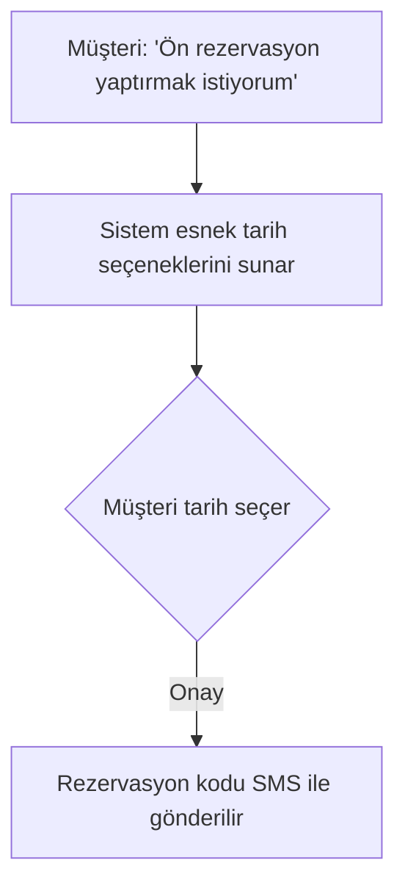

# 📦 Ön Rezervasyon Akışı

## 🎯 Kullanım Senaryosu
- **Kimler Kullanır?**: Yeni müşteriler, Grup rezervasyonları
- **Ön Koşul**: Minimum 24 saat önceden yapılmalı

## 🔄 Adım Adım Akış

## ⚠️ Dikkat Edilecekler
- Kesin tarih 48 saat içinde belirlenmeli
- İptal ücretsiz

---