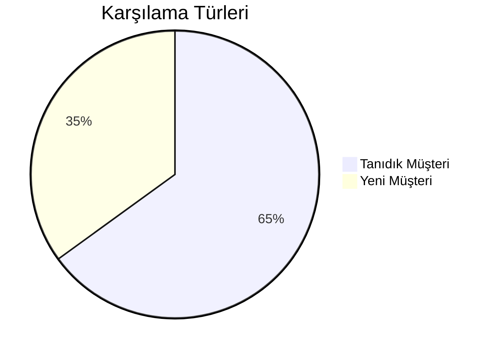

# 🤖 Sentiric: Herkes İçin Basit Sistem Açıklaması

## 🌟 Genel Bakış
*"Telefona cevap veren süper asistan" gibi çalışan yapay zeka destekli çağrı merkezi çözümü*

## 📞 Temel Çalışma Akışı

### 1. Arama Başlangıcı
- Müşteri normal bir telefon numarasını arar
- Sistem aramayı algılar ve hazırlık yapar

### 2. Kişiselleştirilmiş Karşılama

### 3. Akıllı Yönlendirme
- Konuşmayı anında analiz eder
- Doğru departmana bağlar

## 💼 İş Avantajları
| Fayda                | Açıklama                          |
|----------------------|-----------------------------------|
| 7/24 Hizmet          | Gece yarısı bile aynı performans  |
| Tutarlı Deneyim      | Tüm müşterilere standart hizmet   |
| Anlık Raporlama      | Tüm konuşmalar analiz için hazır  |

## 🛠️ Kullanım Senaryoları
1. **Randevu Alma**  
   "Yarın 15:00'e randevu alabilir miyim?" → Sistem otomatik boş yerleri kontrol eder

2. **Bilgi Sorgulama**  
   "Çalışma saatleriniz nedir?" → Hazır bilgiyi sesli paylaşır

3. **Ödeme İşlemleri**  
   SMS ile güvenli ödeme linki gönderir

## 📌 Öne Çıkan Özellikler
- **Tanıdık Müşteri Algılama**: Daha önce arayanları ismiyle karşılar
- **Acil Durum Yönlendirme**: "Acil" dediğinizde doğru birime bağlar
- **Çoklu Dil Desteği**: İngilizce/Türkçe otomatik geçiş

> 💡 Sistem arka planda AI, büyük veri ve bulut teknolojilerini kullanır, ancak kullanıcılar için sadece "konuşan bir asistan" gibi çalışır.