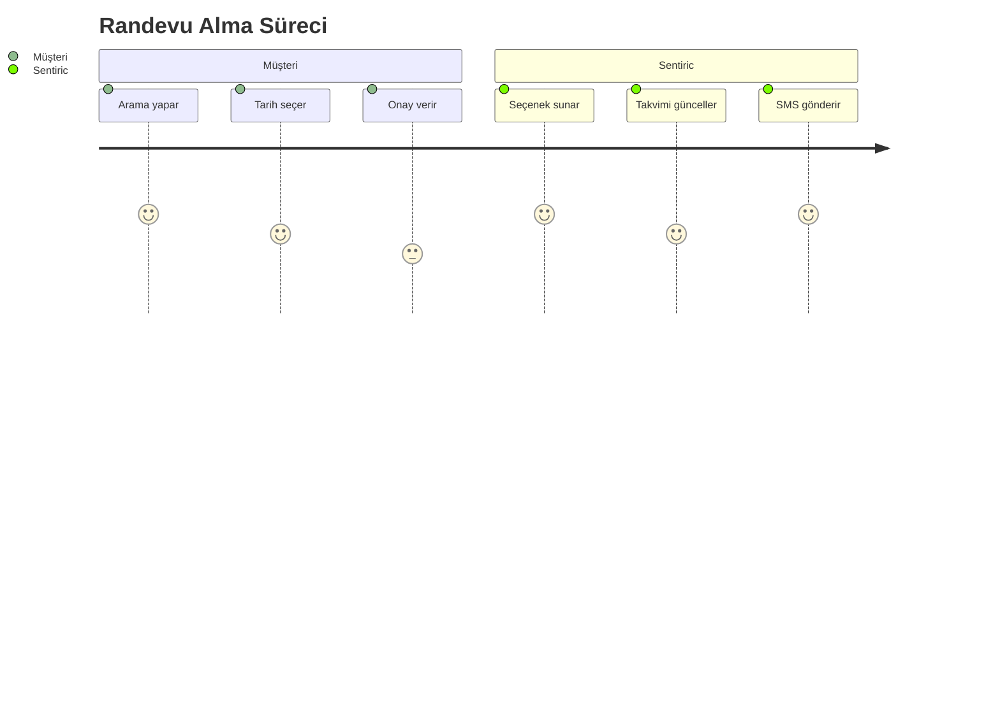

# 🗓️ Randevu Alma Rehberi

## 🔄 Adım Adım Akış

## 💬 Örnek Diyaloglar
**Senaryo 1 - Standart Randevu**  
> Müşteri: "Diş kontrolü için randevu almak istiyorum"  
> Sentiric: "Hangi gün uygun? Yarın 10:00 veya perşembe 14:30 müsait"  
> Müşteri: "Perşembe 14:30 olsun"  
> Sentiric: "Randevunuz kaydedildi. SMS bilgisi gönderdim ✔️"  

**Senaryo 2 - Acil Randevu**  
> Müşteri: "*Acil* diş ağrım var!"  
> Sentiric: "En yakın boş yer bugün 17:15, uygun mu?"  
> Müşteri: "Evet lütfen"  
> Sentiric: "Acil randevunuz oluşturuldu. Doktor sizi bekliyor olacak 🚨"

---