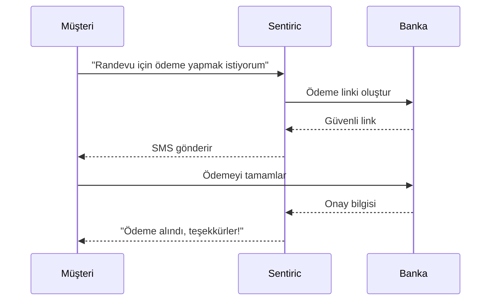

# 💰 Ödeme İşlemleri Rehberi

## 🔄 Temel Akış

```mermaid
sequenceDiagram
    participant Müşteri
    participant Sentiric
    participant Banka
    Müşteri->>Sentiric: "Randevu için ödeme yapmak istiyorum"
    Sentiric->>Banka: Ödeme linki oluştur
    Banka-->>Sentiric: Güvenli link
    Sentiric-->>Müşteri: SMS gönderir
    Müşteri->>Banka: Ödemeyi tamamlar
    Banka-->>Sentiric: Onay bilgisi
    Sentiric-->>Müşteri: "Ödeme alındı, teşekkürler!"
```

## ⚠️ Önemli Noktalar
- **Güvenlik**: Tüm ödemeler şifrelenir
- **İade**: 14 gün içinde iade garantisi
- **Destek**: *0 tuşuyla canlı yardım

---