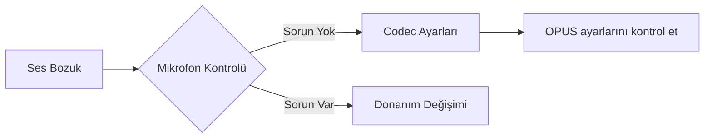
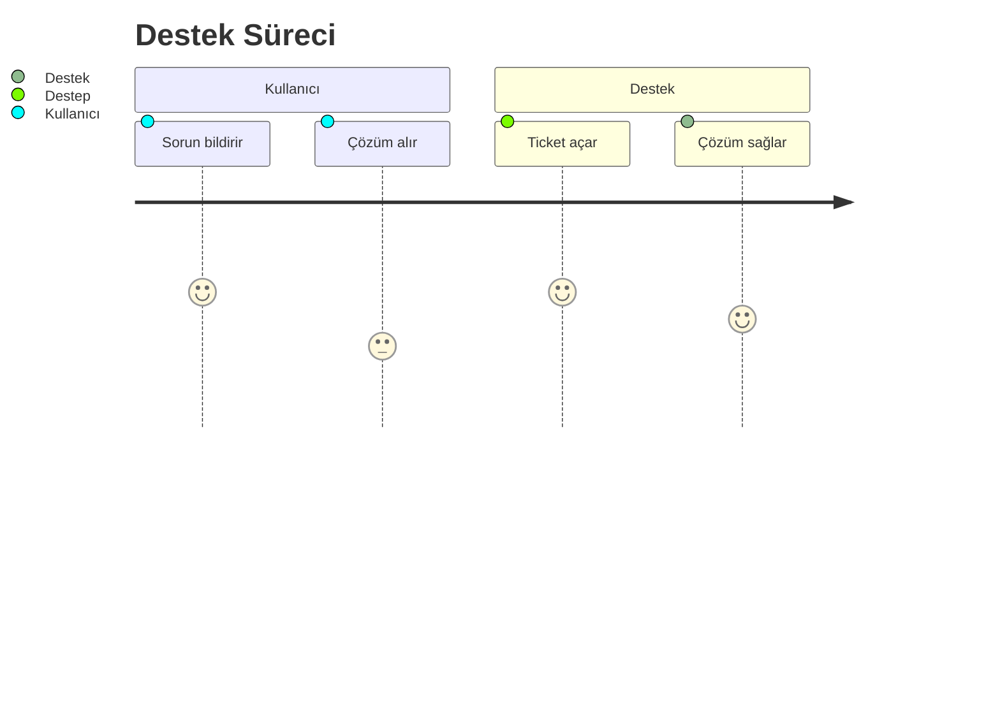

# 🛠️ Sorun Giderme Rehberi

## 🔴 Sık Karşılaşılan Sorunlar

### 1. Ses Kalitesi Problemleri


### 2. AI Yanıt Vermiyor
**Adımlar:**
1. [ ] Çalışan servisleri kontrol et: `docker ps`
2. [ ] API anahtarının geçerli olduğunu doğrula
3. [ ] Fallback adaptörü devreye al

## 🟠 Özel Senaryolar

### Randevu Kaydı Yapılamıyor
**Çözüm:** 
```bash
# Takvim servisi bağlantısını test et
curl -X GET https://calendar-api.sentiric.com/health
```

### Ödeme Alınamıyor
| Hata Kodu | Anlamı                  | Çözüm                     |
|-----------|-------------------------|---------------------------|
| 402       | Kart bilgileri geçersiz | Müşteriden yeni bilgi iste |
| 503       | Ödeme ağ geçidi kapalı  | Fallback ödeme yöntemine geç |

## 🟢 Önleyici Bakım
- **Haftalık Kontroller:**
  - [ ] Ses kayıtlarını test et
  - [ ] Tüm adaptör bağlantılarını doğrula
  - [ ] Yedekleme al

## 📞 Acil Destek


> ℹ️ Tüm sorunlar otomatik olarak `logs/sorunlar/` dizinine kaydedilir


---