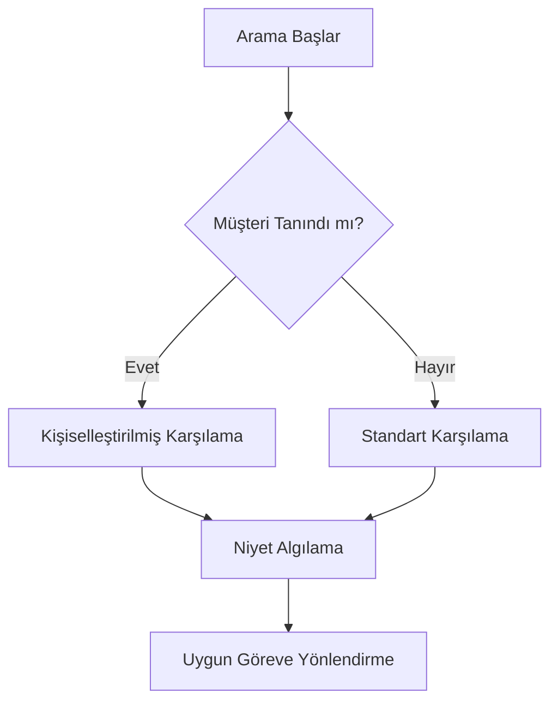

# Sentiric Temel Akışlar

## 📌 Genel Çağrı Akışı


## 🔗 Senaryolara Hızlı Erişim
1. [Randevu Rezervasyonu](./04_SCENARIOS/01_APPOINTMENT_RESERVATION.md)
2. [Ön Rezervasyon](./04_SCENARIOS/02_PRE_RESERVATION.md)
3. [Ödemeli Rezervasyon](./04_SCENARIOS/03_PAID_RESERVATION.md)
```

---