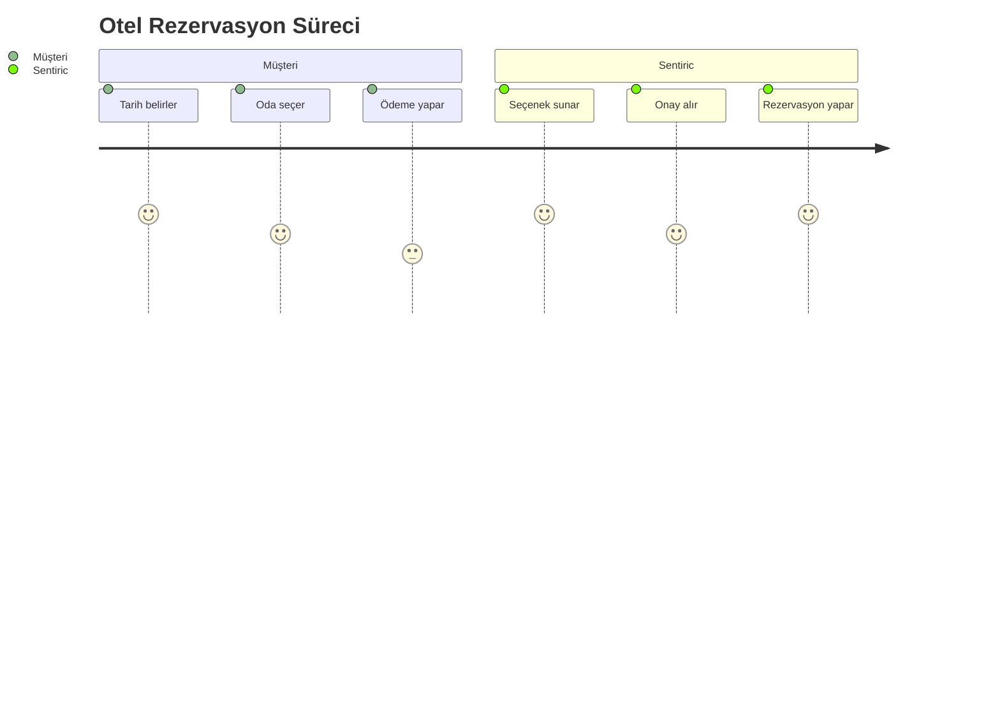
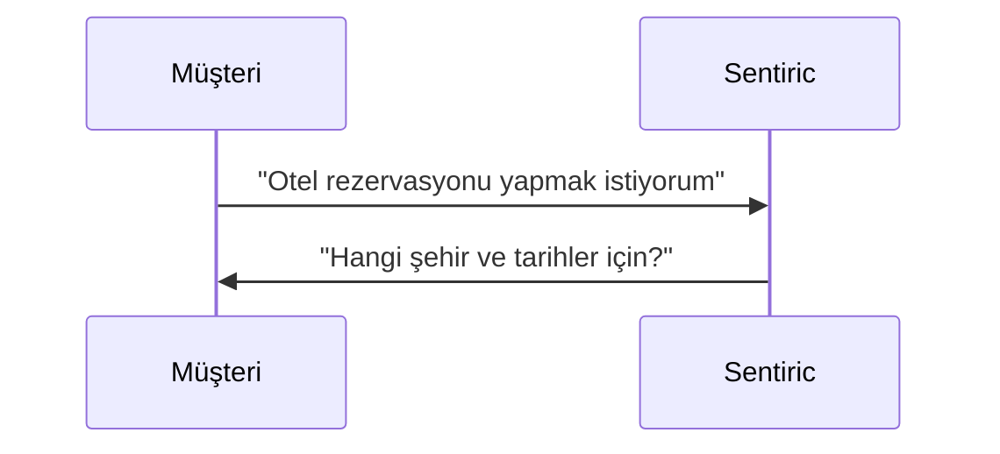
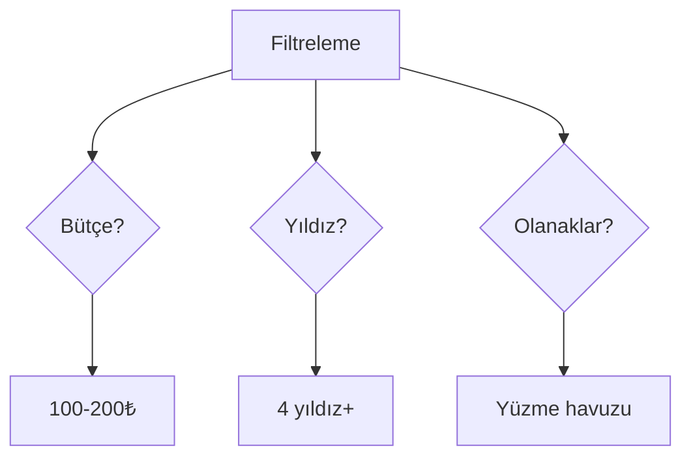
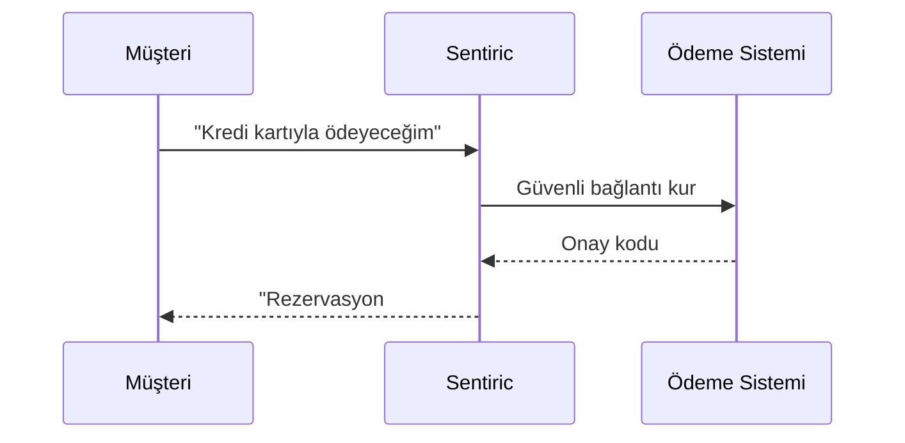
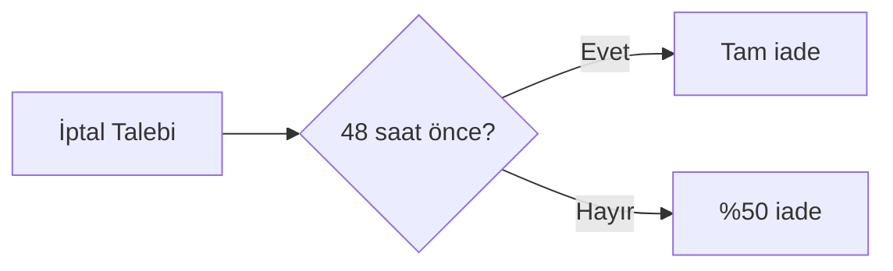
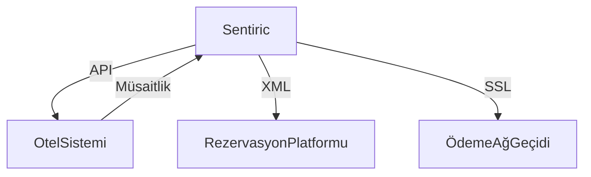
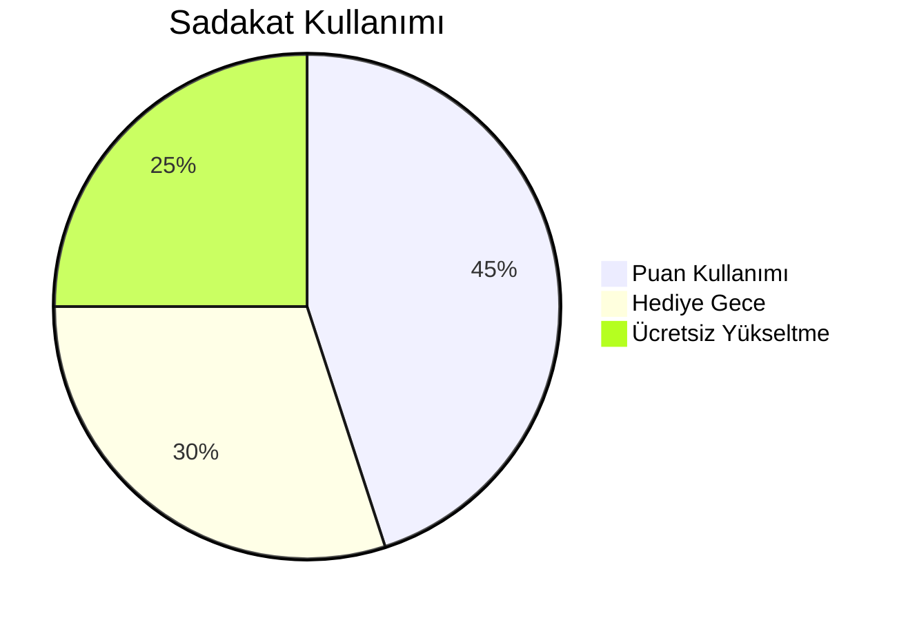

# 🏨 Otel Rezervasyon Kılavuzu

## 🌟 Genel Akış

## 🔄 Adım Adım Tam Akış

### 1. Rezervasyon Başlatma

### 2. Tarih ve Lokasyon Seçimi
> **Örnek Diyalog**:  
> Müşteri: "İstanbul için 15-20 Temmuz"  
> Sentiric: "15-20 Temmuz İstanbul için 42 otel bulundu. *Bütçeniz nedir?*"

### 3. Filtreleme ve Seçim

### 4. Oda ve Konaklama Detayları
| Seçenek          | Açıklama                     |
|------------------|------------------------------|
| Standart Oda     | 2 yetişkin, kahvaltı dahil   |
| Aile Odası       | 2+2, deniz manzarası         |
| Süit Oda         | Jakuzi, özel check-in        |

> **Sistem Yanıtı**:  
> "4 yıldızlı X Otel'de aile odası: 2.500₺/gece. Uygun mu?"

### 5. Ödeme İşlemleri

### 6. Rezervasyon Sonrası
- **Anında**: E-posta/SMS onayı
- **24 Saat Önce**: Hatırlatma mesajı
- **Giriş Günü**: Check-in bilgileri

## 🔧 Özel Senaryolar

### ✏️ Rezervasyon Değişikliği
> Müşteri: "Rezervasyonumu 1 gün uzatmak istiyorum"  
> Sentiric: "18-21 Temmuz olarak güncellendi. Fark: 500₺. Onaylıyor musunuz?"

### ❌ Rezervasyon İptali

### 💰 Ödeme Sorunları
| Sorun               | Çözüm                     |
|---------------------|---------------------------|
| Kart reddedildi      | 3 deneme hakkı + alternatif ödeme |
| Eksik ödeme         | SMS ile tamamlama linki   |
| Çift ödeme          | Otomatik iade süreci      |

## 🌐 Entegrasyon Akışı

## 📞 Örnek Diyaloglar

### Standart Rezervasyon
> **Müşteri**: "Antalya'da 10-15 Ağustos deniz manzaralı otel arıyorum"  
> **Sentiric**: "Mavi Deniz Resort önerilir: 1.750₺/gece, havuz, spa. Detaylar SMS'te 📲"

### Grup Rezervasyonu
> **Müşteri**: "20 kişilik düğün grubu için"  
> **Sentiric**: "Özel fiyat teklifi hazır. Yetkili sizi 10 dk içinde arayacak 👰"

### Son Dakika Rezervasyon
> **Müşteri**: "*Acil* bu gece İstanbul'da oda lazım!"  
> **Sentiric**: "Şişli'de 4 yıldızlı otel: 1.200₺. Hemen rezerve edeyim mi? ⏱️"

## 📌 Önemli Notlar
1. **İptal Politikası**: 48 saat öncesine kadar ücretsiz
2. **Ödeme Seçenekleri**: Kredi kartı/Havale/Dijital cüzdan
3. **Müşteri Desteği**: *0 tuşuyla 7/24 ulaşım
4. **Vize Desteği**: Rezervasyon onayı vize başvurularında kullanılabilir

> 💡 Sistem otomatik olarak en iyi fiyat garantisi sunar. "Daha uygun var mı?" diye sorabilirsiniz!

## 🌟 Ek Özellikler

### 1. Sadakat Programı Entegrasyonu

### 2. Oda Yükseltme Senaryosu
> **Müşteri**: "Daha lüks oda mümkün mü?"  
> **Sentiric**: "Süit odaya 500₺ ek ücretle geçiş yapabilirsiniz. İlginizi çeker mi?"

### 3. Grup İndirimi Hesaplama
| Kişi Sayısı | İndirim Oranı |
|-------------|---------------|
| 5-10        | %10           |
| 10-20       | %15           |
| 20+         | %20 + ücretsiz oda |

Bu kapsamlı rehber:
- Tüm rezervasyon türlerini kapsar
- Özel durumlar için çözüm önerileri sunar
- Gerçek diyalog örnekleri içerir
- Teknik ve teknik olmayan tüm kullanıcılar için uygundur
- Otel işletmecileri için entegrasyon detaylarını gösterir
