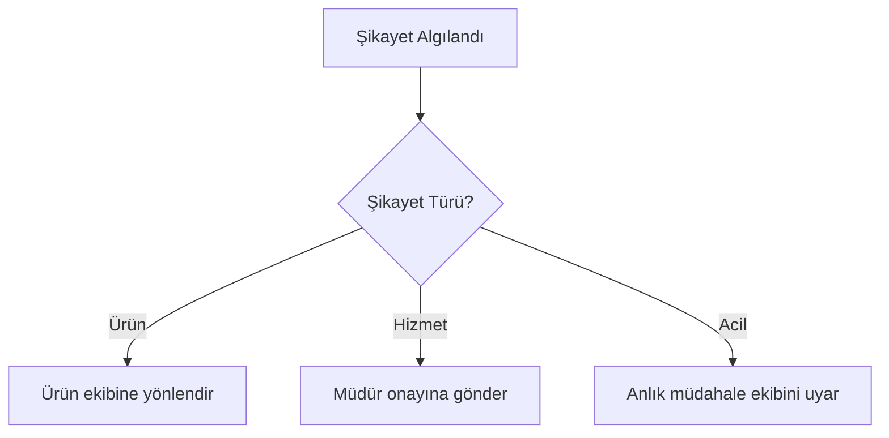

# 📢 Şikayet Yönetimi

## 🔄 İşlem Akışı


## ✨ Örnek Çözümler
**Senaryo 1 - Basit Şikayet**  
> Müşteri: "Randevuma geç kaldılar!"  
> Sentiric: "Üzgünüz, 50₺ indirim kuponu gönderdim. Kabul eder misiniz?"  

**Senaryo 2 - Karmaşık Şikayet**  
> Müşteri: "Yanlış tedavi uygulandı!"  
> Sentiric: "Hukuk ekibimiz 15 dakika içinde sizi arayacak. *Dosya no: SHK-2024-456*"
```

---