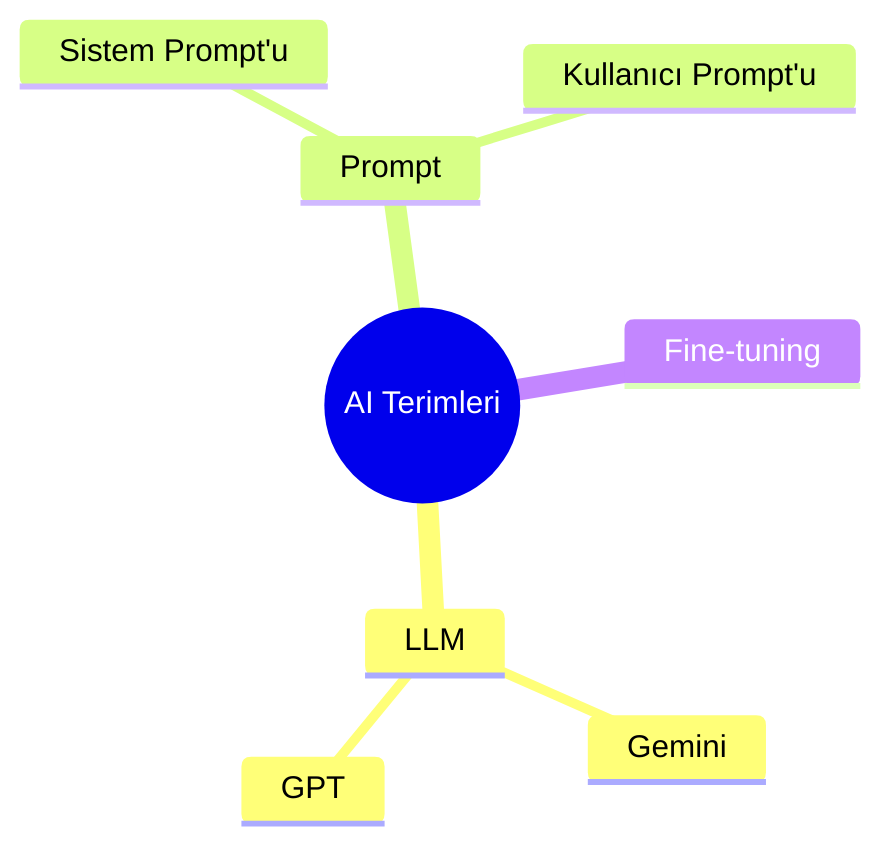

# 📖 Sentiric Terimler Sözlüğü

## 🔍 Temel Kavramlar
| Terim                | Açıklama                                                                 |
|----------------------|--------------------------------------------------------------------------|
| **Niyet Algılama**   | Kullanıcının sözlerinden amacını anlama teknolojisi (Örn: "Randevu almak istiyorum") |
| **STT**              | Konuşmayı Yazıya Dönüştürme (Speech-to-Text)                             |
| **TTS**              | Yazıyı Sese Dönüştürme (Text-to-Speech)                                  |
| **Bağlam Yönetimi**  | Bir çağrı boyunca toplanan tüm bilgilerin saklanması                    |

## 📞 Telefoni Terimleri
| Terim                | Açıklama                                                                 |
|----------------------|--------------------------------------------------------------------------|
| **WebSocket**        | Gerçek zamanlı ses iletimi için kullanılan teknoloji                     |
| **SIP**              | VoIP çağrılarında kullanılan protokol                                    |
| **OPUS Codec**       | Yüksek kaliteli ses sıkıştırma formatı                                   |

## 🤖 AI Terimleri

## 🔧 Sistem Bileşenleri
- **Gateway**: Telefoni sağlayıcılarıyla iletişim kuran yazılım
- **Worker**: Çağrıları yöneten ana akıllı sistem
- **Adaptör**: Farklı sistemleri bağlayan yazılım parçaları

---