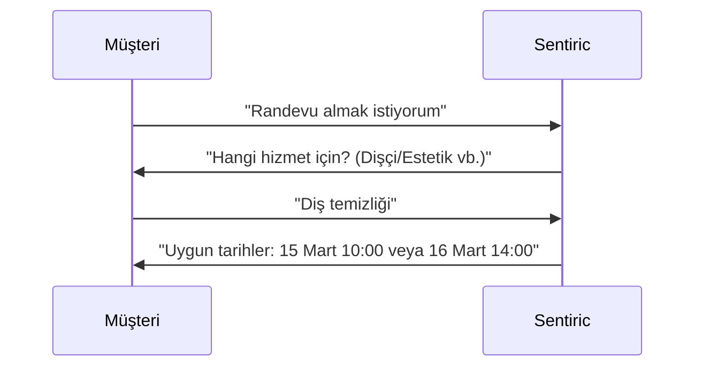

# 📅 Randevu Rezervasyon Akışı

## 🎯 Kullanım Senaryosu
- **Kimler Kullanır?**: Müşteriler, Resepsiyon personeli
- **Ön Koşul**: Müşteri sistemde kayıtlı olmalı

## 🔄 Adım Adım Akış

## 💎 Özel Özellikler
- **Hızlı Komut**: "Yarın öğlen" → Otomatik saat önerisi
- **İptal**: SMS'teki linkle 1 tıkla iptal

---