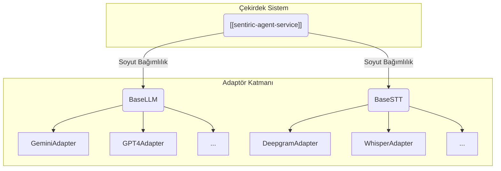
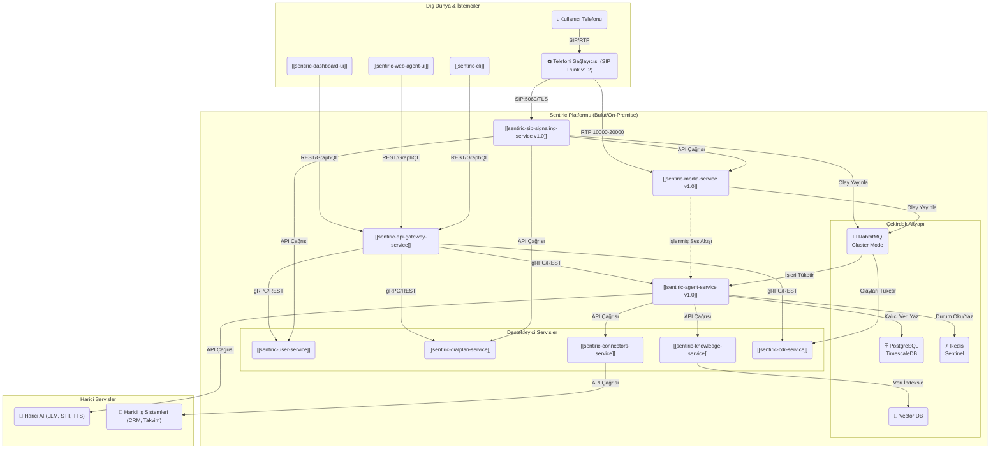
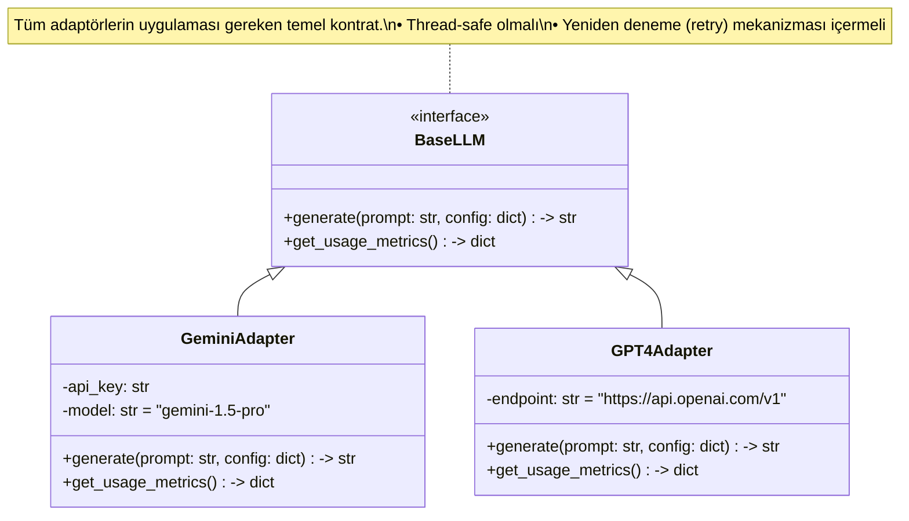
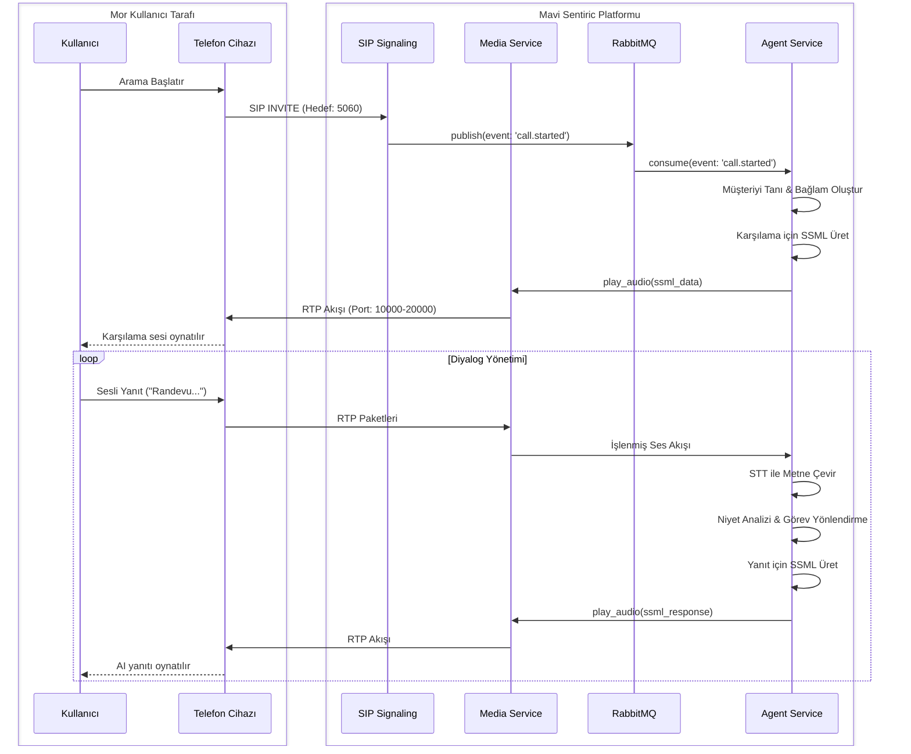
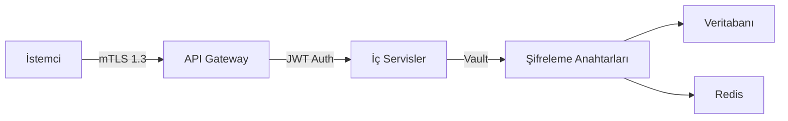

# 🏗️ Sentiric: Kapsamlı Mimari Dokümanı (Anayasa v5.0)

## 1. Mimari Vizyon ve Temel Prensipler

Bu bölüm, Sentiric platformunun temelini oluşturan, değiştirilemez mühendislik ilkelerini tanımlar.

### 1.1. Tak-Çıkar Modüler Mimarisi (Lego Felsefesi)

Platform, belirli bir teknolojiye bağımlı değildir. Her işlev, soyut bir arayüz arkasında çalışan değiştirilebilir bir "Adaptör" ile sisteme bağlanır. Bu, teknoloji bağımsızlığı sağlar.



### 1.2. Asenkron ve Dayanıklı İletişim

Tüm kritik servisler arası iletişim, `RabbitMQ` mesaj kuyruğu üzerinden asenkron olarak gerçekleşir. Bu, sistemin bir bütün olarak dayanıklılığını ve ölçeklenebilirliğini garanti eder.

| Bileşen / Olay Türü  | Örnek Kuyruk Adı       | Hedeflenen TPS | Maks. Gecikme |
|----------------------|------------------------|----------------|---------------|
| SIP Sinyalleşmesi    | `events.call.lifecycle`| 1000+          | < 50ms        |
| Medya Akış Parçaları | `streams.audio.raw`    | 500+           | < 150ms       |
| AI İstekleri         | `requests.ai.priority` | 2000+          | < 100ms       |

### 1.3. İnsan Benzeri Diyalog Sanatı (SSML)

Amacımız, robotik bir sesten ziyade, duyguyu ve tonlamayı yansıtan doğal bir diyalog deneyimi sunmaktır. Bu nedenle LLM'den SSML (Speech Synthesis Markup Language) formatında yanıtlar üretmesini bekleriz.

```python
# Örnek: Duyguya göre SSML üreten bir yardımcı sınıf
class SSMLGenerator:
    def generate_emotional_response(self, text: str, emotion: str = "neutral") -> str:
        """Duygu durumuna göre konuşma hızını ve tonunu ayarlar."""
        prosody = {
            "happy": {'rate': 'fast', 'pitch': 'high'},
            "sad": {'rate': 'slow', 'pitch': 'low'},
            "neutral": {'rate': 'medium', 'pitch': 'medium'}
        }
        selected_prosody = prosody.get(emotion, prosody["neutral"])
        
        return f"""
<speak>
    <prosody rate="{selected_prosody['rate']}" pitch="{selected_prosody['pitch']}">
        {text}
    </prosody>
</speak>
"""
```

## 2. Genel Mimari Şeması (Doğrulanmış v5.0)

Bu şema, bizim **`RabbitMQ` merkezli, 26 repoluk granüler ve asenkron mimarimizi** yansıtmaktadır. Bu yapı, platformun ölçeklenebilirlik ve dayanıklılık hedefleri için esastır.



## 3. Adaptör Mimarisi Sınıf Diyagramı

Bu diyagram, platformun "Tak-Çıkar" felsefesinin kod seviyesindeki yansımasıdır.



## 4. Gelişmiş Çağrı Akışı Sıralı Diyagramı



## 5. Güvenlik, Performans ve Operasyonlar

### 5.1. Güvenlik Mimarisi

Platform, "Derinlemesine Savunma" (Defense in Depth) prensibini benimser.



### 5.2. Performans Optimizasyon Stratejileri

Gecikme (latency), projenin en kritik metriğidir. Aşağıdaki stratejilerle yönetilecektir.

| Senaryo                     | Çözüm Stratejisi                 | Hedeflenen Kazanım |
|-----------------------------|----------------------------------|--------------------|
| Yüksek CPU'lu Medya İşleme  | WebAssembly (Wasm) DSP Filtreleri| %30-40 CPU Azalması|
| STT Gecikmesi (İlk Yanıt)   | Streaming STT & Ön İşlemeli Buffer| 200ms+ İyileşme    |
| LLM Maliyet ve Gecikmesi    | Akıllı Adaptif Model Yönlendirme | %35 Tasarruf       |

### 5.3. Akıllı Ölçeklendirme ve Dayanıklılık

Sistem, KEDA (Kubernetes Event-driven Autoscaling) gibi araçlarla kuyruk uzunluğuna ve CPU kullanımına göre otonom olarak ölçeklenecektir.

```python
# KEDA'ya ilham verecek otonom ölçeklendirme mantığı (Teorik)
async def auto_scale_logic():
    while True:
        # Prometheus'tan metrikleri al
        cpu_load = get_metric("cpu.agent_service.avg")
        queue_depth = get_metric("rabbitmq.requests_ai_priority.depth")
        
        if cpu_load > 0.8 and queue_depth > 1000:
            # Agent Service pod sayısını artır
            scale_up("agent-service", count=2)
        elif cpu_load < 0.3 and queue_depth < 50:
            # Agent Service pod sayısını azalt
            scale_down("agent-service", count=1)
        
        await asyncio.sleep(60)
```

### 5.4. Gelişmiş Hata Ayıklama (Debugging)

Üretim ortamındaki sorunları çözmek için, çağrı bazında dinamik olarak etkinleştirilebilen hata ayıklama özellikleri olacaktır.

```yaml
# Örnek: Belirli bir çağrı için debug yapılandırması (Redis'te tutulur)
# call_id: CA123456789
features:
  call_recording: true
  realtime_logs: 
    enabled: true
    level: DEBUG
  trace_injection:
    enabled: true
    sample_rate: 1.0 # Bu çağrıyı kesinlikle izle
```

## 6. Sonuç ve Doküman Yönetimi

Bu doküman, Sentiric platformunun yaşayan anayasasıdır ve **v5.0** olarak kabul edilmiştir. Tüm geliştirme faaliyetleri bu belgeye referansla yapılmalıdır. Bu belge, projenin `sentiric-governance` reposunda `docs/blueprint/Architecture-Overview.md` olarak yer alacaktır.
