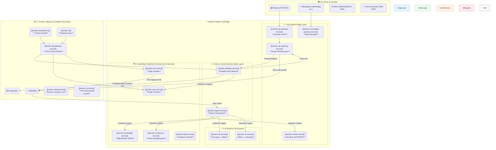

# 🏛️ Sentiric: Platform Anayasası ve Bütünleşik Ekosistem Mimarisi (v9.0 "Genesis")

**Belge Sürümü:** 3.0
**Son Güncelleme:** 28 Temmuz 2025
**Durum:** **AKTİF VE BAĞLAYICI**

## **İçindekiler**

1.  [Yönetici Özeti: "İletişim İşletim Sistemi" Vizyonu](#1-yönetici-özeti-iletişim-işletim-sistemi-vizyonu)
2.  ["Genesis Bloğu" Mimarisi: Temel Felsefemiz](#2-genesis-bloğu-mimarisi-temel-felsefemiz)
3.  [Ekosistemin Bütünleşik Mimarisi (26 Repo)](<#3-ekosistemin-bütünleşik-mimarisi-26-repo>)
4.  [Servislerin Nihai Rolleri ve Etki Analizi](#4-servislerin-nihai-rolleri-ve-etki-analizi)
5.  [Uçtan Uca Senaryo: "Misafir Arayan" Yaşam Döngüsü](#5-uçtan-uca-senaryo-misafir-arayan-yaşam-döngüsü)
6.  [Teknik Derinlik: Güvenlik, Performans ve Veri Tutarlılığı](#6-teknik-derinlik-güvenlik-performans-ve-veri-tutarlılığı)

---

### 1. Yönetici Özeti: "İletişim İşletim Sistemi" Vizyonu

Sentiric, bir ürün değil, bir **ekosistemdir**. Geleneksel PBX sistemlerinin kararlılığını, modern VoIP'nin esnekliğini, yapay zekanın anlama ve konuşma yeteneğini ve iş akışı otomasyon platformlarının gücünü tek bir çatı altında birleştiren, **yeni nesil bir İletişim İşletim Sistemi (Communication OS)** inşa ediyoruz.

**Misyonumuz:** Her türlü insan-makine etkileşimini (ses, metin, video) akıllı, otomatize edilebilir ve geliştiriciler tarafından sonsuz şekilde genişletilebilir bir platforma dönüştürmek.

**Temel Değer Önerimiz:** Müşterilerimize "kiralık" bir çözüm sunmak yerine, onlara kendi iletişim geleceklerinin **tapusunu** veriyoruz. Platform, hem bulutta bir hizmet (SaaS) olarak hem de müşterinin kendi sunucularında (On-Premise) çalışarak mutlak veri egemenliği ve esneklik sağlar.

---

### 2. "Genesis Bloğu" Mimarisi: Temel Felsefemiz

Platformumuzun kalbinde, tüm kararları koddan ayıran ve her şeyi dinamik, veritabanı tabanlı kurallarla yöneten dört temel prensip yatar:

1.  **Sıfır Hard-Code:** Hiçbir telefon numarası, anons metni veya iş kuralı kodun içinde yer almaz. Her şey bir UI aracılığıyla yönetilebilir.
2.  **Tek Sorumluluk Prensibi:** Her mikroservis sadece tek bir işi mükemmel bir şekilde yapar. `sip-signaling` sadece sinyali taşır, `dialplan-service` sadece karar verir, `agent-service` sadece uygular.
3.  **Kendi Kendini Başlatma (Self-Bootstrapping):** Sistem, boş bir veritabanıyla bile, çalışması için gereken temel "sistem" ve "misafir" kurallarını otomatik olarak oluşturur. Tak ve çalıştır.
4.  **Genişletilebilirlik:** Yeni bir iletişim kanalı (WhatsApp) veya yeni bir iş akışı eklemek, kodun çekirdeğini değiştirmeyi değil, veritabanına yeni "eylem" (action) ve "yönlendirme" (route) kuralları eklemeyi gerektirir.

---

### 3. Ekosistemin Bütünleşik Mimarisi (26 Repo)

---

### 4. Servislerin Nihai Rolleri ve Etki Analizi

"Genesis Bloğu" mimarisiyle bazı servislerin rolleri daha da netleşti ve güçlendi:

| Repo Adı | **Nihai Rolü** | Stratejik Gerekçe |
| :--- | :--- | :--- |
| **`dialplan-service`** | **Stratejik Karar Merkezi.** "Bu çağrıya ne yapılmalı?" sorusunun tek yetkili cevabını verir. | İş mantığını tek bir yerde toplamak, diğer servisleri basitleştirmek. |
| **`sip-signaling-service`**| **Yüksek Hızlı Postacı.** Sadece gelen isteği `dialplan-service`'e sorar ve gelen cevabı `agent-service`'e iletir. | Performansı maksimize etmek ve sorumluluğu azaltmak. |
| **`agent-service`** | **Dinamik Eylem Orkestratörü.** `dialplan-service`'ten gelen komutları (`PLAY_ANNOUNCEMENT` vb.) harfiyen uygular. | Platformu kod değişikliği olmadan, UI üzerinden yönetilebilir kılmak. |
| **`user-service`** | **Kimlik ve Varlık Yönetimi.** Sadece kullanıcılar, agent'lar, yöneticiler gibi varlıkların CRUD operasyonlarından sorumlu. | Tek Sorumluluk Prensibi. |

Diğer 22 reponun rolleri, `Ecosystem-Repos.md` belgesinde tanımlandığı gibi geçerliliğini korumaktadır.

---

### 5. Uçtan Uca Senaryo: "Misafir Arayan" Yaşam Döngüsü

Bu yeni mimarinin gücünü en iyi anlatan senaryo:

1.  **İlk Temas:** Sistemin hiç tanımadığı bir numara, platforma ait bir numarayı arar.
2.  **Karar:** `sip-signaling`, bu bilgiyi `dialplan-service`'e sorar. `dialplan-service`, arayan numarayı veritabanında bulamaz ve **`DP_GUEST_ENTRY`** (Misafir Giriş Planı) planını geri döner.
3.  **Eylem:** `agent-service` bu planı alır. `PROCESS_GUEST_CALL` eylemini görür.
4.  **Orkestrasyon:**
    *   Misafir karşılama anonsunu çalar.
    *   `user-service`'i çağırarak bu yeni numarayı veritabanına "misafir" olarak kaydeder.
    *   Varsayılan AI konuşma akışını başlatır.
5.  **Sonuç:** Çağrı bittiğinde, bu "misafir" artık sistem için tanınan bir kullanıcıdır. Bir sonraki aramasında, `dialplan-service` onu tanıyacak ve kiracıya özel karşılama planını uygulayacaktır. Sistem, **kendi kendine öğrenmiş ve büyümüştür.**

---

### 6. Teknik Derinlik: Güvenlik, Performans ve Veri Tutarlılığı

Bu mimari, en başından itibaren kurumsal düzeyde gereksinimleri karşılamak üzere tasarlanmıştır:

*   **Güvenlik:**
    *   **Uçtan Uca Şifreleme:** `media-service`, SRTP/ZRTP protokollerini destekleyerek sesli iletişimin gizliliğini garanti altına alacaktır.
    *   **AI Güvenliği:** STT/TTS servisleri, ses deepfake'leri gibi `adversarial` saldırılara karşı, ses filigranı (audio watermarking) gibi tekniklerle güçlendirilecektir.
*   **Performans:**
    *   **Gerçek Zamanlı AI:** `agent-service` ile AI motorları (STT/TTS/LLM) arasındaki tüm iletişim, gecikmeyi minimize etmek için **streaming (akış) API'leri** üzerine kurulacaktır. Kullanıcı konuşurken transkripsiyon başlayacak, LLM yanıt üretmeye başlar başlamaz TTS sesi sentezlemeye başlayacaktır.
*   **Veri Tutarlılığı:**
    *   **Dağıtık İşlemler:** Birden fazla servisi ilgilendiren karmaşık iş akışları (örn: ödeme al ve rezervasyon yap), veri tutarlılığını garanti altına almak için gelecekte **SAGA pattern**'i ile yönetilecektir.

Bu anayasa, Sentiric platformunun bugünkü inşa sürecine rehberlik eden ve yarının zorluklarına hazır olmasını sağlayan yaşayan bir belgedir.
