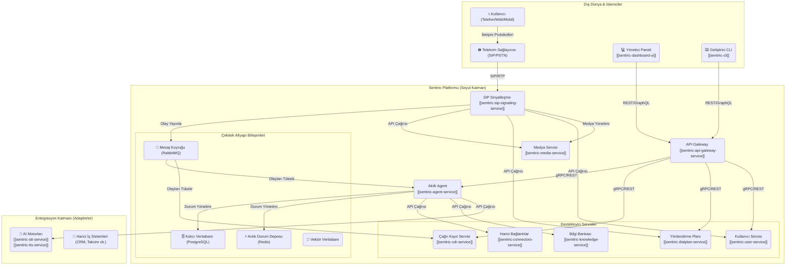
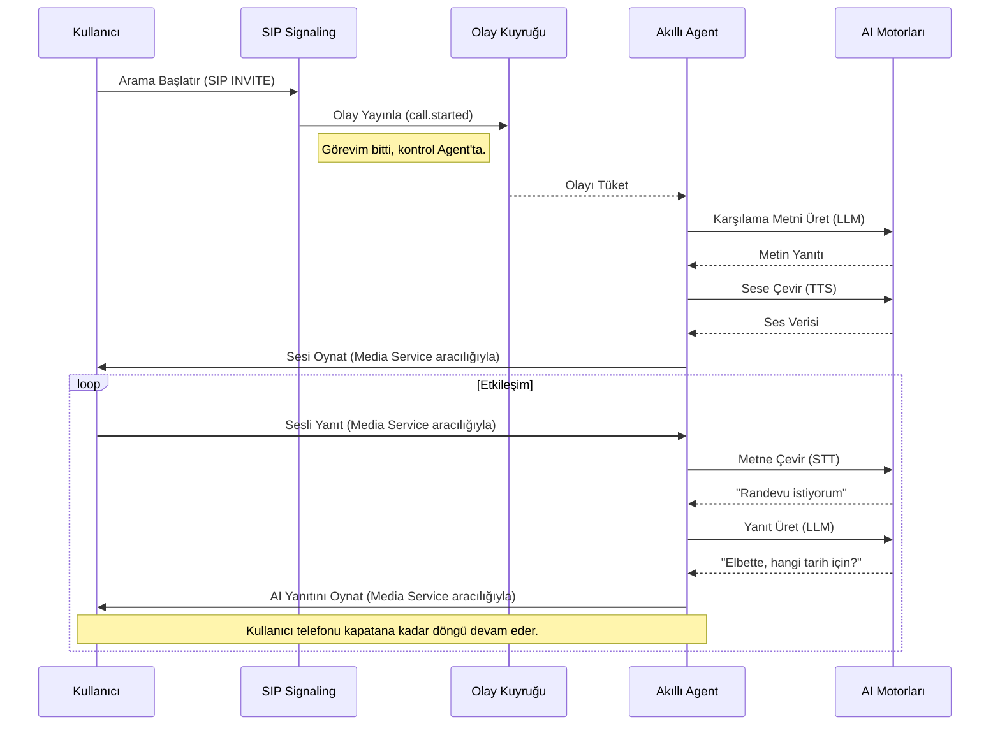

# 🏗️ Sentiric: Kapsamlı Teknik Mimari Dokümanı (Anayasa v8.1)

## 1. Yönetici Özeti (Executive Summary)

Bu doküman, Sentiric platformunun, üzerinde çalıştığı altyapıdan veya uygulanan iş modelinden bağımsız, **evrensel ve değişmez teknik mimarisini** tanımlar. Platform, "Tak-Çıkar Lego Seti" felsefesini temel alan, asenkron, dayanıklı ve modüler bir mikroservis ekosistemidir. Temel amaç, her türlü iletişim protokolünü ve yapay zeka motorunu entegre edebilen, esnek ve ölçeklenebilir bir "Konuşan İşlem Platformu" (Conversational Workflow Platform) için sağlam bir mavi kopya (blueprint) sunmaktır.

Bu anayasa, projenin teknik "NEDEN"ini ve "NASIL"ını tanımlar.

---

## 2. Mimari Prensipleri: Platformun DNA'sı

Platformumuzun tüm mühendislik kararlarına yön veren dört temel prensip vardır:

1.  **Soyutlama ve Bağımsızlık (Lego Felsefesi):** Her kritik işlev (örn: LLM, STT, Telekom) soyut bir arayüz (`BaseLLM`, `BaseTelephony`) arkasında çalışır. Bu, belirli bir teknolojiye (örn: Google Gemini) veya sağlayıcıya (örn: Telkotürk) olan bağımlılığı ortadan kaldırır. Bir teknolojiyi değiştirmek, sadece yeni bir "adaptör" takmaktır.
2.  **Asenkron Olay Yönelimli İletişim:** Servisler arasındaki kritik ve anlık yanıt gerektirmeyen iletişim, `RabbitMQ` gibi bir mesaj kuyruğu üzerinden olay (event) bazlı olarak gerçekleşir. Bu, sistemin bileşenlerinin çökmesine karşı dayanıklılığını (resilience) ve ölçeklenebilirliğini garanti eder.
3.  **Sorumlulukların Net Ayrımı (Single Responsibility):** Her mikroservis (`sentiric-user-service`, `sentiric-media-service` vb.) sadece tek bir işi, en iyi şekilde yapmakla sorumludur. Bu, geliştirmeyi, testi ve bakımı basitleştirir.
4.  **Durum Yönetimi Ayrımı:** Çağrıların anlık durumu (session data) gibi geçici ve yüksek hız gerektiren veriler `Redis`'te tutulurken, kullanıcı bilgileri ve çağrı kayıtları gibi kalıcı veriler `PostgreSQL`'de saklanır.

---

## 3. Evrensel Sistem Mimarisi: Tam Potansiyel

Bu şema, Sentiric platformunun **tüm 26 ekosistem reposunun hayata geçirildiği, ideal ve tam kapsamlı yapıyı** gösterir. Bu, ulaşmaya çalıştığımız nihai hedeftir.

---

## 4. Kritik İş Akışları

### 4.1. Bir Telefon Çağrısının Anatomisi (Yazılı Akış)

1.  **Giriş (Ingress):** Telekom sağlayıcısı, bir `INVITE` isteğini `sentiric-sip-signaling-service`'e gönderir.
2.  **Orkestrasyon (Senkron):** `sip-signaling` servisi, anında yanıt alması gereken işlemleri gerçekleştirir:
    *   `sentiric-user-service`'e API çağrısı ile kullanıcıyı doğrular.
    *   `sentiric-dialplan-service`'e API çağrısı ile yönlendirme planını alır.
    *   `sentiric-media-service`'e API çağrısı ile medya (RTP) oturumu açar.
3.  **Olay Tetikleme (Asenkron):** Çağrı başarıyla kurulduğunda, `sip-signaling` bir `call.started` olayını `RabbitMQ`'ya yayınlar ve kendi anlık görevini tamamlar.
4.  **Diyalog Yönetimi (Asenkron):** `sentiric-agent-service`, bu olayı `RabbitMQ`'dan tüketir ve çağrının "beyni" olarak kontrolü devralır. Kullanıcıyla olan tüm diyalog döngüsünü (STT -> LLM -> TTS) yönetir.
5.  **Veri Toplama (Asenkron):** `sentiric-cdr-service` de `RabbitMQ`'daki `call.started` ve `call.ended` gibi olayları dinleyerek, arka planda çağrı detay kaydını oluşturur ve `PostgreSQL`'e yazar.

### 4.2. Tam Diyalog Döngüsü (Sekans Diyagramı)

---

## 5. Uygulama ve Dağıtım Modelleri

Bu evrensel mimari anayasası, farklı operasyonel, ticari ve güvenlik ihtiyaçlarına göre çeşitli somut şekillerde hayata geçirilebilir. Her model, aynı temel mimari prensiplerini farklı bir altyapı üzerinde uygular.

Platformun temel dağıtım senaryoları ve uygulama detayları için lütfen aşağıdaki özel dokümana başvurun:

**➡️ [Dağıtım Modelleri ve Uygulama Senaryoları](../operations/Deployment-Models.md)**

## 6. Referans Dokümanlar

Bu anayasa, projenin en üst düzey teknik belgesidir. Daha detaylı bilgi için aşağıdaki belgelere başvurulmalıdır:

*   **Servislerin Birbiriyle Nasıl Konuştuğu:** `docs/engineering/Service-Communication-Architecture.md`
*   **İş Modeli ve Ürün Paketleri:** `docs/product/Business-Model.md`
*   **Uygulama Geliştirme Yol Haritası:** `docs/blueprint/Build-Strategy.md`
*   **Repo ve Sorumluluk Listesi:** `docs/blueprint/Ecosystem-Repos.md`
