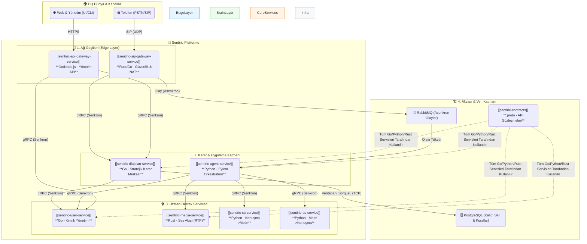

# 🏛️ Sentiric Anayasası (v10.0 - Nihai Sürüm)

**Belge Durumu:** **AKTİF VE BAĞLAYICI**
**Son Güncelleme:** [Bugünün Tarihi]

**Önsöz:** Bu doküman, Sentiric platformunun vizyonunu, felsefesini, mimarisini ve yol haritasını tanımlayan **tek ve nihai referans kaynağıdır.** Önceki tüm mimari ve vizyon belgelerinin en iyi yönlerini birleştirir ve onların yerini alır.

## **BÖLÜM 1: VİZYON VE FELSEFE**

### **1.1. Vizyon: "İletişim İşletim Sistemi" (Communication OS)**

Sentiric, bir ürün değil, bir **ekosistemdir**. Geleneksel PBX'lerin kararlılığını, modern VoIP'nin esnekliğini, yapay zekanın anlama yeteneğini ve iş akışı otomasyonunun gücünü birleştiren, **yeni nesil bir İletişim İşletim Sistemi** inşa ediyoruz.

**Misyonumuz:** Her türlü insan-makine etkileşimini, geliştiriciler tarafından sonsuz şekilde genişletilebilir, akıllı ve otomatize edilebilir bir platforma dönüştürmek.

### **1.2. Değer Önerisi: Dijital Egemenlik**

Müşterilerimize "kiralık" bir çözüm sunmak yerine, onlara iletişim geleceklerinin **tapusunu** veriyoruz. Platform, hem bulut (SaaS) hem de müşteri sunucularında (On-Premise) çalışarak mutlak veri egemenliği ve esneklik sağlar.

### **1.3. Temel Felsefelerimiz**

1.  **"Tak-Çıkar Lego Seti":** Platform, belirli bir teknolojiye (örn: Google Gemini) bağımlı değildir. Her dış servis, soyut bir arayüzün arkasında çalışan değiştirilebilir bir **"Adaptör"** aracılığıyla sisteme bağlanır.
2.  **"Genesis Bloğu":** Platform, tüm iş mantığını ve kurallarını koddan ayırır.
    *   **Sıfır Hard-Code:** Hiçbir yönlendirme kuralı veya anons metni kodda yer almaz; her şey veritabanından dinamik olarak yönetilir.
    *   **Tek Sorumluluk:** Her mikroservis sadece tek bir işi mükemmel yapar.
    *   **Self-Bootstrapping:** Sistem, boş bir veritabanıyla bile, çalışması için gereken temel kuralları otomatik olarak oluşturur (`init.sql`).

## **BÖLÜM 2: MİMARİ VE TEKNOLOJİ**

### **2.1. Bütünleşik Ekosistem Mimarisi**

Bu şema, platformun bütünleşik yapısını, servislerin rollerini ve iletişim protokollerini gösterir.

### **2.2. Teknoloji Yığını ve Gerekçeleri**

*   **Rust (`sip-gateway`, `media-service`):** Maksimum performans, bellek güvenliği ve düşük seviye ağ kontrolü gerektiren, dış dünyaya en yakın servisler için.
*   **Go (`dialplan-service`, `user-service`):** Hızlı, basit, yüksek eşzamanlılık gerektiren ve veritabanı ile yoğun iletişim kuran gRPC tabanlı uzman servisler için.
*   **Python (`agent-service`, `stt/tts`):** Zengin AI/ML ekosistemi, hızlı prototipleme ve karmaşık iş mantığının uygulanması için ideal olan, platformun beyni için.

### **2.3. Uçtan Uca Çağrı Akışı (Genesis Senaryosu)**

1.  **Giriş:** Bir `INVITE` paketi `sip-gateway`'e ulaşır.
2.  **Senkron Karar:** `sip-gateway`, `dialplan-service`'i **gRPC** ile çağırır. `dialplan-service` de `user-service`'i çağırır, veritabanını sorgular ve nihai kararı (`DP_GUEST_ENTRY` vb.) `sip-gateway`'e geri döner.
3.  **Asenkron Devir:** `sip-gateway`, bu karar ve çağrı bilgileriyle birlikte bir `call.started` olayını **RabbitMQ**'ya atar.
4.  **Uygulama:** `agent-service`, bu olayı tüketir, kararı okur (`PROCESS_GUEST_CALL`) ve ilgili uzman servisleri (`user-service`, `media-service`) **gRPC** ile çağırarak eylemi hayata geçirir.

## **BÖLÜM 3: YOL HARİTASI VE GELECEK VİZYONU**

### **3.1. Mevcut Odak (Faz 1): "Konuşan Ürün"**

*   **Hedef:** Mevcut, çalışan iskeleti, gerçek bir AI diyalog döngüsü ile "konuşan" bir ürüne dönüştürmek.
*   **Adımlar:** `agent-service`'e STT/LLM/TTS entegrasyonlarını ekleyerek tam diyalog döngüsünü tamamlamak.

### **3.2. Orta Vade (Faz 2): "Platformlaşma"**

*   **Hedef:** Geliştiricilerin ve yöneticilerin platformu "low-code" (az kodlu) bir şekilde yönetmesini ve genişletmesini sağlamak.
*   **Potansiyel Özellikler:**
    *   `dashboard-ui` üzerinden sürükle-bırak ile `dialplan` oluşturma.
    *   `connectors-service` ile harici CRM/Takvim entegrasyonları.

### **3.3. Uzun Vade (Faz 3): "Zeka ve Optimizasyon"**

*   **Hedef:** Platformun verimliliğini, zekasını ve maliyet etkinliğini en üst düzeye çıkarmak.
*   **Potansiyel Özellikler:**
    *   **Akıllı AI Orkestratör:** `agent-service`'in, gelen görevin türüne göre en uygun (hızlı/ucuz/güçlü) LLM'i dinamik olarak seçmesi.
    *   **Gelişmiş RAG:** `knowledge-service` ile daha karmaşık bilgi bankası yönetimi.
    *   **Veri Bütünlüğü:** Karmaşık iş akışları için **SAGA pattern**'inin uygulanması.
