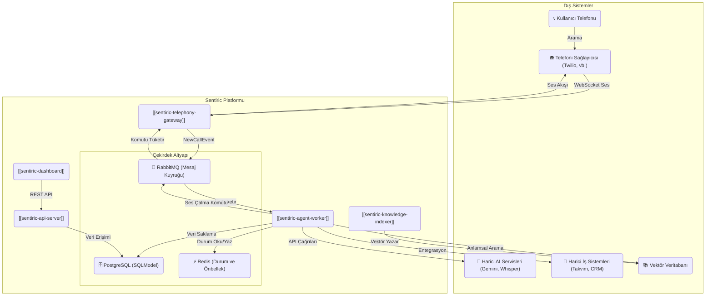
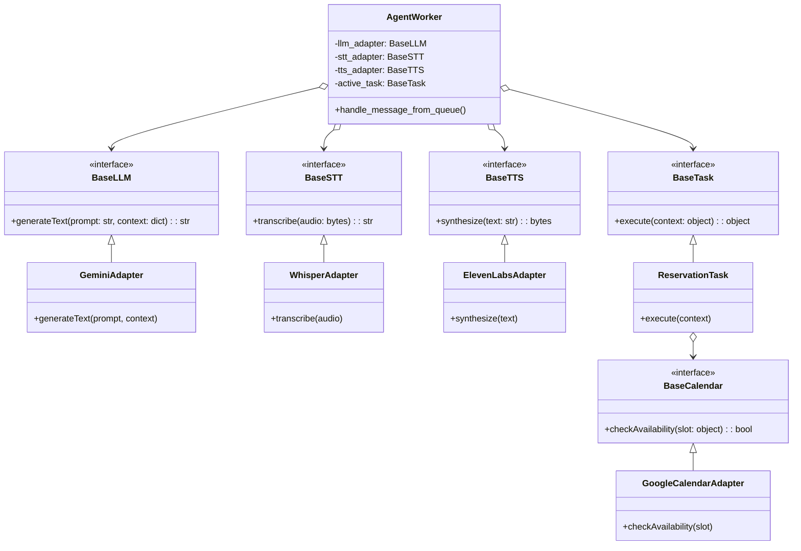
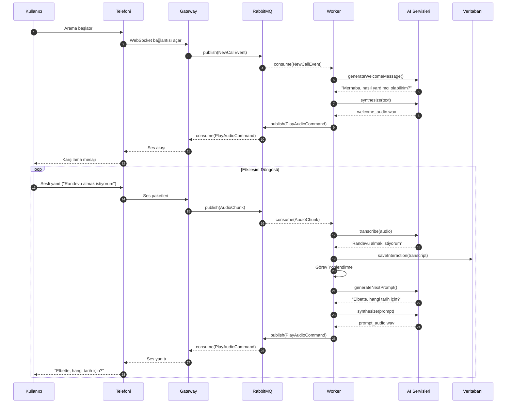

# 🏗️ Sentiric: Kapsamlı Mimari Dokümanı (Mevcut Anayasa v3.0)

## 1. Mimari Vizyon ve Temel Prensipler
**"Tak-Çıkar Lego Seti" & "Gerçek Zamanlı AI Diyaloğu" Felsefesi:**
- **Asenkron ve Dayanıklı:** Sistem, telefon görüşmesinin gerçek zamanlı doğasına saygı duyar. Bileşenler, **RabbitMQ** gibi bir mesaj kuyruğu üzerinden asenkron iletişim kurarak birbirlerinin yavaşlamasından veya çökmesinden etkilenmez.
- **Teknoloji Bağımsız:** Her işlev (LLM, TTS, Takvim), soyut bir arayüz (`BaseLLM`) arkasında çalışan somut bir adaptör (`GeminiAdapter`) ile sisteme bağlanır. Bu, teknoloji yığınını (stack) kolayca değiştirmemizi sağlar.
- **Akışkan Diyalog Odaklı:** Amacımız, katı menüler sunan bir IVR değil, `ChatGPT` veya `Gemini` gibi akışkan, bağlam farkındalığına sahip ve insan benzeri diyaloglar kurabilen bir platform oluşturmaktır.

## 2. Genel Mimari Şeması (Uygulanabilir ve Düzeltilmiş Versiyon)

Bu şema, sistemin dayanıklılığını ve ölçeklenebilirliğini artıran Mesaj Kuyruğu (RabbitMQ) ve merkezi durum/konfigürasyon yönetimi (Redis) gibi kritik ve **bugün uygulamaya başlayacağımız** bileşenleri içermektedir.



## 3. Genişletilmiş ve Detaylı Lego Mimarisi (Arayüz & Adaptörler)

Bu diyagram, platformun "Tak-Çıkar" felsefesinin kalbini gösterir. `AgentWorker`, somut implementasyonlardan değil, soyut arayüzlerden (interfaces) haberdardır.



## 4. Detaylı Arama Akışı (Sequence Diagram)



```mermaid
sequenceDiagram
    autonumber
    participant K as Kullanıcı
    participant T as Telefoni
    participant G as Gateway
    participant MQ as RabbitMQ
    participant W as Worker
    participant AI as AI Servisleri
    participant DB as Veritabanı

    ...
    
    W->>W: Görev Yönlendirme
    W->>AI: **generateNextPromptAsSSML()**
    AI-->>W: **SSML Yanıtı:** <speak>Elbette, <break time="300ms"/> hangi tarih için?</speak>
    W->>AI: synthesizeSSML(ssml_text)
    AI-->>W: prompt_audio.wav
    W->>MQ: publish(PlayAudioCommand)
    MQ-->>G: consume(PlayAudioCommand)
    G-->>T: Ses yanıtı
    T-->>K: "Elbette, (duraksama) hangi tarih için?"
```

## 5. Konfigürasyon Yönetimi (Güvenli ve Esnek)

Konfigürasyon, sır içermeyen davranışsal parametreleri tanımlar. Sırlar, ortam değişkenleri ile yönetilir.

**Örnek Konfigürasyon (`config/tenant_acme.yaml`):**
```yaml
# ACME Şirketi'ne özel konfigürasyon
telephony:
  adapter: "TwilioAdapter"
  params:
    account_sid_ref: "TWILIO_ACCOUNT_SID"

ai:
  stt_adapter: "WhisperAdapter"
  llm_adapter: "GeminiAdapter"
  tts_adapter: "ElevenLabsAdapter"

tasks:
  enabled:
    - "ReservationTask"
    - "InformationRequestTask"
```

## 6. Bileşen Detayları ve Sürüm Yönetimi

| Bileşen                  | Sorumlu Repo                   | Açıklama                                       |
|--------------------------|--------------------------------|------------------------------------------------|
| telephony-gateway        | `sentiric-telephony-gateway`   | Telefoni sağlayıcıları ile WebSocket bağlantısı kurar. |
| agent-worker             | `sentiric-agent-worker`        | Diyalog mantığını yürütür, görevleri orkestre eder. |
| api-server               | `sentiric-api-server`          | Dashboard için REST API sunar.                 |
| knowledge-indexer        | `sentiric-knowledge-indexer`   | Bilgi bankasını vektör veritabanına indeksler. |
| core-interfaces          | `sentiric-core-interfaces`     | Tüm adaptörlerin uyması gereken soyut sınıflar.  |
---
