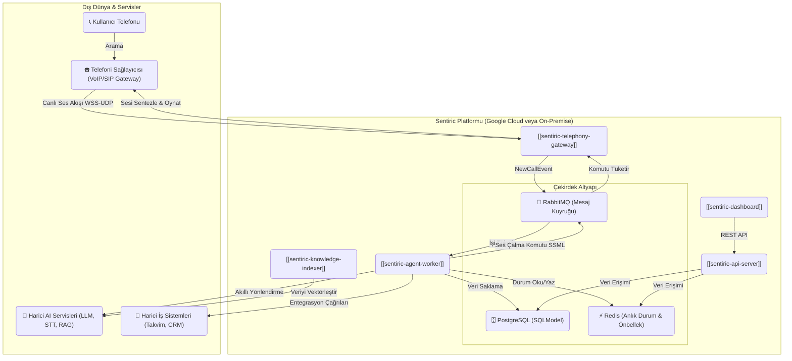
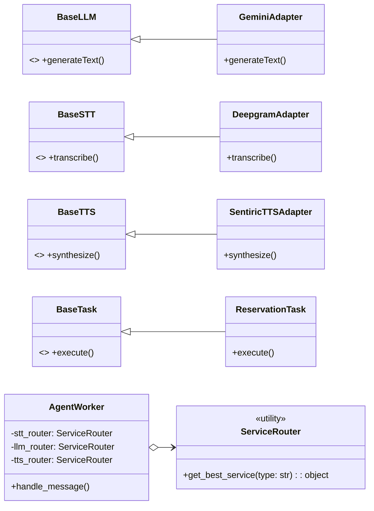
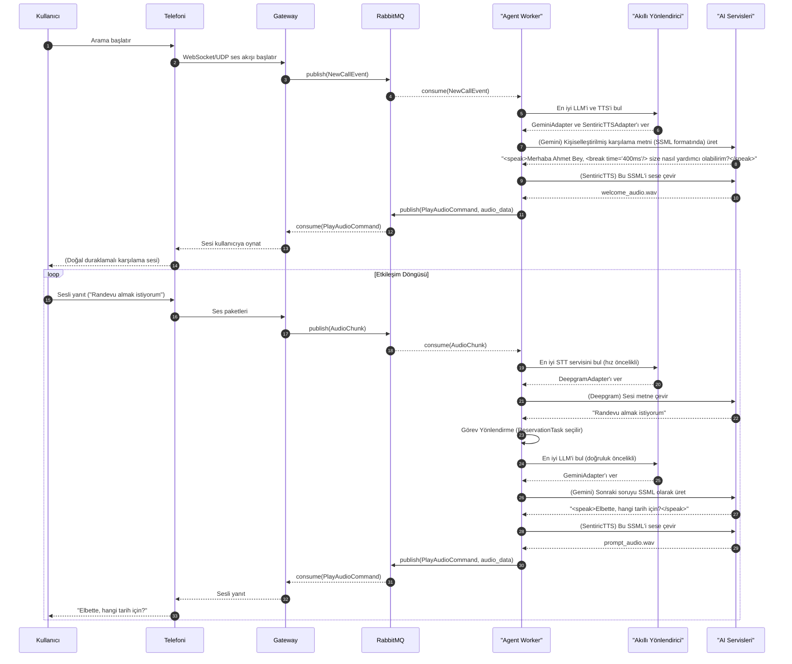

# 🏗️ Sentiric: Kapsamlı Mimari Dokümanı (Anayasa v4.0)

## 1. Mimari Vizyon ve Temel Prensipler

*   **"Tak-Çıkar Lego Seti" Felsefesi:** Platform, belirli teknolojilere (örn: Gemini, Twilio) "kaynak" yapılmamıştır. Her harici veya dahili servis (LLM, TTS, Takvim, STT), soyut bir arayüz (`BaseLLM`) arkasında çalışan somut bir **"Adaptör"** (`GeminiAdapter`) ile sisteme bağlanır. Bu, teknoloji yığınını (stack) gelecekte kolayca ve güvenle değiştirmemizi sağlar.

*   **Asenkron ve Dayanıklı Mimari:** Sistem, telefon görüşmesinin gerçek zamanlı doğasına saygı duyar. Tüm kritik servisler, bir **Mesaj Kuyruğu (`RabbitMQ`)** üzerinden asenkron iletişim kurar. Bu, bir bileşenin yavaşlamasının veya çökmesinin, sistemin geri kalanını etkilemesini engeller ve platformu son derece dayanıklı hale getirir.

*   **İnsan Benzeri Akışkan Diyalog:** Amacımız, katı menüler sunan bir IVR değil, `ChatGPT` gibi akışkan, bağlamı anlayan ve doğal bir diyalog kurabilen bir platform oluşturmaktır. Bu hedefe ulaşmak için, sadece metin değil, aynı zamanda konuşmanın tonunu, hızını ve duraklamalarını da yöneten **SSML (Speech Synthesis Markup Language)** kullanımı temel bir prensiptir.

## 2. Genel Mimari Şeması

Bu şema, sistemin dayanıklılığını ve ölçeklenebilirliğini artıran Mesaj Kuyruğu (RabbitMQ) ve merkezi durum/konfigürasyon yönetimi (Redis) gibi kritik bileşenleri içermektedir.



## 3. Genişletilmiş Lego Mimarisi (Arayüz & Adaptörler)

Bu diyagram, platformun "Tak-Çıkar" felsefesinin kalbini gösterir. `AgentWorker`, somut implementasyonlardan değil, soyut arayüzlerden (interfaces) haberdardır.



## 4. Detaylı ve Akıllı Arama Akışı (SSML ve Yönlendirme ile)

Bu akış, sistemin sadece bir dizi komutu değil, aynı zamanda akıllı yönlendirme ve doğal konuşma üretme yeteneklerini de nasıl kullandığını gösterir.



## 5. Akış Tanımlama ve Servis Orkestrasyonu

Platformun esnekliği ve zekası, iş mantığının koddan ayrıştırılması ve servis çağrılarının dinamik olarak yönetilmesine dayanır.

### 5.1. Sentiric Reçeteleri (YAML)

Bir "Kiracı" (Tenant) için tüm diyalog akışı ve kullanılacak görevler, **"Reçete" (Recipe)** adını verdiğimiz basit YAML dosyaları ile tanımlanır. Bu, platformun davranışını kod değişikliği yapmadan özelleştirmeyi sağlar.

**Örnek `tenant_recipe.yaml`:**
```yaml
# ACME Şirketi'ne özel Reçete
recipe_name: "Standart Müşteri Hizmetleri Akışı"
version: 1.0

enabled_tasks:
  - "AppointmentReservationTask"
  - "InformationRequestTask"

task_routing:
  - intent: "randevu_al"
    task: "AppointmentReservationTask"
  - intent: "bilgi_iste"
    task: "InformationRequestTask"
```

### 5.2. Akıllı Servis Yönlendirme: Kademeli Fallback

Sentiric, tek bir servis endpoint'ine bağımlı kalmak yerine, her servis türü (TTS, STT, LLM) için ayrı bir **"Servis Reçetesi"** kullanır. Bu reçete, kullanılacak servislerin bir öncelik listesini, zaman aşımlarını ve stratejilerini içerir. Bu, platformun otonom olarak en iyi performans/maliyet dengesini bulmasını ve bir servisin çökmesi durumunda bile diyalogun kesintisiz devam etmesini garanti altına alır.

**Örnek `stt_recipe.yaml`:**
```yaml
# STT Servisleri için Yönlendirme Reçetesi
# Strateji: En hızlıdan başla, kalite için gerekirse yedeğe geç.

services:
  - name: "Deepgram_Streaming_API"
    adapter: "DeepgramAdapter"
    priority: 1
    timeout_ms: 1500
    enabled: true

  - name: "Google_Speech_API_Enhanced"
    adapter: "GoogleSTTAdapter"
    priority: 2
    timeout_ms: 3000
    enabled: true
    config:
      model: "telephony"

  - name: "Sentiric_Inhouse_Whisper"
    adapter: "WhisperAdapter"
    endpoint: "http://localhost:5003/api/stt"
    priority: 3
    timeout_ms: 5000
    enabled: false
```
`Agent-Worker` içerisindeki **Akıllı Yönlendirici (ServiceRouter)**, bir STT isteği geldiğinde bu listeyi okur ve `priority` sırasına göre, `timeout_ms` sürelerini göz önünde bulundurarak servisleri dener.

## 6. Bileşen Detayları ve Sorumlu Repolar

| Bileşen | Sorumlu Repo | Açıklama |
| :--- | :--- | :--- |
| **telephony-gateway** | `sentiric-telephony-gateway` | Telefoni sağlayıcıları ile WebSocket/UDP ses akışını yönetir. |
| **agent-worker** | `sentiric-agent-worker` | Diyalog mantığını yürütür, Akıllı Yönlendiriciyi kullanır, görevleri orkestre eder. |
| **api-server** | `sentiric-api-server` | Dashboard için REST API sunar ve veritabanı işlemlerini yönetir. |
| **knowledge-indexer** | `sentiric-knowledge-indexer` | Bilgi bankasını RAG mimarisi için vektör veritabanına indeksler. |
| **core-interfaces** | `sentiric-core-interfaces` | Tüm adaptörlerin uyması gereken soyut Python sınıflarını (`BaseLLM` vb.) barındırır. |