# 🏛️ Sentiric: Platform Anayasası ve Bütünleşik Ekosistem Mimarisi (Nihai Sürüm v8.0)

**Belge Durumu:** **AKTİF VE BAĞLAYICI**
**Son Güncelleme:** 2024-08-10

## **İçindekiler**

1.  [Yönetici Özeti ve Proje Manifestosu](#1-yönetici-özeti-ve-proje-manifestosu)
2.  [Mimari Prensipleri: Platformun DNA'sı](#2-mimari-prensipleri-platformun-dnası)
3.  [Ekosistemin Bütünleşik Mimarisi (Büyük Resim)](#3-ekosistemin-bütünleşik-mimarisi-büyük-resim)
4.  [Servislerin Detaylı Dökümü ve Sorumluluk Matrisi](#4-servislerin-detaylı-dökümü-ve-sorumluluk-matrisi)
    *   [Kategori A: Ağ Geçitleri (Edge Layer)](#kategori-a-ağ-geçitleri-edge-layer)
    *   [Kategori B: Zeka ve İş Akışı (Asenkron Beyin)](#kategori-b-zeka-ve-iş-akışı-asenkron-beyin)
    *   [Kategori C: Destekleyici Çekirdek Servisler (Senkron Uzmanlar)](#kategori-c-destekleyici-çekirdek-servisler-senkron-uzmanlar)
    *   [Kategori D: Yapay Zeka Motorları](#kategori-d-yapay-zeka-motorları)
    *   [Kategori E: Altyapı ve Paylaşılan Kaynaklar](#kategori-e-altyapı-ve-paylaşılan-kaynaklar)
5.  [Uçtan Uca Veri Akışı: Bir Telefon Çağrısının Anatomisi](#5-uçtan-uca-veri-akışı-bir-telefon-çağrısının-anatomisi)
6.  [Platform Port ve Protokol Referans Haritası](#6-platform-port-ve-protokol-referans-haritası)
7.  [Yaşayan Belge Olarak Anayasa](#7-yaşayan-belge-olarak-anayasa)

---

## 1. Yönetici Özeti ve Proje Manifestosu

Bu doküman, Sentiric platformunun **tüm 26 deposunu** kapsayan, bütünleşik ve nihai teknik anayasasıdır. Sentiric, insan-makine sesli etkileşimini, akışkan, bağlam farkındalığına sahip ve geliştiriciler tarafından kolayca özelleştirilebilen bir **"Konuşan İşlem Platformu"na** dönüştürmeyi hedefler.

**Manifestomuz:** Müşteri etkileşimini bir maliyet merkezinden, veri üreten ve verimlilik sağlayan stratejik bir varlığa dönüştürmek.

Bu belge, projenin geliştirilmesi, dağıtımı ve bakımı için **tek ve değişmez referans noktasıdır.**

---

## 2. Mimari Prensipleri: Platformun DNA'sı

Platformumuzun tüm mühendislik kararlarına yön veren dört temel prensip vardır:

1.  **Hibrit İletişim Modeli (Performans ve Dayanıklılık):**
    *   **gRPC (Senkron):** Anında ve düşük gecikmeli yanıt gerektiren tüm servis-içi komutlar için (örn: `signal` -> `media` port talebi). Bu, sistemin **hızlı** olmasını sağlar.
    *   **RabbitMQ (Asenkron):** Ana iş akışlarını tetikleyen, anında yanıt gerektirmeyen olaylar için (örn: `call.started`). Bu, sistemin **dayanıklı** olmasını sağlar.

2.  **Soyutlama ve Bağımsızlık (Tak-Çıkar Lego Seti):** Her kritik işlev (`BaseLLM`, `BaseTelephony`) soyut bir "Adaptör" arkasında çalışır. Belirli bir teknolojiye (örn: Google Gemini) olan bağımlılığı ortadan kaldırır.

3.  **Merkezi Kontrat Yönetimi (Tutarlılık):** Tüm servisler arası API sözleşmeleri (`.proto` ve `OpenAPI` dosyaları), `sentiric-core-interfaces` reposunda merkezi olarak yönetilir.

4.  **Tek Sorumluluk Prensibi (Sadelik):** Her mikroservis, sadece tek bir işi en iyi şekilde yapmakla sorumludur. Bu, geliştirmeyi, testi ve bakımı basitleştirir.

---

## 3. Ekosistemin Bütünleşik Mimarisi (Büyük Resim)

Bu şema, platformun tüm servislerinin ve destekleyici bileşenlerinin birbiriyle nasıl etkileşimde bulunduğunu gösteren nihai haritadır.

```mermaid
graph TD
    subgraph "🌍 Dış Dünya & Kullanıcılar"
        A1("☎️ Telekom Sağlayıcısı / SIP Proxy")
        A2("📱 Mesajlaşma Platformları <br> (WhatsApp, Telegram vb.)")
        A3("💼 Harici İş Sistemleri <br> (CRM, Takvim vb.)")
        A4("💻 Yönetici <br> via [[sentiric-dashboard-ui]]")
        A5("⌨️ Geliştirici <br> via [[sentiric-cli]]")
        A6("🌐 Son Kullanıcı <br> via [[sentiric-embeddable-voice-widget-sdk]]")
    end

    subgraph "🚀 Sentiric Platformu"
        subgraph "🔌 1. Ağ Geçitleri Katmanı (Edge Layer)"
            style EdgeLayer fill:#e7f5ff,stroke:#228be6
            B1("[[sentiric-sip-signaling-service]] <br> **Rust**")
            B2("[[sentiric-messaging-gateway-service]] <br> **Node.js**")
            B3("[[sentiric-api-gateway-service]] <br> **Go/Node.js**")
        end

        subgraph "🧠 2. Zeka ve İş Akışı Katmanı (Asenkron)"
             style IntelligenceLayer fill:#ebfbee,stroke:#40c057
            C1("[[sentiric-agent-service]] <br> **Python**")
            C2("[[sentiric-task-service]] <br> **Python**")
        end

        subgraph "🛠️ 3. Destekleyici Çekirdek Servisler (Senkron - gRPC)"
            style CoreServices fill:#fff4e6,stroke:#fd7e14
            D1("[[sentiric-user-service]] <br> **Go**")
            D2("[[sentiric-dialplan-service]] <br> **Go**")
            D3("[[sentiric-media-service]] <br> **Rust**")
            D4("[[sentiric-knowledge-service]] <br> **Python**")
            D5("[[sentiric-connectors-service]] <br> **Python**")
            D6("[[sentiric-cdr-service]] <br> **Go/Python**")
        end

        subgraph "🤖 4. AI Motorları (Dahili/Harici)"
            style AIEngines fill:#ffebee,stroke:#e53935
            E1("[[sentiric-stt-service]] <br> **Python**")
            E2("[[sentiric-tts-service]] <br> **Python**")
        end
    end

    subgraph "🏗️ 5. Altyapı ve Paylaşılan Kaynaklar"
        style Infra fill:#f8f9fa,stroke:#6c757d
        F1("🐇 RabbitMQ")
        F2("🗄️ PostgreSQL")
        F3("⚡ Redis")
        F4("[[sentiric-core-interfaces]] <br> **.proto / OpenAPI**")
        F5("[[sentiric-db-models]] <br> **SQLModel / Prisma**")
        F6("[[sentiric-assets]] <br> **Ses, İkonlar**")
        F7("[[sentiric-infrastructure]] <br> **Docker Compose**")
    end

    %% --- Akışlar ---
    A1 -- "SIP/RTP" --> B1
    A2 -- "Webhook/API" --> B2
    A4 & A5 & A6 -- "HTTPS/WSS" --> B3
    A3 -- "API" --> D5

    B1 -- "gRPC (Hızlı Komut)" --> D1 & D2 & D3
    B1 -.-> |"Olay (Dayanıklı)"| F1
    B2 -.-> |"Olay (Dayanıklı)"| F1
    B3 -- "gRPC/REST" --> D1 & D2 & D6 & C1
    
    F1 -- "Olayları Tüketir" --> C1 & C2 & D6

    C1 -- "gRPC/REST" --> E1 & E2 & D3 & D4 & D5
    C1 -- "Durum Yönetimi" --> F3
    C1 -- "Kalıcı Veri" --> F2

    D1 & D2 & D6 -- "Veri Saklar" --> F2
    D4 -- "Veri Saklar" --> F2
    D5 -- "Harici API Çağrısı" --> A3

    subgraph " "
    direction LR
    F4 & F5 -.-> |"Kod Üretimi / Bağımlılık Olarak Kullanılır"| B1 & C1 & D1 & D2 & D3 & D4 & D5 & D6
    end
```


---

## 4. Servislerin Detaylı Dökümü ve Sorumluluk Matrisi

### Kategori A: Ağ Geçitleri (Edge Layer)
*Dış dünyadan gelen "ham" trafiği alıp platformun iç diline çeviren sınır muhafızları.*

| Repo Adı | Sorumluluk | **Nihai Teknoloji** | Giden İletişim |
| :--- | :--- | :--- | :--- |
| `sip-signaling-service` | SIP Sinyal Kalkanı | **Rust** | `user`, `dialplan`, `media` (gRPC ile); `RabbitMQ` (Olay ile) |
| `messaging-gateway-service` | Mesajlaşma Kanalı | **Node.js** | `RabbitMQ` (Olay ile) |
| `api-gateway-service` | Yönetim & UI Kapısı | **Go/Node.js** | Çoğu destekleyici servis (gRPC/REST ile) |
| `telephony-gateway-service` | PSTN/TDM Köprüsü | **Go/C++** | `sip-signaling-service` (SIP ile) |

### Kategori B: Zeka ve İş Akışı (Asenkron Beyin)
*`RabbitMQ`'dan gelen olayları dinleyerek platformun asıl "düşünme" ve "eyleme geçme" işini yapan servisler.*

| Repo Adı | Sorumluluk | **Nihai Teknoloji** | Giden İletişim |
| :--- | :--- | :--- | :--- |
| `agent-service` | Akıllı Agent | **Python (FastAPI)** | `stt`, `tts`, `media`, `knowledge`, `connectors` (API ile); `Redis`, `PostgreSQL` |
| `task-service` | Asenkron Görev Yöneticisi | **Python (Celery)** | `RabbitMQ`, `PostgreSQL` |

### Kategori C: Destekleyici Çekirdek Servisler (Senkron Uzmanlar)
*Belirli bir işi çok iyi yapan ve diğer servisler tarafından **gRPC** ile anlık olarak çağrılan uzman birimler.*

| Repo Adı | Sorumluluk | **Nihai Teknoloji** | Giden İletişim |
| :--- | :--- | :--- | :--- |
| `user-service` | Kullanıcı Yönetimi | **Go** | `PostgreSQL` |
| `dialplan-service` | Çağrı Yönlendirme | **Go** | `PostgreSQL` |
| `media-service` | Ses İşleme ve Akış | **Rust** | Dış dünya (RTP ile) |
| `knowledge-service` | Bilgi Bankası (RAG) | **Python** | `PostgreSQL` / Vektör DB |
| `connectors-service` | Harici Entegrasyonlar | **Python** | Harici API'ler (CRM, Takvim vb.) |
| `cdr-service` | Çağrı Detay Kaydı | **Go/Python** | `RabbitMQ` (Gelen), `PostgreSQL` (Giden) |

### Kategori D: Yapay Zeka Motorları
*Platforma konuşma ve anlama yeteneklerini kazandıran, değiştirilebilir AI servisleri.*

| Repo Adı | Sorumluluk | **Nihai Teknoloji** | Giden İletişim |
| :--- | :--- | :--- | :--- |
| `stt-service` | Konuşma-Metin | **Python** | Yok |
| `tts-service` | Metin-Konuşma | **Python** | Yok |

### Kategori E: Altyapı ve Paylaşılan Kaynaklar
*Platformun üzerinde durduğu temel ve tüm servislerin ortak kullandığı yapı taşları.*

| Repo Adı | Tür | Sorumluluk |
| :--- | :--- | :--- |
| `infrastructure` | Orkestrasyon | `Docker Compose` ile tüm platformu bir araya getirir. |
| `core-interfaces` | Kütüphane | Tüm `.proto` ve `OpenAPI` dosyalarını barındırır. |
| `db-models` | Kütüphane | Paylaşılan veritabanı şemalarını ve ORM modellerini içerir. |
| `assets` | Depo | Anons sesleri, UI ikonları gibi statik dosyaları depolar. |
| `governance` | Yönetim | Projenin anayasası; vizyon, mimari, standartlar. **(Bu repo)** |
| *(Diğer UI, SDK, CLI repoları)* | Araçlar/Arayüzler| İlgili kullanıcı personalarına hizmet eder. |

---

## 5. Uçtan Uca Veri Akışı: Bir Telefon Çağrısının Anatomisi

Bu akış, sistemin hibrit iletişim modelinin nasıl çalıştığını somut bir örnekle gösterir.

```mermaid
sequenceDiagram
    participant Arayan
    participant Signal (Rust)
    participant Media (Rust)
    participant RabbitMQ
    participant Agent (Python)

    %% Faz 1: Senkron Kurulum (Hızlı Yanıt)
    Arayan->>+Signal (Rust): INVITE
    Note right of Signal (Rust): Anlık gRPC çağrıları <br> (User, Dialplan)
    Signal (Rust)->>+Media (Rust): gRPC: AllocatePort()
    Media (Rust)-->>-Signal (Rust): gRPC: port: 18050
    Signal (Rust)-->>-Arayan: 200 OK (SDP ile)
    
    %% Faz 2: Asenkron Devir (Dayanıklı Tetikleme)
    Signal (Rust)- H>RabbitMQ: Olay Yayınla: call.started
    deactivate Signal (Rust)

    %% Faz 3: Asenkron İşleme (Zeka)
    RabbitMQ-->>Agent (Python): Olayı Tüket
    activate Agent (Python)
    Note over Agent (Python): Diyalog döngüsü başlar. <br> LLM ve TTS'e API çağrıları yapılır.
    Agent (Python)->>+Media (Rust): API: playAudio(port: 18050, audio_data)
    Media (Rust)-->>Arayan: Karşılama Sesi (RTP)
    deactivate Agent (Python)
    deactivate Media (Rust)
```

---

## 6. Platform Port ve Protokol Referans Haritası

| Servis | Port | Protokol | Amaç | Erişilebilirlik |
| :--- | :--- | :--- | :--- | :--- |
| `sip-signaling`| 5060 | UDP | Dış SIP trafiği | **Harici (Public)** |
| `api-gateway` | 80, 443 | TCP | Dış HTTP/S trafiği | **Harici (Public)** |
| `media-service`| 50052 | TCP | Dahili gRPC komutları | Dahili |
| | 10000-20000 | UDP | Harici RTP (ses) akışı | **Harici (Public)** |
| `user-service` | 50053 | TCP | Dahili gRPC komutları | Dahili |
| `dialplan-service`| 50054 | TCP | Dahili gRPC komutları | Dahili |
| `rabbitmq` | 5672 | TCP | AMQP protokolü | Dahili |
| | 15672 | TCP | RabbitMQ Yönetim Arayüzü | Opsiyonel (Harici) |
| `postgres` | 5432 | TCP | Veritabanı bağlantısı | Dahili |
| `redis` | 6379 | TCP | Önbellek/Durum Deposu | Dahili |

---

## 7. Yaşayan Belge Olarak Anayasa

Bu doküman, statik bir plan değil, projenin yaşayan anayasasıdır. Herhangi bir mimari değişiklik, yeni bir servis eklenmesi veya teknoloji yığınının güncellenmesi, **öncelikle bu belgede revize edilmelidir.** Bu, projenin bütünlüğünü, tutarlılığını ve uzun vadeli sağlığını korumanın tek yoludur.
