# 🏛️ Sentiric Anayasası (v11.0 - Ses Orkestrasyonu)

**Belge Durumu:** **AKTİF VE BAĞLAYICI**
**Son Güncelleme:** [Bugünün Tarihi]

**Önsöz:** Bu doküman, Sentiric platformunun vizyonunu, felsefesini, mimarisini ve yol haritasını tanımlayan **tek ve nihai referans kaynağıdır.** Önceki tüm mimari ve vizyon belgelerinin en iyi yönlerini birleştirir ve onların yerini alır.

## **BÖLÜM 1: VİZYON VE FELSEFE**

### **1.1. Vizyon: "İletişim İşletim Sistemi" (Communication OS)**

Sentiric, bir ürün değil, bir **ekosistemdir**. Geleneksel PBX'lerin kararlılığını, modern VoIP'nin esnekliğini, yapay zekanın anlama yeteneğini ve iş akışı otomasyonunun gücünü birleştiren, **yeni nesil bir İletişim İşletim Sistemi** inşa ediyoruz.

**Misyonumuz:** Her türlü insan-makine etkileşimini, geliştiriciler tarafından sonsuz şekilde genişletilebilir, akıllı ve otomatize edilebilir bir platforma dönüştürmek.

### **1.2. Değer Önerisi: Dijital Egemenlik**

Müşterilerimize "kiralık" bir çözüm sunmak yerine, onlara iletişim geleceklerinin **tapusunu** veriyoruz. Platform, hem bulut (SaaS) hem de müşteri sunucularında (On-Premise) çalışarak mutlak veri egemenliği ve esneklik sağlar.

### **1.3. Temel Felsefelerimiz**

1.  **"Tak-Çıkar Lego Seti":** Platform, belirli bir teknolojiye (örn: Google Gemini) bağımlı değildir. Her dış servis, soyut bir arayüzün arkasında çalışan değiştirilebilir bir **"Adaptör"** aracılığıyla sisteme bağlanır.
2.  **"Genesis Bloğu":** Platform, tüm iş mantığını ve kurallarını koddan ayırır.
    *   **Sıfır Hard-Code:** Hiçbir yönlendirme kuralı veya anons metni kodda yer almaz; her şey veritabanından dinamik olarak yönetilir.
    *   **Tek Sorumluluk:** Her mikroservis sadece tek bir işi mükemmel yapar.
    *   **Self-Bootstrapping:** Sistem, boş bir veritabanıyla bile, çalışması için gereken temel kuralları otomatik olarak oluşturur (`init.sql`).

## **BÖLÜM 2: MİMARİ VE TEKNOLOJİ**

### **2.1. Bütünleşik Ekosistem Mimarisi**

Bu şema, platformun bütünleşik yapısını, servislerin rollerini ve iletişim protokollerini gösterir.

```mermaid
graph TD
    subgraph "🌍 Dış Dünya & Kanallar"
        A1("☎️ Telefon (PSTN/SIP)")
        A2("🌐 Web & Yönetim (UI/CLI)")
    end

    subgraph "🚀 Sentiric Platformu"
        subgraph "🔌 1. Ağ Geçitleri (Edge Layer)"
            style EdgeLayer fill:#e7f5ff,stroke:#228be6
            B1("[[sentiric-sip-gateway-service]] <br> **Rust - Güvenlik & NAT**")
            B2("[[sentiric-api-gateway-service]] <br> **Go/Node.js - Yönetim API**")
        end

        subgraph "🧠 2. Zeka & Orkestrasyon Katmanı"
             style BrainLayer fill:#ebfbee,stroke:#40c057
             C1("[[sentiric-dialplan-service]] <br> **Stratejik Karar Merkezi**")
             C2("[[sentiric-agent-service]] <br> **Eylem & SAGA Orkestratörü**")
             C3("[[sentiric-llm-service]] <br> **Python - AI Dil Modeli Ağ Geçidi**")
        end
        
        subgraph "🎤 3. Ses Orkestrasyon Katmanı"
            style TtsLayer fill:#f3e5f5,stroke:#8e24aa
            TTS_GW("[[sentiric-tts-gateway-service]] <br> **Rust - Akıllı Ses Yönlendirici**")
        end

        subgraph "🛠️ 4. Uzman Destek Servisleri"
            style CoreServices fill:#fff4e6,stroke:#fd7e14
            D1("[[sentiric-user-service]] <br> **Go - Kimlik Yönetimi**")
            D2("[[sentiric-media-service]] <br> **Rust - Ses Akışı (RTP)**")
            D3("[[sentiric-stt-service]] <br> **Python - Konuşma->Metin**")
            TTS_Edge("[[sentiric-edge-tts-service]] <br> **Python - Hızlı/Ücretsiz Ses**")
            TTS_Coqui("[[sentiric-coqui-tts-service]] <br> **Python - Klonlama/Yerel Ses**")
        end
    end

    subgraph "🏗️ 5. Altyapı & Veri Katmanı"
        style Infra fill:#f8f9fa,stroke:#6c757d
        F1("🐇 RabbitMQ (Asenkron Olaylar)")
        F2("🗄️ PostgreSQL (Kalıcı Veri, Kurallar, SAGA State)")
        F3("⚡ Redis (Cache, Durum Yönetimi)")
        F4("[[sentiric-contracts]] <br> **.proto - API Sözleşmeleri**")
    end

    %% --- İletişim Akışları (Güncellenmiş) ---
    A1 -- "SIP (UDP)" --> B1
    B1 -- "Olay (Asenkron)" --> F1
    B1 -- "gRPC (Senkron)" --> C1
    
    F1 -- "Olayı Tüketir" --> C2
    C2 -- "gRPC" --> D1 & D2
    C2 -- "HTTP/REST" --> C3 & D3
    C2 -- "gRPC (SSML İsteği)" --> TTS_GW
    
    TTS_GW -- "Cache Sorgusu" --> F3
    TTS_GW -- "gRPC (Basit Metin)" --> TTS_Edge
    TTS_GW -- "gRPC (Basit Metin)" --> TTS_Coqui
    
    A2 -- "HTTPS" --> B2
    B2 -- "gRPC" --> C1 & D1
    
    F4 -.-> |"Tüm Go/Rust/Python Servisleri Kullanır"| B1
```

### **2.2. Teknoloji Yığını ve Gerekçeleri**

*   **Rust (`sip-gateway`, `media-service`, `tts-gateway`):** Maksimum performans, bellek güvenliği ve düşük seviye ağ kontrolü gerektiren, dış dünyaya en yakın ve yüksek verim gerektiren servisler için.
*   **Go (`dialplan-service`, `user-service`, `agent-service`):** Hızlı, basit, yüksek eşzamanlılık gerektiren ve veritabanı ile yoğun iletişim kuran gRPC tabanlı uzman servisler ve ana orkestratör için.
*   **Python (`llm-service`, `stt-service`, `tts-*` uzman motorları):** Zengin AI/ML ekosistemi, hızlı prototipleme ve karmaşık AI mantığının uygulanması için ideal olan, izole AI ağ geçitleri için.

### **2.3. Uçtan Uca Sesli Yanıt Akışı (Yeni Mimari)**

1.  **Giriş ve Karar:** `INVITE` paketi gelir, `sip-gateway` -> `sip-signaling` -> `dialplan-service` akışı çalışır. `call.started` olayı RabbitMQ'ya atılır.
2.  **Devralma:** `agent-service` olayı alır. Diyalog akışında bir ses çalınması gerektiğine karar verir.
3.  **Ses Talebi:** `agent-service`, metin ve klonlama URL'si gibi bilgilerle `tts-gateway`'e **gRPC** ile bir `Synthesize` isteği gönderir.
4.  **Akıllı Yönlendirme:** `tts-gateway` isteği analiz eder. Klonlama URL'si olduğu için isteği `tts-coqui-service`'e yönlendirir.
5.  **Sentezleme:** `tts-coqui-service` sesi üretir ve ham ses verisini (`bytes`) `tts-gateway`'e geri döner.
6.  **Yanıt:** `tts-gateway`, bu ham ses verisini `agent-service`'e gRPC yanıtı olarak iletir.
7.  **Medya Oynatma:** `agent-service`, aldığı ham ses verisini base64'e kodlar, bir `data:` URI'si oluşturur ve `media-service`'in `PlayAudio` RPC'sini bu URI ile çağırır.
8.  **Sonuç:** `media-service` URI'yi çözer, sesi RTP paketlerine dönüştürür ve kullanıcıya gönderir.

## **BÖLÜM 3: YOL HARİTASI VE GELECEK VİZYONU**

### **3.1. Mevcut Odak (Faz 1): "Konuşan Ürün"**

*   **Hedef:** Mevcut, çalışan iskeleti, gerçek bir AI diyalog döngüsü ile "konuşan" bir ürüne dönüştürmek.
*   **Adımlar:** `agent-service`'e STT/LLM/TTS entegrasyonlarını ekleyerek tam diyalog döngüsünü tamamlamak.

### **3.2. Orta Vade (Faz 2): "Platformlaşma"**

*   **Hedef:** Geliştiricilerin ve yöneticilerin platformu "low-code" (az kodlu) bir şekilde yönetmesini ve genişletmesini sağlamak.
*   **Potansiyel Özellikler:**
    *   `dashboard-ui` üzerinden sürükle-bırak ile `dialplan` oluşturma.
    *   `connectors-service` ile harici CRM/Takvim entegrasyonları.

### **3.3. Uzun Vade (Faz 3): "Zeka ve Optimizasyon"**

*   **Hedef:** Platformun verimliliğini, zekasını ve maliyet etkinliğini en üst düzeye çıkarmak.
*   **Potansiyel Özellikler:**
    *   **Akıllı AI Orkestratör:** `agent-service`'in, gelen görevin türüne göre en uygun (hızlı/ucuz/güçlü) LLM'i dinamik olarak seçmesi.
    *   **Gelişmiş RAG:** `knowledge-service` ile daha karmaşık bilgi bankası yönetimi.
    *   **Veri Bütünlüğü:** Karmaşık iş akışları için **SAGA pattern**'inin uygulanması.
