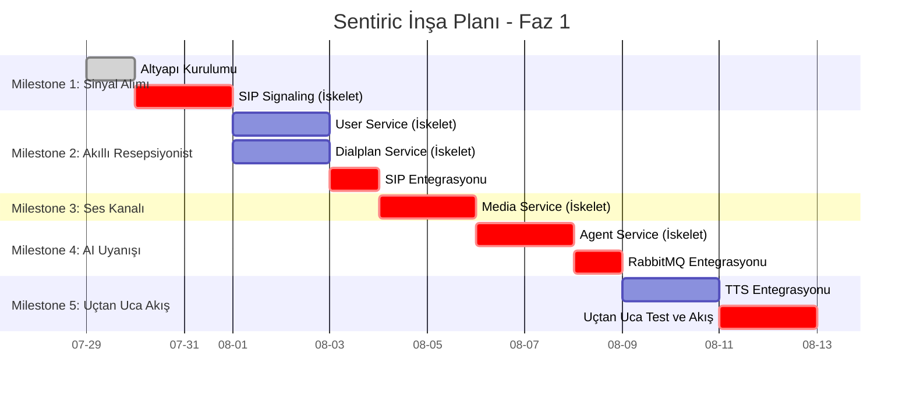

# 🏗️ Sentiric: Platform İnşa Stratejisi ve Yol Haritası

Bu doküman, Sentiric platformunun "Dikey Dilim" (Vertical Slice) yaklaşımıyla, yani tek bir telefon aramasının yolculuğunu takip ederek nasıl adım adım inşa edileceğini tanımlar. Her bir kilometre taşı (Milestone), sisteme yeni bir temel yetenek ekler ve projenin somut ilerlemesini gösterir.

Bu belge, `Roadmap.md`'deki genel vizyonu, eyleme geçirilebilir adımlara bölen taktiksel bir plandır.

---

## İnşa Felsefesi: İlk Telefon Aramasının Yolculuğu

Sistemi yatay katmanlar halinde (önce tüm veritabanları, sonra tüm gateway'ler) inşa etmek yerine, tek bir telefon aramasının baştan sona geçeceği kritik yolu adım adım tamamlayarak ilerleyeceğiz. Bu, her aşamada çalışan ve test edilebilir bir sistem parçası elde etmemizi sağlar.

## Kilometre Taşları (Milestones)

### Milestone 1: "Alo?" - Arama Sinyalinin Alınması (The Dial Tone)

*   **Amaç:** Dış dünyadan gelen bir SIP çağrısının, altyapımızdaki doğru kapıyı çalabilmesi. Bu, sistemin en temel "yaşam belirtisidir".
*   **İnşa Edilecekler:**
    1.  `sentiric-infrastructure`: Temel altyapı (Postgres, Redis, RabbitMQ). (**✅ TAMAMLANDI**)
    2.  `sentiric-sip-signaling-service` (İskelet): Gelen bir SIP `INVITE` isteğini alıp, konsola "Çağrı alındı!" yazan ve arayana `200 OK` yanıtı dönen en basit versiyon.
*   **Doğrulama Testi:** Bir SIP softphone ile numaramızı aradığımızda, çağrının kurulması ve `sip-signaling-service` loglarında mesajın görülmesi.

### Milestone 2: "Kimsiniz ve Ne İstiyorsunuz?" - Akıllı Resepsiyonist

*   **Amaç:** Gelen çağrıyı sadece almakla kalmayıp, kimin aradığını anlamak ve aramanın nereye gitmesi gerektiğine dair ilk kararı vermek.
*   **İnşa Edilecekler:**
    1.  `sentiric-user-service` (İskelet): Basit bir "bu kullanıcı var mı?" servisi.
    2.  `sentiric-dialplan-service` (İskelet): Sabit bir "IVR_Giris uygulamasına yönlendir" kuralı olan bir servis.
*   **Entegrasyon:** `sentiric-sip-signaling-service` artık bu iki servise API çağrıları yapacak.

### Milestone 3: "Sizi Duyuyorum" - Ses Kanalının Açılması

*   **Amaç:** Sinyalleşme tamamlandıktan sonra, kullanıcının sesinin (RTP akışı) platformumuza ulaşabileceği bir medya kanalı açmak.
*   **İnşa Edilecekler:**
    1.  `sentiric-media-service` (İskelet): "Bir medya oturumu başlat" komutunu alıp bir RTP portu açan en basit versiyon.
*   **Entegrasyon:** `sentiric-sip-signaling-service` çağrıyı kurarken `media-service`'den bir medya oturumu talep edecek.

### Milestone 4: İlk Kelime "Merhaba" - Yapay Zekanın Uyanışı

*   **Amaç:** Çağrı başarıyla kurulduktan sonra, sistemin ilk akıllı eylemini gerçekleştirmesi: kullanıcıyı karşılamak. Bu, asenkron mimarimizin ilk testidir.
*   **İnşa Edilecekler:**
    1.  `sentiric-agent-service` (İskelet): RabbitMQ'dan gelen `call.started` olayını dinleyip tepki veren bir servis.
*   **Entegrasyon:** `sip-signaling-service` çağrı başarılı olduğunda RabbitMQ'ya bir mesaj yayınlayacak.

### Milestone 5: Uçtan Uca Akış - "Sentiric Konuşuyor"

*   **Amaç:** Tüm parçaları birleştirerek, kullanıcının aradığında sistemden önceden tanımlanmış bir sesli yanıt duymasını sağlamak.
*   **Entegrasyon:** `agent-service`, bir TTS servisi/API'si aracılığıyla ses üretecek ve `media-service`'e bu sesi kullanıcıya dinletmesini söyleyecek.
*   **Doğrulama Testi:** Numarayı aradığımızda, telefondan "Merhaba, Sentiric'e hoş geldiniz" sesini duymak.

## Görsel İnşa Planı (Gantt Şeması)

