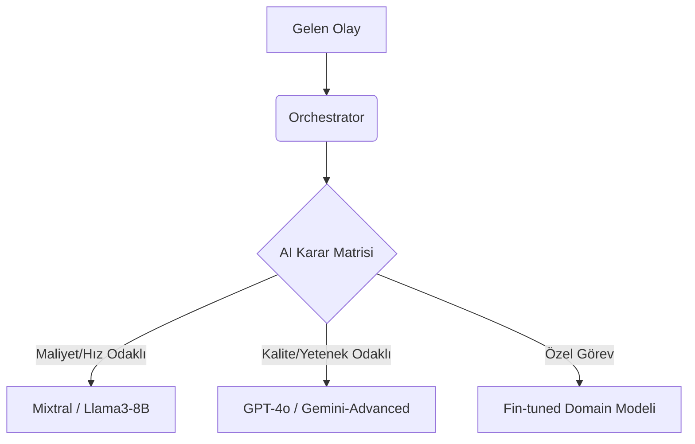

# ☄️ Sentiric Stratejik Vizyonu: "Phoenix" Mimarisi (v9.0)

**Belge Durumu:** **UZUN VADELİ YOL HARİTASI (NORTH STAR)**
**İlgili Anayasa:** [Platform Anayasası ve Bütünleşik Ekosistem Mimarisi (v8.0)](./Architecture-Overview.md)

## 1. Önsöz: Neden Bir Vizyon Belgesi?

Mevcut **Anayasa v8.0**, bugün inşa ettiğimiz, pragmatik ve sağlam temellere dayanan platformu tanımlar. Bu "Phoenix" vizyonu ise, Sentiric'in **gelecekteki 3-5 yıl içinde** dönüşeceği, sektör lideri, ultra ölçeklenebilir ve askeri düzeyde güvenli platformun teknik manifestosudur.

Bu belge bir "hedef" değil, bir "ufuktur". Attığımız her pragmatik adım, bizi bu ufka daha da yakınlaştıracaktır. v8.0 mimarisi, bu vizyona ulaşmak için inşa ettiğimiz sağlam rampadır.

---

## 2. Temel Paradigma Değişiklikleri: Geleceğin Teknolojisi

Platform olgunlaştıkça ve pazar talepleri arttıkça, aşağıdaki temel teknolojik evrimleri hedefleyeceğiz:

| Özellik | v8.0 (Bugünkü Sağlam Temel) | v9.0 (Gelecekteki Zirve) | Stratejik Gerekçe |
| :--- | :--- | :--- | :--- |
| **Mimari** | Hibrit (Senkron gRPC / Asenkron RabbitMQ) | **Tamamen Olay Yönelimli (Event-Driven)** | Tek bir iletişim paradigması ile sistemin bilişsel karmaşıklığını azaltmak ve sonsuz esneklik sağlamak. |
| **Veri Modeli**| Durum Odaklı (CRUD) | **Olay Kaynağı (Event Sourcing) + CQRS** | Her değişikliğin denetlenebilir bir geçmişini tutmak, "zamanda geriye gitme" yeteneği ve okuma/yazma operasyonlarını ayrı ayrı ölçeklendirmek. |
| **Güvenlik** | Sağlam Güvenlik (mTLS Planı) | **Sıfır Güven (Zero-Trust) Modeli** | Ağın içini de dışı kadar güvensiz kabul ederek, her bir servis etkileşimini kriptografik olarak doğrulamak. |
| **Ölçek** | Pratik Ölçeklenme (Binlerce Eş Zamanlı Çağrı) | **Yatay Parçalama (Sharding)** | Tek bir veritabanı veya mesaj kuyruğunun sınırlarını aşarak milyonlarca eş zamanlı çağrıyı yönetebilmek. |
| **AI Entegrasyonu** | Esnek Adaptör Deseni | **Akıllı AI Orkestrasyon Katmanı** | Gelen görevin türüne göre en uygun AI modelini (hız, maliyet, yetenek) dinamik olarak seçen merkezi bir beyin. |

---

## 3. "Phoenix" Mimarisi Bileşenleri

### 3.1. Çekirdek Motor: "Event Broker"

Gelecekte, `RabbitMQ` ve `PostgreSQL`'in birleşik rolü, **"Event Broker"** adı verilen tek ve birleşik bir sistem tarafından üstlenilecektir. Bu sistem, olayların hem anlık olarak iletilmesinden hem de kalıcı olarak saklanmasından sorumlu olacaktır.

*   **Teknoloji Adayları:** [Apache Kafka](https://kafka.apache.org/), [Pulsar](https://pulsar.apache.org/), veya [NATS JetStream](https://nats.io/).
*   **İşlev:** Platformda gerçekleşen her eylem (`call_initiated`, `digit_pressed`, `audio_chunk_received`), bu sisteme değişmez (immutable) bir olay olarak kaydedilir. Platformun anlık durumu, bu olayların baştan sona tekrar oynatılmasıyla yeniden oluşturulabilir.

```mermaid
graph LR
    subgraph "Geleceğin Veri Omurgası"
        A[Gateway'ler] -- "Olay Yazar" --> B((Event Broker <br> Sharded Event Logs))
        C[İşlemciler (Agent vb.)] -- "Olay Okur/Yazar" --> B
    end
    B -- "Olayları Kalıcı Saklar" --> D[(Cold Storage <br> Parquet/S3)]
    B -- "Okuma Modellerini Besler" --> E{CQRS Read Models}
    E --> F[PostgreSQL]
    E --> G[Elasticsearch]
```

### 3.2. Platformun Beyni: "AI Orchestrator"

`sentiric-agent-service`, bu vizyonda bir **"AI Orchestrator"**'a evrilecektir. Görevi, sadece diyalog akışını yönetmek değil, aynı zamanda en akıllı AI kaynağını seçmektir.

*   **İşlev:** Bir `call.started` olayı geldiğinde, Orchestrator arayanın profilini, amacını ve aciliyetini analiz eder.
*   **Karar Matrisi:**
    *   *"Sadece 'evet'/'hayır' cevabı gereken bir IVR adımı mı?"* -> **Hızlı ve ucuz, yerel bir model kullan.**
    *   *"Karmaşık bir şikayet yönetimi mi?"* -> **En güçlü ve en yetenekli model olan GPT-4o'yu kullan.**
    *   *"Acil durum tespiti gerekiyor mu?"* -> **Bu iş için özel eğitilmiş `EmergencyDetectionAdapter`'ı çağır.**



### 3.3. Güvenlik Omurgası: "Identity Provider" (SPIFFE/SPIRE)

Gelecekte, servisler birbirlerine IP adresi veya basit bir API anahtarı ile değil, sürekli yenilenen, kriptografik olarak doğrulanabilir **kimliklerle (SPIFFE Verifiable Identity Documents - SVIDs)** güvenecektir.

*   **Teknoloji:** [SPIFFE](https://spiffe.io/) / [SPIRE](https://spiffe.io/spire/).
*   **İşlev:** `media-service`, `user-service`'ten bir istek aldığında, "Bu gerçekten `user-service` mi, yoksa ağa sızmış bir saldırgan mı?" diye sormaz. Gelen isteğin içindeki SVID, bu kimliği matematiksel olarak kanıtlar. Bu, **Sıfır Güven (Zero-Trust)** mimarisinin temelidir.

---

## 4. Vizyonun Somut Kazanımları

Bu mimariye ulaştığımızda Sentiric'in kazanacağı yetenekler:

| Kazanım | Açıklama |
| :--- | :--- |
| **Petabyte-Ölçeğinde Veri İşleme** | Event Sourcing sayesinde, platform on yıllar boyunca trilyonlarca olayı işleyebilir ve analiz edebilir hale gelir. |
| **Gerçek Zamanlı Karar Döngüleri** | AI Orchestrator, milisaniyeler içinde en doğru AI modelini seçerek hem maliyeti optimize eder hem de yanıt süresini kısaltır. |
| **Kırılmaz Güvenlik** | SPIFFE/SPIRE ile sağlanan Zero-Trust modeli, platformu iç ve dış tehditlere karşı en üst düzeyde korur. |
| **Çoklu Kanal (Multi-modal) İletişim**| Olay tabanlı yapı, sadece `call.started` olayını değil, `video.frame.received` veya `iot.sensor.triggered` gibi olayları da doğal bir şekilde işleyebilir. |

---

## 5. Evrimsel Geçiş Planı

Bu vizyona bir gecede ulaşılmayacak. v8.0'dan v9.0'a geçiş, planlı ve evrimsel adımlarla gerçekleşecektir:

1.  **Faz 1: Orkestrasyon Zekası:** `agent-service`'e "AI Karar Matrisi" mantığını ekleyerek AI Orkestrasyonu'na ilk adımı atmak.
2.  **Faz 2: Güvenliği Artırmak:** Servisler arasına yavaş yavaş mTLS ekleyerek Zero-Trust mimarisine hazırlanmak.
3.  **Faz 3: Olay Tabanlı Denemeler:** `cdr-service` gibi belirli servisleri, verilerini CRUD yerine olay akışından alacak şekilde yeniden yapılandırarak Event Sourcing'i test etmek.
4.  **Faz 4: Omurganın Değişimi:** Platform yeterli olgunluğa ve pazar büyüklüğüne ulaştığında, Event Broker'a geçişi planlamak.

Bu vizyon, Sentiric'in sadece bugünün sorunlarını çözen bir platform değil, aynı zamanda yarının teknolojik zorluklarına ve fırsatlarına hazır, kalıcı bir ekosistem olmasını sağlayacaktır.
