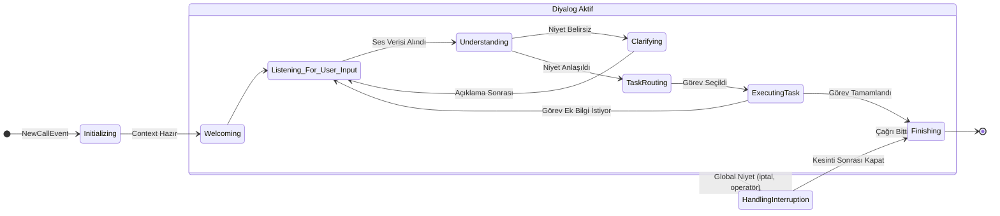

# 🧠 Agent-Worker: Durum Makinesi (State Machine) Mantığı (Detaylandırılmış v2.0)

`sentiric-agent-worker`, her telefon çağrısını yöneten beyindir. Diyalog akışının karmaşıklığını yönetmek için sofistike bir **Durum Makinesi (State Machine)** mimarisi kullanır.

## Durum Diyagramı

## Durumların Açıklaması ve Alt Adımları

*   **Initializing:** Çağrı bilgileri alınır, `CallContext` oluşturulur, müşteri CRM'den sorgulanır.
*   **Welcoming:** LLM'den dinamik bir karşılama metni üretilir ve TTS ile sese çevrilerek kullanıcıya dinletilir.
*   **Listening_For_User_Input:** Sistemin kullanıcıdan sesli girdi beklediği durum. Sürekli ses akışını dinler ve sessizlik tespit ettiğinde bir sonraki duruma geçer.
*   **Understanding:**
    1.  **STT:** Gelen ses verisi metne çevrilir.
    2.  **NLU:** Metinden niyet ve varlıklar (tarih, isim vb.) çıkarılır.
    3.  **Sonuç:** Anlaşılır bir niyet varsa `TaskRouting`'e, belirsizlik varsa `Clarifying`'e geçilir.
*   **Clarifying:** Niyet belirsizse ("Randevu mu dediniz, randevu iptali mi?"), sistem LLM kullanarak bir netleştirme sorusu sorar.
*   **TaskRouting:** Anlaşılan niyete göre, konfigürasyonda tanımlı görevlerden uygun olan (`ReservationTask` vb.) bulunur ve `task_stack`'e eklenir.
*   **ExecutingTask:** Seçilen görevin `execute()` metodu çalıştırılır. Bu görev, harici API'leri çağırabilir veya kullanıcıdan yeni bilgiler istemek üzere bir sonraki "prompt"u hazırlayabilir. Bu durumda tekrar `Listening_For_User_Input` durumuna dönülür.
*   **HandlingInterruption:** Kullanıcı "iptal et" veya "operatöre bağlan" gibi mevcut görevi kesen bir şey söylediğinde devreye girer. `task_stack` temizlenir ve uygun eylem yapılır.
*   **Finishing:** Çağrı özeti veritabanına kaydedilir, veda mesajı oynatılır ve çağrı sonlandırılır.
---