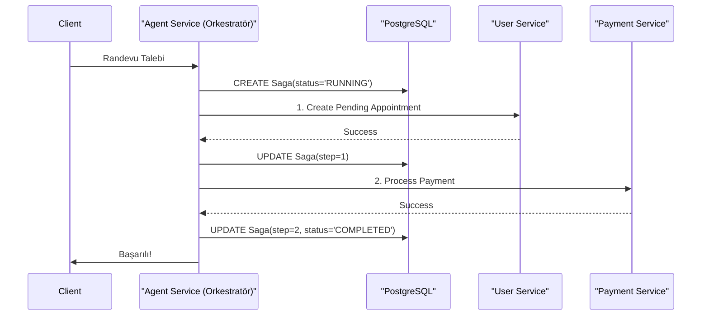
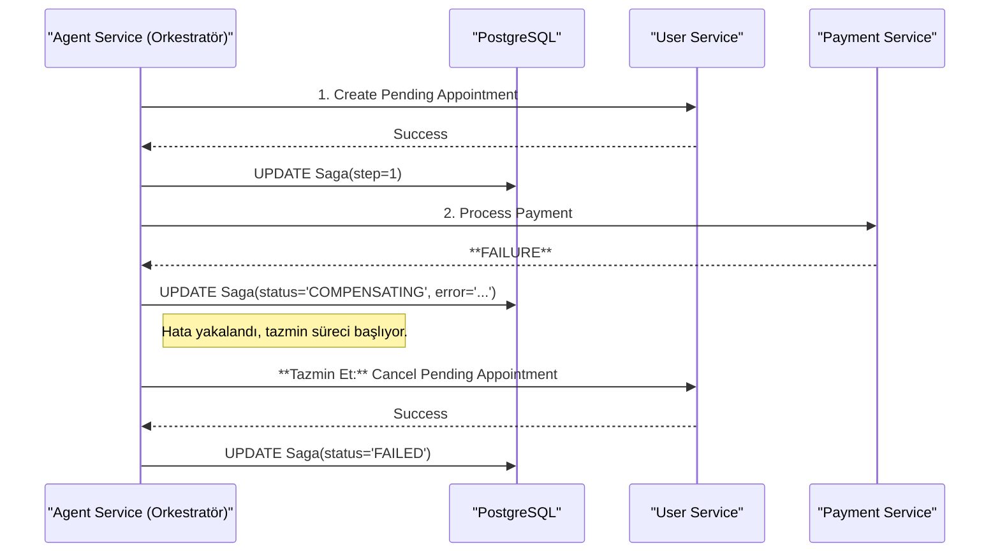

# 🛠️ Sentiric: SAGA Modeli Uygulama Rehberi

Bu rehber, `ADR-003`'te kararlaştırılan SAGA (Orchestration) modelinin platforma nasıl uygulanacağına dair teknik detayları ve standartları tanımlar.

## 1. Felsefe ve Seçilen Model

Dağıtık işlemlerde veri bütünlüğünü sağlamak için **Orkestrasyon (Orchestration)** tabanlı SAGA modelini kullanıyoruz. Bu modelde, `sentiric-agent-service` merkezi bir orkestratör görevi görerek tüm iş akışını yönetir.

## 2. Temel Bileşenler

*   **Orkestratör (`agent-service`):** İş akışını başlatan, adımları yöneten, hataları yakalayan ve tazmin etme (compensation) sürecini tetikleyen merkezi servis.
*   **Durum Deposu (PostgreSQL - `saga_transactions`):** Her SAGA'nın mevcut durumunu, adımlarını ve sonuçlarını kalıcı olarak tutan veritabanı tablosu.
*   **Katılımcılar (Diğer Servisler):** Bir iş akışındaki belirli bir adımı gerçekleştiren servisler (örn: `user-service`, `payment-service`).

## 3. Veritabanı Şeması

Tüm SAGA işlemlerinin durumunu izlemek için `init.sql` içine aşağıdaki tablo eklenecektir.

```sql
-- Dağıtık işlemlerin (SAGA) durumunu yöneten merkezi tablo
CREATE TABLE saga_transactions (
    saga_id UUID PRIMARY KEY DEFAULT gen_random_uuid(),      -- Her iş akışı için benzersiz ID
    saga_name VARCHAR(255) NOT NULL,                          -- Örn: 'create-paid-appointment'
    current_step INT NOT NULL DEFAULT 0,                      -- İş akışının hangi adımında olduğu
    status VARCHAR(50) NOT NULL DEFAULT 'RUNNING',            -- RUNNING, COMPLETED, COMPENSATING, FAILED
    payload JSONB,                                            -- İşlem için gerekli tüm veriler (user_id, amount vb.)
    step_results JSONB DEFAULT '{}'::jsonb,                   -- Her adımın sonucunu saklamak için (örn: appointment_id)
    last_error TEXT,                                          -- Hata durumunda hatanın sebebini kaydetmek için
    created_at TIMESTAMPTZ NOT NULL DEFAULT NOW(),
    updated_at TIMESTAMPTZ NOT NULL DEFAULT NOW()
);

-- Sık sorgulanan 'status' alanı için index
CREATE INDEX idx_saga_status ON saga_transactions(status);
```

## 4. Katılımcı Servisler İçin API Kontratı

Bir iş akışına katılan her servis, iki tür temel endpoint sunmalıdır:

1.  **İşlem Endpoint'i (Action Endpoint):** Belirli bir işi yapar.
2.  **Tazmin Endpoint'i (Compensation Endpoint):** Yapılan işi geri alır.

**Örnek: `payment-service`**

*   **İşlem:** `POST /v1/payments`
    *   **Gövde:** `{ "saga_id": "...", "amount": 100.00, "currency": "TRY", ... }`
    *   **Başarılı Yanıt:** `201 Created` - `{ "payment_id": "..." }`
    *   **Başarısız Yanıt:** `4xx/5xx` - `{ "error": "Insufficient funds" }`
*   **Tazmin:** `POST /v1/refunds`
    *   **Gövde:** `{ "saga_id": "...", "payment_id": "...", "reason": "Appointment creation failed" }`
    *   **Başarılı Yanıt:** `200 OK`

## 5. Örnek Akış Şemaları

### Başarılı Akış (Happy Path)



### Başarısızlık ve Geri Alma Akışı


