### **Sentiric Platformu: Servisler Arası İletişim Mimarisi**

Platformumuzdaki servisler, iki ana yöntemle iletişim kurar:

1.  **Doğrudan API Çağrıları (Senkron):** Bir servisin, başka bir servisten anında bir yanıt beklemesi gereken durumlarda kullanılır (örn: "Bu kullanıcı geçerli mi?"). Genellikle HTTP/REST veya daha yüksek performans için gRPC kullanılır.
2.  **Olay Tabanlı İletişim (Asenkron):** Bir servisin, bir olayın gerçekleştiğini diğer servislere "duyurması" ve anında bir yanıt beklemediği durumlarda kullanılır. Bu iletişim, `RabbitMQ` mesaj kuyruğu üzerinden sağlanır ve sistemin en dayanıklı parçasını oluşturur.

---

### **Görsel İletişim Haritası (Tüm Ekosistem)**

Bu şema, 26 reponun çalışan servislerinin birbiriyle nasıl bir etkileşim ağı kurduğunu göstermektedir.

```mermaid
graph TD
    subgraph "Dış Dünya & İstemciler"
        TelefoniSaglayici("☎️ Telefoni Sağlayıcısı (SIP Trunk)")
        DashboardUI("💻 Yönetici Paneli <br> [[sentiric-dashboard-ui]]")
        CLI("⌨️ Geliştirici CLI <br> [[sentiric-cli]]")
    end

    subgraph "Platform Çekirdeği"
        subgraph "Ağ Geçitleri (Gateways)"
            style Gateways fill:#f9f
            SIPSignaling("SIP Sinyalleşme <br> [[sentiric-sip-signaling-service]]")
            APIGateway("API Gateway <br> [[sentiric-api-gateway-service]]")
        end

        subgraph "Çekirdek Mantık & AI"
            style CoreAI fill:#ccf
            AgentService("Akıllı Agent <br> [[sentiric-agent-service]]")
            MediaService("Medya Servisi <br> [[sentiric-media-service]]")
        end

        subgraph "Destekleyici Servisler"
            style Support fill:#D5F5E3
            UserService("Kullanıcı Servisi <br> [[sentiric-user-service]]")
            DialplanService("Yönlendirme Planı <br> [[sentiric-dialplan-service]]")
            KnowledgeService("Bilgi Bankası <br> [[sentiric-knowledge-service]]")
            Connectors("Harici Bağlantılar <br> [[sentiric-connectors-service]]")
            CDRService("Çağrı Kayıt Servisi <br> [[sentiric-cdr-service]]")
        end
        
        subgraph "AI Motorları (Yerel/Bulut)"
             style AIEngine fill:#fce
             STT_Engine["STT Motoru <br> [[sentiric-stt-service]]"]
             TTS_Engine["TTS Motoru <br> [[sentiric-tts-service]]"]
        end
    end

    subgraph "Veri Katmanı (Altyapı)"
        style DataLayer fill:#cfc
        MQ("🐇 RabbitMQ")
        DB("🗄️ PostgreSQL")
        Cache("⚡ Redis")
    end

    %% --- Akışlar ---

    %% 1. Dış Dünya Girişleri
    TelefoniSaglayici -- "SIP/RTP" --> SIPSignaling
    DashboardUI & CLI -- "HTTPS (REST/GraphQL)" --> APIGateway

    %% 2. API Gateway Akışları
    APIGateway -- "API Çağrılarını Yönlendirir" --> UserService
    APIGateway -- "API Çağrılarını Yönlendirir" --> DialplanService
    APIGateway -- "API Çağrılarını Yönlendirir" --> CDRService
    APIGateway -- "API Çağrılarını Yönlendirir" --> AgentService

    %% 3. SIP Sinyalleşme Akışları
    SIPSignaling -- "Kullanıcı Doğrula (API)" --> UserService
    SIPSignaling -- "Yönlendirme Planı Al (API)" --> DialplanService
    SIPSignaling -- "Medya Oturumu Aç (API)" --> MediaService
    SIPSignaling -.-> |"call.started Olayı"| MQ

    %% 4. Agent Service (Beyin) Akışları
    AgentService -.-> |"Olayları Tüketir"| MQ
    AgentService -- "Ses Çal/Dinle (API)" --> MediaService
    AgentService -- "Sesi Metne Çevir (API)" --> STT_Engine
    AgentService -- "Metni Sese Çevir (API)" --> TTS_Engine
    AgentService -- "Bilgi Al (API)" --> KnowledgeService
    AgentService -- "Harici Sistemi Tetikle (API)" --> Connectors
    AgentService -- "Durum Sakla/Oku" --> Cache & DB

    %% 5. Veri Toplama Akışları
    MediaService -.-> |"media.quality Olayı"| MQ
    CDRService -.-> |"Tüm Çağrı Olaylarını Tüketir"| MQ
    CDRService -- "Kayıtları Yazar" --> DB
```

---

### **Yazılı İletişim Akışı (Repo Bazında)**

#### 1. `sentiric-sip-signaling-service` (Platformun Kulağı)
*   **Giden İletişim (Nereye Konuşur):**
    *   **[Kime]** `sentiric-user-service`: **[Neden]** Gelen aramadaki kullanıcıyı doğrulamak için. **[Nasıl]** REST API.
    *   **[Kime]** `sentiric-dialplan-service`: **[Neden]** Aranan numara için ne yapılması gerektiğini (yönlendirme planını) öğrenmek için. **[Nasıl]** REST API.
    *   **[Kime]** `sentiric-media-service`: **[Neden]** Ses akışı (RTP) için bir medya oturumu (port) başlatmasını istemek için. **[Nasıl]** REST API.
    *   **[Kime]** `RabbitMQ`: **[Neden]** Çağrı başarıyla kurulduğunda `call.started` gibi yaşam döngüsü olaylarını platformun geri kalanına duyurmak için. **[Nasıl]** AMQP Protokolü (Asenkron).
*   **Gelen İletişim (Kim Ona Konuşur):**
    *   `Telefoni Sağlayıcısı (Telkotürk)`: Yeni bir çağrı başlatmak veya sonlandırmak için. **[Nasıl]** SIP Protokolü.

#### 2. `sentiric-agent-service` (Platformun Beyni)
*   **Giden İletişim:**
    *   **[Kime]** `sentiric-media-service`: **[Neden]** Sesi kullanıcıya dinletmek (anons çalmak) veya kullanıcının sesini dinlemeye başlamak için. **[Nasıl]** REST API.
    *   **[Kime]** `sentiric-stt-service`: **[Neden]** Media Service'ten gelen ses akışını metne çevirmek için. **[Nasıl]** REST API / WebSocket.
    *   **[Kime]** `sentiric-tts-service`: **[Neden]** Ürettiği metin yanıtlarını doğal insan sesine dönüştürmek için. **[Nasıl]** REST API.
    *   **[Kime]** `LLM Engine (Yerel/Harici)`: **[Neden]** STT'den gelen metni anlamak ve akıllı bir yanıt üretmek için. **[Nasıl]** REST API.
    *   **[Kime]** `sentiric-knowledge-service`: **[Neden]** Kullanıcının sorusuna cevap bulmak için bilgi bankasını sorgulamak. **[Nasıl]** REST API.
    *   **[Kime]** `sentiric-connectors-service`: **[Neden]** Bir CRM'de müşteri bilgisi güncellemek veya bir takvime randevu eklemek gibi harici işlemleri tetiklemek için. **[Nasıl]** REST API.
    *   **[Kime]** `Redis`: **[Neden]** Çağrı boyunca konuşma geçmişi gibi anlık verileri saklamak ve hızlıca erişmek için. **[Nasıl]** Redis Protokolü.
    *   **[Kime]** `PostgreSQL`: **[Neden]** Çağrı sonunda tamamlanan görevin sonucunu kalıcı olarak kaydetmek için. **[Nasıl]** SQL.
*   **Gelen İletişim:**
    *   `RabbitMQ`: Yeni bir çağrı başladığında veya başka bir önemli olay olduğunda tetiklenmek için. **[Nasıl]** AMQP Protokolü.
    *   `sentiric-api-gateway-service`: Belki de metin tabanlı bir kanaldan (chat) gelen bir mesajı işlemek için. **[Nasıl]** REST API / gRPC.

#### 3. `sentiric-api-gateway-service` (Yönetim Kapısı)
*   **Giden İletişim:**
    *   Hemen hemen tüm destekleyici servislere (`user-service`, `dialplan-service`, `cdr-service` vb.) konuşur. **[Neden]** Yöneticinin Dashboard üzerinden yaptığı CRUD (Oluştur, Oku, Güncelle, Sil) işlemlerini ilgili servise iletmek için. **[Nasıl]** REST API / gRPC.
*   **Gelen İletişim:**
    *   `sentiric-dashboard-ui`, `sentiric-cli`: Yönetim ve otomasyon komutlarını almak için. **[Nasıl]** HTTPS.

#### 4. `sentiric-cdr-service` (Platformun Hafızası)
*   **Giden İletişim:**
    *   **[Kime]** `PostgreSQL`: **[Neden]** İşlediği çağrı kayıtlarını kalıcı olarak depolamak için. **[Nasıl]** SQL.
*   **Gelen İletişim:**
    *   `RabbitMQ`: `call.started`, `call.ended` gibi tüm yaşam döngüsü olaylarını dinleyerek bilgi toplamak için. **[Nasıl]** AMQP Protokolü.

---

### **Senaryo: Bir Telefon Çağrısının Anatomisi**

1.  **Giriş:** `Telefoni Sağlayıcısı`, `sip-signaling-service`'e bir SIP `INVITE` gönderir.
2.  **Orkestrasyon:** `sip-signaling`, `user-service`, `dialplan-service` ve `media-service` ile **API çağrıları** yaparak çağrıyı kurar.
3.  **Duyuru:** `sip-signaling`, `call.started` olayını `RabbitMQ`'ya **asenkron olarak** yayınlar.
4.  **Devralma:** `agent-service` bu olayı `RabbitMQ`'dan tüketir ve çağrının kontrolünü alır.
5.  **Diyalog:** `agent-service`, `media-service`, `stt-service`, `tts-service` ve AI motorları arasında sürekli bir **API çağrıları** döngüsü başlatarak kullanıcıyla konuşur. Konuşma durumu `Redis`'te tutulur.
6.  **Kayıt:** Bu sırada, `cdr-service` de `RabbitMQ`'daki olayları sessizce dinleyerek çağrının kaydını tutar ve `PostgreSQL`'e yazar.
7.  **Yönetim:** Eş zamanlı olarak, bir yönetici `dashboard-ui` üzerinden `api-gateway` aracılığıyla `cdr-service`'in yazdığı kayıtları görüntüleyebilir.

Bu yapı, her bir servisin kendi görevine odaklanmasını sağlarken, `RabbitMQ` ve `API`'ler aracılığıyla birbiriyle uyum içinde çalışarak karmaşık bir görevi yerine getirmesine olanak tanır.