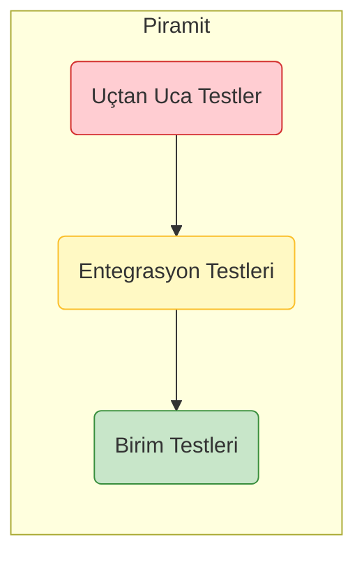

# 🧪 Sentiric: Test Stratejisi

Bu doküman, Sentiric platformunun kalitesini, güvenilirliğini ve kararlılığını sağlamak için uygulanan çok katmanlı test stratejisini tanımlar. Amacımız, hataları mümkün olan en erken aşamada yakalamak ve her sürümün güvenle yayınlanabilmesini sağlamaktır.

## 1. Test Piramidi

Stratejimiz, klasik test piramidi modeline dayanır:

*   **Birim Testleri (En Geniş Katman):** Her bir fonksiyonun veya sınıfın izole bir şekilde doğru çalıştığını doğrular. Hızlıdır ve CI/CD sürecinin temelini oluşturur.
*   **Entegrasyon Testleri (Orta Katman):** Farklı modüllerin veya servislerin (örn: `agent-worker`'ın `core-interfaces`'i doğru kullanması) birlikte uyum içinde çalıştığını test eder.
*   **Uçtan Uca Testler (En Dar Katman):** Gerçek bir kullanıcı senaryosunu baştan sona simüle eder (örn: bir telefon araması başlatıp rezervasyon işlemini tamamlama). Yavaştır ve genellikle sürüm öncesi son kontrol olarak çalıştırılır.

## 2. Test Türleri ve Sorumluluklar

| Test Türü | Sorumlu Repo(lar) | Araçlar | Ne Zaman Çalışır? | Amaç |
| :--- | :--- | :--- | :--- | :--- |
| **Birim Testleri** | Tümü (`core-interfaces`, `connectors`, `tasks` vb.) | `pytest` (Python), `Vitest`/`Jest` (React) | Her push ve PR'da (CI/CD) | Algoritmaların, adaptörlerin ve görevlerin iç mantığının doğruluğunu garanti etmek. |
| **Pratik Modül Testleri** | Tümü (Python Repoları) | `if __name__ == "__main__":` | Geliştirme sırasında manuel olarak | Geliştiriciye anında geri bildirim sağlamak, hızlı hata ayıklama. |
| **Entegrasyon Testleri** | `sentiric-agent-worker`, `sentiric-api-server` | `pytest`, `docker-compose` | Her PR'da, `develop` branch'ine birleştirmeden önce | Servislerin ve kütüphanelerin birbiriyle doğru kontratlar üzerinden konuştuğunu doğrulamak. |
| **Uçtan Uca Testler (E2E)**| `sentiric-governance` (test senaryoları burada yaşar) | `Twilio API` + Özel Test Betiği | Gecelik (Nightly Build) veya Sürüm Adayı (RC) oluşturulduğunda | Platformun gerçek dünya koşullarında bir kullanıcı senaryosunu hatasız tamamlayabildiğini kanıtlamak. |
| **Gecikme (Latency) Testleri**| `sentiric-agent-worker` | Özel metrikler | Her E2E testinde | Kullanıcı konuşması ile sistemin cevabı arasındaki sürenin belirlenen SLA (örn: <800ms) altında kaldığını garanti etmek. |

## 3. Temel Test Senaryoları

*   **Birim:** `RestaurantReservationTask`'ın, `{"date": "yarın", "people": 2}` bilgisini doğru ayrıştırabildiğini test etmek.
*   **Entegrasyon:** `agent-worker`'ın, `GoogleGeminiAdapter`'ı başarıyla yükleyip ondan bir cevap alabildiğini test etmek.
*   **Uçtan Uca:** Test betiğinin Twilio aracılığıyla bir arama başlatması, "yarın için rezervasyon" demesi, sistemin "saat kaçta?" diye sorması ve aramanın başarıyla sonlanmasını test etmek.

---
