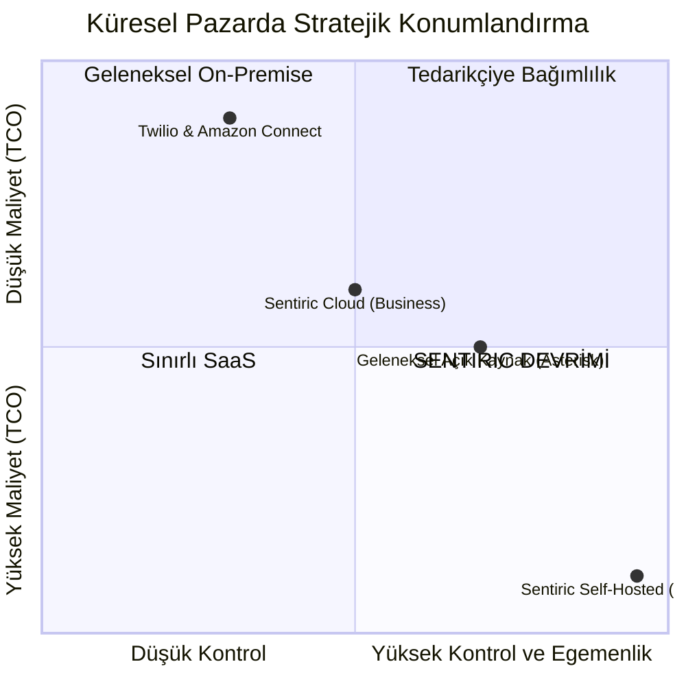

# ♟️ Sentiric: Stratejik İş Modeli ve İş Ortağı Oyun Planı (v5.2)

## BÖLÜM 1: MANİFESTOMUZ - NEDEN KAZANACAĞIZ?

**Felsefemiz:** "İletişim Altyapınızı Harcamadan Varlığa Dönüştürün. Küresel Kontrol, Yerel Güvenlik."

Sentiric, rakiplerinin aksine, müşteriyi kendine bağımlı kılan bir hizmet değil, müşteriye **dijital egemenlik** sağlayan bir teknoloji varlığı sunar. Pazardaki konumumuz, hem en yüksek kontrolü hem de en düşük uzun vadeli maliyeti (TCO) sunarak rakiplerimizin rekabet edemeyeceği bir "mavi okyanus" yaratır.

## BÖLÜM 2: HİBRİT BÜYÜME MOTORU - İKİ YOL, TEK HEDEF

Stratejimiz, pazarın farklı segmentlerini hedefleyen iki ana model üzerine kuruludur. Bu modeller, birbirini besleyen bir müşteri hunisi (funnel) oluşturur.

*   **Kolaylık Yolu (Sentiric Cloud):** Müşteriyi ekosistemimize çeken, ürünün değerini hızla kanıtlayan ve düzenli nakit akışı (MRR) sağlayan giriş kapımızdır.
*   **Egemenlik Yolu (Sentiric Self-Hosted):** Teknolojik üstünlüğümüzü, pazar farklılaşmamızı ve asıl kârlılıımızı sağlayan nihai hedefimizdir.

## BÖLÜM 3: FİYATLANDIRMA MİMARİSİ VE FİNANSAL ANALİZ

### 3.1. Sentiric Cloud Fiyatlandırması

| Paket | AYLIK (USD) | YILLIK (USD) | TEMEL LİMİTLER | STRATEJİK AMAÇ |
| :--- | :--- | :--- | :--- | :--- |
| **Professional** | $249 | $2,490 (%16 İndirim) | 25k Dakika, 15 Agent | Ciddi KOBİ'leri ve ajansları yakalamak. |
| **Business** | $899 | $8,990 (%16 İndirim) | 125k Dakika, 50 Agent | Kurumsal departmanlara hizmet vermek. |
| **First Class** | $2,999| $29,990 (%16 İndirim)| Sınırsız Büyüme Garantisi* | Yüksek hacimli operasyonları barındırmak. |

### 3.2. Sentiric Self-Hosted Fiyatlandırması

| Paket | FİYAT (EUR - Tek Seferlik) | YILLIK DESTEK (Ops.) | TEMEL LİMİTLER | STRATEJİK AMAÇ |
| :--- | :--- | :--- | :--- | :--- |
| **Business License** | €18,000 | €3,600 | 50 Eş Zamanlı Çağrı | Teknolojik firmalara ve entegratörlere satış. |
| **Enterprise Unlimited**| €90,000 | €18,000 | Sınırsız | Kurumsal devlere "karşı konulamaz teklif" sunmak. |
| **Sovereign Partner**| €300,000+ | Anlaşmaya Özel | Sınırsız + Kaynak Kod | Devlet ve Telekom ortaklıkları kurmak. |

### 3.3. Yatırımın Geri Dönüşü (ROI) - Karşı Konulamaz Teklifimiz

**Senaryo:** 50 operatörlü, Avrupa merkezli bir çağrı merkezi.
*   **Geleneksel Yıllık Maliyet (Personel + Altyapı):** ~€2,550,000
*   **Sentiric Enterprise ile İlk Yıl Toplam Maliyet:** €90,000 (Lisans) + €500,000 (10 Denetleyici) + €6,000 (Sunucu) = **€596,000**
*   **YILLIK NET TASARRUF:** **~€1,954,000**
*   **YATIRIMIN GERİ DÖNÜŞ SÜRESİ:** €90,000 / (€1.95M / 12) = **17 GÜNDEN AZ.**

Bu analiz, satış ekibimizin ve iş ortaklarımızın en güçlü argümanıdır.

## BÖLÜM 4: RİSK YÖNETİMİ VE SÜRDÜRÜLEBİLİRLİK

*   **Finansal Model:** Cloud'dan gelen MRR, şirketin operasyonel giderlerini karşılar. Self-Hosted satışları ise Ar-Ge, büyüme ve kâr marjını oluşturur. Bu yapı, başlangıç sermayesi olmadan dahi ilk Cloud müşterileriyle operasyonel olarak ayakta kalmamızı sağlar.
*   **Sınırsız Büyüme Garantisi Felsefesi:** Bu bir pazarlama hilesi değil, bir iş ortaklığı sözüdür. Amacımız, müşterinin organik büyümesini asla cezalandırmamaktır. Adil Kullanım Politikası, yalnızca sistemsel anomali ve kötüye kullanımı (DDoS, yasa dışı faaliyetler) engeller. Normal bir işletme bu sınıra asla takılmaz.
*   **"Win-Win-Win" Modeli:** Bu fiyatlandırma, müşteriye inanılmaz bir tasarruf, şirkete sağlıklı bir kâr ve çalışanlara başarıya endeksli prim potansiyeli sunar.

## BÖLÜM 5: PAZARA GİRİŞ (GO-TO-MARKET) OYUN PLANI

### Hedef 1: Cloud Modeliyle Pazarı Ele Geçirmek (Nakit Akışı ve Marka Bilinirliği)
*   **Kim?** Teknik detayla uğraşmak istemeyen KOBİ'ler, ajanslar, start-up'lar.
*   **Nasıl?**
    *   **Kanca:** $50'lık risksiz kullanım kredisi.
    *   **Pazarlama:** İçerik pazarlaması ("5 Adımda Çağrı Merkezinizi Otomatize Edin"), SEO, Google Ads.
    *   **Satış:** Tamamen self-servis online satış.

### Hedef 2: Self-Hosted Modeliyle Değer Yaratmak (Kârlılık ve Stratejik Ortaklıklar)
*   **Kim?** Veri egemenliği isteyen büyük kurumlar, regüle sektörler (finans, sağlık), sistem entegratörleri.
*   **Nasıl?**
    *   **Kanca:** Yukarıdaki ROI analizi ve "Verileriniz Sizin Kalsın" güvencesi.
    *   **Pazarlama:** Teknik makaleler (whitepaper), vaka çalışmaları (case study), konferans sunumları.
    *   **Satış:** Doğrudan satış ve **İş Ortaklığı Programı** (Satışların %20-30'u komisyon).
