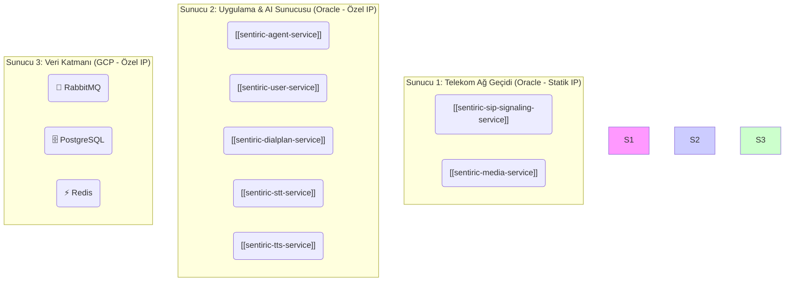

# 🚀 Sentiric: Dağıtım Modelleri ve Uygulama Senaryoları

Bu doküman, Sentiric platformunun evrensel mimarisinin (`Architecture-Overview.md`), farklı operasyonel ve ticari ihtiyaçlara göre nasıl hayata geçirilebileceğini gösteren somut dağıtım modellerini tanımlar.

---

## Model A: Minimalist Hibrit Başlangıç (Faz 1 Uygulaması)

Bu model, **sıfır maliyet** hedefine ulaşmak için mevcut veya düşük maliyetli kaynakları (örn: 2 Oracle + 1 GCP sunucusu) en verimli şekilde kullanır. Bu, anayasadaki mimarinin en temel ve kaynak-optimize edilmiş uygulamasıdır.

*   **Altyapı:** 2-3 adet düşük kaynaklı sanal makine (VM).
*   **Odak Noktası:** Maliyet minimizasyonu, temel fonksiyonellik, dayanıklılık.
*   **Kullanım Alanı:** Start-up'lar, geliştiriciler, KOBİ'ler için ilk kurulum, MVP (Minimum Değerli Ürün) aşaması.


*   **Limitleri:** `API Gateway`, `CDR Service` gibi bazı ileri düzey servisler bu minimalist modelde henüz aktif değildir.

---

## Model B: Tek Sağlayıcıda Kurumsal Dağıtım

Bu model, platformun tüm 26 reposunun hayata geçirildiği, daha fazla bütçeye sahip kurumsal bir müşterinin veya kendi SaaS hizmetimizin ideal dağıtım senaryosunu temsil eder.

*   **Altyapı:** Kubernetes (K8s) Cluster ve Yönetilen Veritabanı Servisleri.
*   **Odak Noktası:** Yüksek erişilebilirlik, otomatik ölçeklendirme, tam fonksiyonellik.
*   **Kullanım Alanı:** Sentiric'in SaaS hizmeti, yüksek çağrı hacmine sahip büyük kurumsal müşteriler.

```mermaid
graph TD
    subgraph "Bulut Sağlayıcı (örn: Oracle Cloud Kubernetes Engine - OKE)"
        
        subgraph "Ağ Katmanı"
            IngressController["🌐 Yük Dengeleyici"]
        end

        subgraph "Kubernetes Cluster"
            
            subgraph "Telekom Pod'ları"
                style Telekom fill:#f9f
                SIPSignaling("[[sentiric-sip-signaling-service]]")
                MediaService("[[sentiric-media-service]]")
            end

            subgraph "Uygulama & AI Pod'ları (Otomatik Ölçeklenir)"
                style AppAI fill:#ccf
                APIGateway("[[sentiric-api-gateway-service]]")
                AgentService("[[sentiric-agent-service]]")
                CDRService("[[sentiric-cdr-service]]")
                KnowledgeService("[[sentiric-knowledge-service]]")
                % Diğer tüm uygulama servisleri
            end
            
            subgraph "Yönetilen Altyapı Servisleri"
                 style Managed fill:#cfc
                 MQ("🐇 RabbitMQ Cluster")
                 DB("🗄️ Yönetilen PostgreSQL")
                 Cache("⚡ Yönetilen Redis")
            end
        end
    end
```

---

## Model C: %100 On-Premise Egemen Model

Bu model, bir bankanın, hastanenin veya devlet kurumunun Sentiric'i tamamen kendi veri merkezine kurduğu, internete minimum bağımlılığı olan senaryoyu temsil eder.

*   **Altyapı:** Müşterinin kendi donanımı (Bare-metal veya özel sanal sunucular).
*   **Odak Noktası:** Maksimum veri güvenliği, tam kontrol, veri egemenliği, regülasyonlara uyum.
*   **Kullanım Alanı:** Veri gizliliğinin kritik olduğu finans, sağlık ve kamu sektörleri.

Bu model, mimari olarak **Model B**'ye benzer, ancak tüm altyapı bileşenleri (`Kubernetes`, `PostgreSQL` vb.) müşterinin kendi donanımı üzerinde çalışır.
