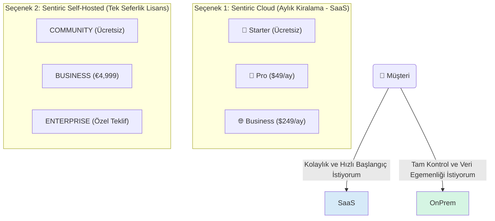

# 💼 Sentiric: Esnek İş Modeli ve Fiyatlandırma Stratejisi

**Ana Felsefe:** "İster Bulutta Kirala, İster Kendi Sunucuna Kur. Kontrol Sende."

Bu hibrit model, müşteriye iki temel seçenek sunarak pazarın tamamına hitap etmeyi hedefler. Her seçeneğin kendi içinde farklı ihtiyaçlara yönelik katmanları vardır.

---

### **Model 1: Sentiric Cloud (Aylık Kiralama - SaaS)**

Bu model, teknik altyapı yönetimiyle uğraşmak istemeyen, hızlı başlangıç yapmak ve kullandığı kadar ödemek isteyen müşteriler için idealdir. Altyapıyı Sentiric yönetir.

**Fiyatlandırma Tablosu (SaaS):**

| Paket | Aylık Fiyat | Ana Özellikler | Limitler | Hedef Kitle |
| :--- | :--- | :--- | :--- | :--- |
| **Starter** | **$0** | 1 AI Agent, Web Arayüzü, Temel Raporlama | 500 Dakika/Ay, 1 Telefon Hattı | Bireysel Geliştiriciler, Mikro İşletmeler |
| **Pro** | **$49** | 5 AI Agent, Gelişmiş Raporlama, CRM Entegrasyonu | 5,000 Dakika/Ay, 5 Telefon Hattı | KOBİ'ler, Dijital Ajanslar |
| **Business**| **$249** | Sınırsız Agent, API Erişimi, Öncelikli Destek | 30,000 Dakika/Ay, Sınırsız Hat | Büyüyen İşletmeler, Departmanlar |

*Not: Dakika aşımları `$0.01/dakika` gibi ek bir ücretle faturalandırılabilir.*

---

### **Model 2: Sentiric Self-Hosted (Kendi Sunucuna Kur)**

Bu model, veri gizliliğine ve egemenliğine önem veren, regülasyonlara tabi olan (bankalar, hastaneler) veya kendi altyapısını tam olarak kontrol etmek isteyen kurumsal müşteriler için tasarlanmıştır.

**Fiyatlandırma ve Lisanslama Tablosu (Self-Hosted):**

| Paket | Fiyat | Lisans & Destek | Limitler / Kapsam | Hedef Kitle |
| :--- | :--- | :--- | :--- | :--- |
| **Community**| **Ücretsiz** | AGPLv3 Lisansı, Topluluk Desteği | 2 Eş Zamanlı Çağrı | Açık Kaynak Topluluğu |
| **Business** | **€4,999** (Tek Seferlik) | Ticari Lisans, 1 Yıl Destek & Güncelleme | 10 Eş Zamanlı Çağrı | Orta Ölçekli İşletmeler, Sistem Entegratörleri |
| **Enterprise**| **Özel Teklif** | Kaynak Koda Erişim (Escrow), SLA Destek | Sınırsız | Kurumsal Firmalar, Devlet Kurumları |

*Not: Business ve Enterprise için yıllık %20'lik opsiyonel destek ve güncelleme paketi sunulur.*
