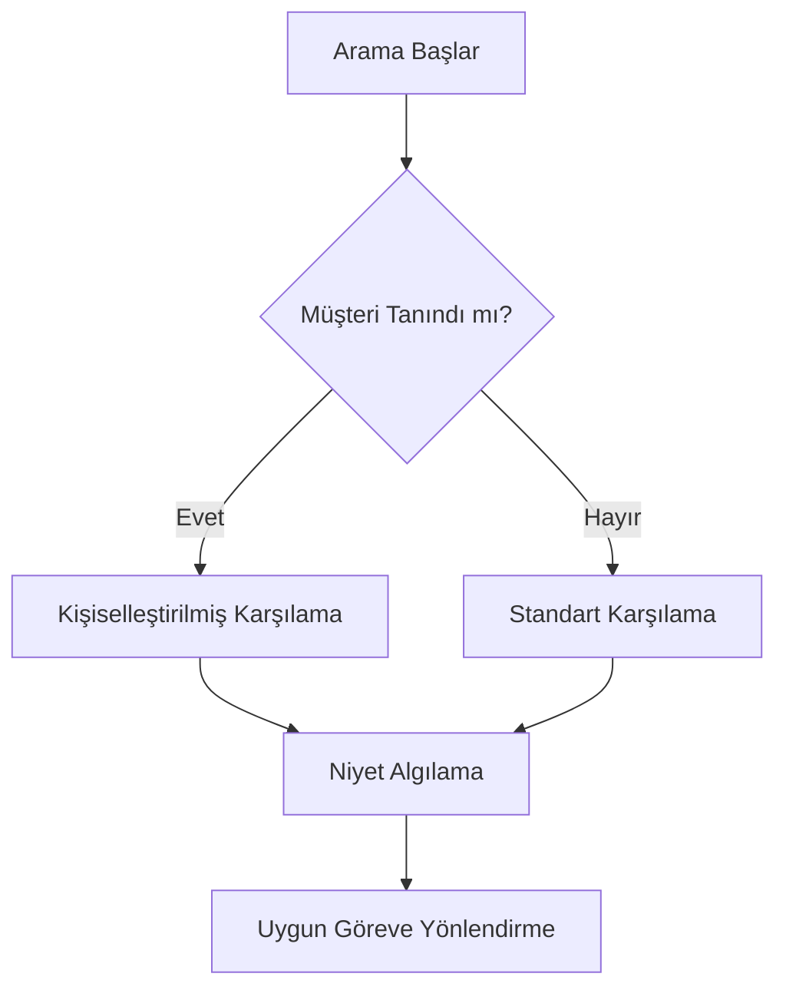
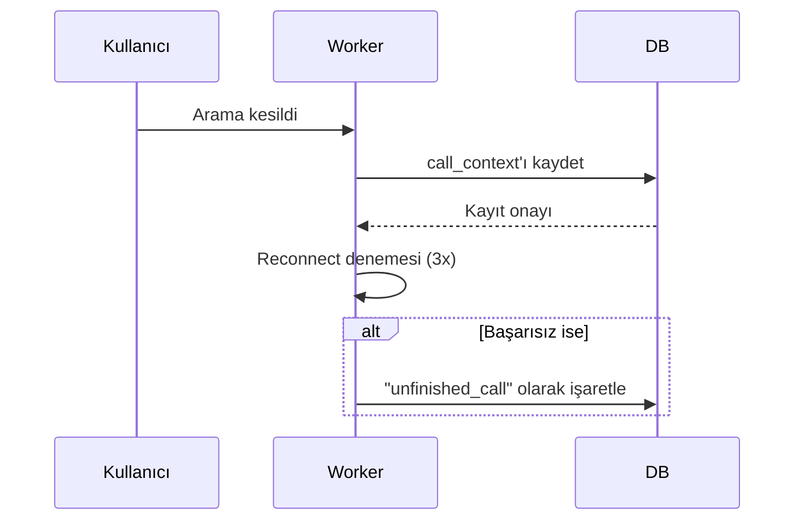
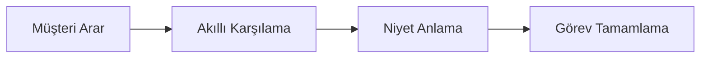
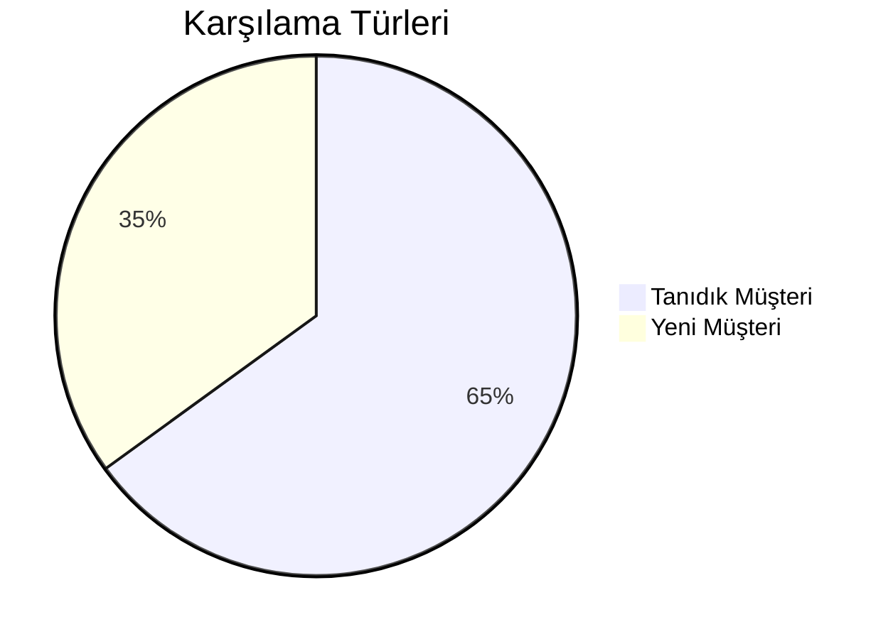

## 🌟 Genel Bakış: Herkes İçin Basit Anlatım

Sentiric, en basit haliyle, telefona cevap veren akıllı bir süper asistandır. Müşteri aradığında, sistem:
1.  **Karşılama yapar:** Arayanı tanırsa ismiyle, tanımıyorsa genel bir merhaba ile.
2.  **Niyetini anlar:** "Randevu almak istiyorum" gibi cümlelerden ne istendiğini anlar.
3.  **Görevi tamamlar:** Arka planda takvim, CRM gibi sistemlerle konuşarak randevuyu ayarlar, bilgiyi verir veya sorunu çözer.



---

# 📜 Sentiric: Tam Sistem Akış Dokümanı

## 1. Çağrı Başlatma Aşaması
**1.1 Kullanıcı Tarafı Tetikleme**
- Kullanıcı Sentiric'in hizmet numarasını (örn. 0850 XXX XX XX) arar
- Telefon operatörü aramayı Twilio/VoIP sağlayıcıya yönlendirir

**1.2 Telefoni Entegrasyonu**
- Telefoni sağlayıcısı:
  - Yeni çağrıyı algılar
  - Sentiric Gateway'e WebSocket bağlantısı açar
  - Arama meta verilerini (Caller ID, timestamp vb.) iletir

**1.3 Gateway İlk Yanıt**
- `sentiric-telephony-gateway`:
  - WebSocket bağlantısını doğrular
  - Yeni çağrı event'ını Worker servisine iletir
  - Ses kanalını açar (codec: OPUS/G.711)

---

## 2. Müşteri Tanımlama ve Bağlam Oluşturma
**2.1 Müşteri Profili Çekme**
- `sentiric-agent-worker`:
  - Arayan numarayı CRM sistemine sorgular
  - Eşleşme varsa müşteri geçmişini çeker:
    ```json
    {
      "customer_id": "12345",
      "name": "Ahmet Yılmaz",
      "last_interaction": "2023-11-20",
      "preferences": {"language": "tr", "service_type": "premium"}
    }
    ```

**2.2 Bağlam İlklendirme**
- Çağrı bağlamı (context) oluşturulur:
  ```python
  call_context = {
      "call_id": "a1b2c3d4",
      "customer": customer_data,
      "current_task": None,
      "collected_data": {},
      "timestamps": {"start": "2024-03-15T09:00:00Z"}
  }
  ```

---

## 3. Karşılama ve Niyet Algılama
**3.1 Akıllı Karşılama**
- Worker, LLM'ye bağlamı ileterek kişiselleştirilmiş mesaj oluşturur:
  ```python
  prompt = f"""
  Müşteri: {customer.name}
  Son Etkileşim: {customer.last_interaction}
  Sistem: Lütfen uygun karşılama mesajını oluştur"""
  ```
- AI'dan gelen yanıt (örn. "Merhaba Ahmet Bey, size nasıl yardımcı olabilirim?") TTS'e iletilir

**3.2 İlk Kullanıcı Yanıtı İşleme**
- Kullanıcı sesli yanıt verir (örn. "Randevu almak istiyorum")
- Ses verisi:
  1. Gateway'de ön işlemeden geçer (noise reduction)
  2. Worker'a iletilir
  3. STT (Speech-to-Text) servisine gönderilir
  4. Transkript edilmiş metin bağlama kaydedilir:
     ```json
     {
       "user_input": "Randevu almak istiyorum",
       "intent_confidence": 0.92,
       "detected_intent": "appointment_create"
     }
     ```

---

## 4. Görev Orkestrasyonu
**4.1 Görev Seçimi**
- Intent classifier, uygun görevi belirler:
  ```mermaid
  graph LR
    A["Randevu Al"] --> B[ReservationTask]
    A["Bilgi Sorgula"] --> C[InformationTask]
    A["Şikayet Bildir"] --> D[ComplaintTask]
  ```

**4.2 Görev Başlatma**
- `ReservationTask` örneği oluşturulur:
  ```python
  task = ReservationTask(
      llm_adapter=GeminiAdapter,
      calendar_adapter=GoogleCalendarAdapter,
      context=call_context
  )
  ```

**4.3 Çoklu Adımlı Etkileşim**
1. **Tarih Sorgulama**:
   - Worker: "Hangi tarih için randevu istersiniz?"
   - Kullanıcı: "Yarın öğleden sonra"
   
2. **Müsaitlik Kontrolü**:
   - CalendarAdapter 15:00-17:00 arası slotları kontrol eder
   - Uygun slotlar AI'ya iletilir: "Şu slotlar müsait: 15:30, 16:15"

3. **Onay ve Detaylar**:
   - AI: "16:15 uygun mu?"
   - Kullanıcı onay verirse CRM'e kaydedilir

---

## 5. Çağrı Sonlandırma
**5.1 Kapanış Protokolü**
1. Worker son bağlam durumunu kaydeder:
   ```json
   {
     "status": "completed",
     "result": {
       "appointment_id": "apt-67890",
       "date": "2024-03-16T16:15:00Z"
     }
   }
   ```

2. Kullanıcıya veda mesajı iletilir:
   ```text
   "Randevunuz 16 Mart 16:15 için ayarlandı. İyi günler dileriz."
   ```

**5.2 Post-Call İşlemler**
- Çağrı özeti CRM'e kaydedilir
- Analiz için veri işlenir (duygu analizi, süre vb.)
- Monitoring panosu güncellenir

---

## 6. Hata Senaryoları ve Kurtarma
**6.1 Beklenmeyen Kesinti**


**6.2 Adaptör Hatası**
1. Primary LLM timeout (5s)
2. Otomatik olarak fallback LLM'ye geçiş
3. Olay loglanır:
   ```log
   WARNING [LLM_SWITCH] Primary adapter timeout, 
   switched to fallback (OpenAI)
   ```

---

## 7. Sistem Sonrası İş Akışı
**7.1 Veri Ardışık İşleme**
```python
def post_call_processing(call_id):
    # 1. Ses kaydının transkripsiyonu
    transcript = transcribe_full_call(call_id)
    
    # 2. Duygu analizi
    sentiment = analyze_sentiment(transcript)
    
    # 3. Performans metrikleri
    metrics = calculate_metrics(call_duration, wait_times)
    
    # 4. Rapor oluşturma
    generate_report(call_id, transcript, sentiment, metrics)
```

**7.2 Geri Bildirim Döngüsü**
- Otomatik SMS ile müşteri memnuniyeti anketi
- AI tarafından çağrı kalitesi puanlaması
- Geliştirme için öneri üretme

---


# 🤖 Sentiric: Herkes İçin Basit Sistem Açıklaması

## 🌟 Genel Bakış
*"Telefona cevap veren süper asistan" gibi çalışan yapay zeka destekli çağrı merkezi çözümü*



## 📞 Temel Çalışma Akışı

### 1. Arama Başlangıcı
- Müşteri normal bir telefon numarasını arar
- Sistem aramayı algılar ve hazırlık yapar

### 2. Kişiselleştirilmiş Karşılama


### 3. Akıllı Yönlendirme
- Konuşmayı anında analiz eder
- Doğru departmana bağlar

## 💼 İş Avantajları
| Fayda                | Açıklama                          |
|----------------------|-----------------------------------|
| 7/24 Hizmet          | Gece yarısı bile aynı performans  |
| Tutarlı Deneyim      | Tüm müşterilere standart hizmet   |
| Anlık Raporlama      | Tüm konuşmalar analiz için hazır  |

## 🛠️ Kullanım Senaryoları
1. **Randevu Alma**  
   "Yarın 15:00'e randevu alabilir miyim?" → Sistem otomatik boş yerleri kontrol eder

2. **Bilgi Sorgulama**  
   "Çalışma saatleriniz nedir?" → Hazır bilgiyi sesli paylaşır

3. **Ödeme İşlemleri**  
   SMS ile güvenli ödeme linki gönderir

## 📌 Öne Çıkan Özellikler
- **Tanıdık Müşteri Algılama**: Daha önce arayanları ismiyle karşılar
- **Acil Durum Yönlendirme**: "Acil" dediğinizde doğru birime bağlar
- **Çoklu Dil Desteği**: İngilizce/Türkçe otomatik geçiş

> 💡 Sistem arka planda AI, büyük veri ve bulut teknolojilerini kullanır, ancak kullanıcılar için sadece "konuşan bir asistan" gibi çalışır.


---

# Sentiric Temel Akışlar

## 📌 Genel Çağrı Akışı


## 🔗 Senaryolara Hızlı Erişim
1. [Randevu Rezervasyonu](./04_SCENARIOS/01_APPOINTMENT_RESERVATION.md)
2. [Ön Rezervasyon](./04_SCENARIOS/02_PRE_RESERVATION.md)
3. [Ödemeli Rezervasyon](./04_SCENARIOS/03_PAID_RESERVATION.md)
```

---