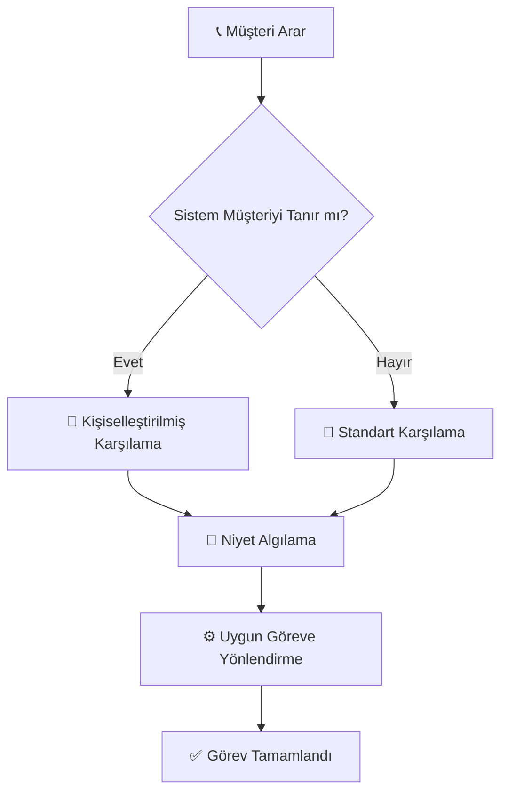
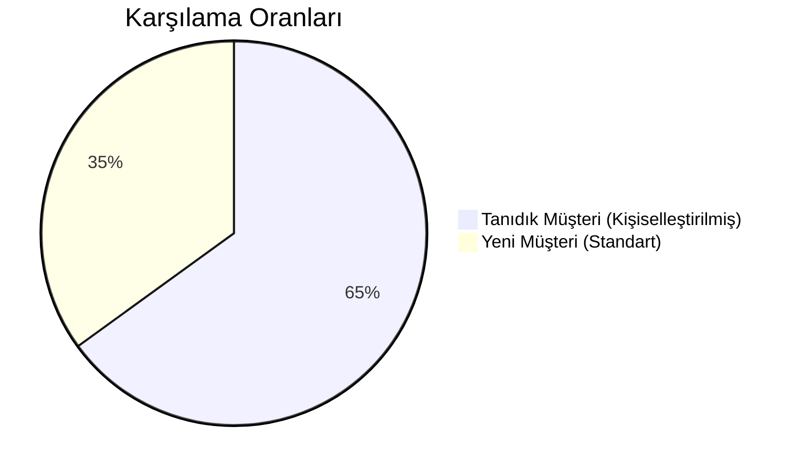

# 🌟 Sentiric: Yüksek Seviye Genel Bakış

Bu doküman, Sentiric platformunun ne olduğunu ve temel işleyişini teknik olmayan bir dille açıklar.

## Sentiric Nedir? Herkes İçin Basit Anlatım

Sentiric, en basit haliyle, telefona cevap veren akıllı bir süper asistandır. Bir müşteri şirketinizin numarasını aradığında, Sentiric devreye girer ve insan bir operatör gibi konuşarak aşağıdaki işlemleri yapar:

1.  **Karşılama:** Arayanı tanırsa ismiyle ("Merhaba Ahmet Bey!"), tanımıyorsa genel bir merhaba ile karşılar.
2.  **Anlama:** Müşterinin "Randevu almak istiyorum" veya "Siparişim nerede?" gibi taleplerini anında anlar.
3.  **Eyleme Geçme:** Arka planda şirketinizin sistemleriyle (takvim, sipariş veritabanı vb.) konuşarak randevuyu ayarlar, sipariş durumunu söyler veya sorunu çözer.

> **Özetle:** Sentiric, 7/24 çalışan, yorulmayan, her müşteriye aynı kalitede hizmet veren ve tüm konuşmaları raporlayan bir dijital ekip üyesidir.

## Temel Çalışma Akışı



## Karşılama Türleri



## İş Avantajları

| Fayda                | Açıklama                          |
|----------------------|-----------------------------------|
| 7/24 Hizmet          | Gece yarısı bile aynı performans. |
| Tutarlı Deneyim      | Tüm müşterilere standart hizmet.  |
| Anlık Raporlama      | Tüm konuşmalar analiz için hazır. |
```
