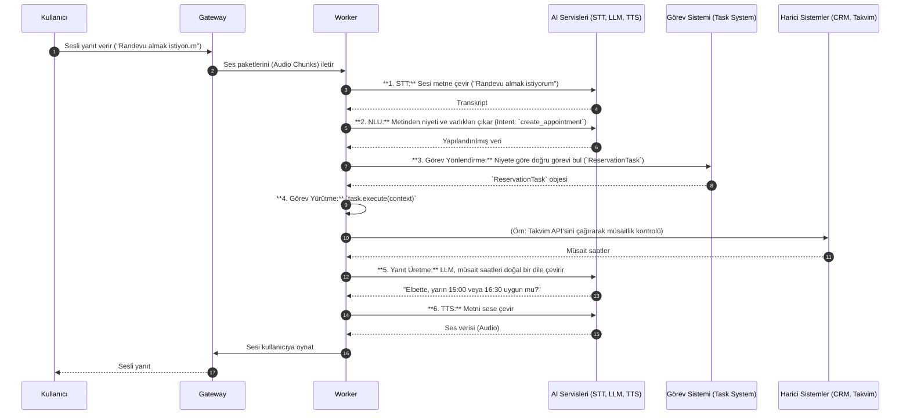

# 🛠️ Sentiric: Teknik Derinlemesine İnceleme

Bu doküman, bir telefon çağrısının Sentiric platformu içindeki yaşam döngüsünü teknik olarak adım adım açıklar.

## 1. Çağrı Başlatma Aşaması (Ingress)

**1.1. Kullanıcı Tarafı Tetikleme:** Kullanıcı, hizmet numarasını arar.
**1.2. Telefoni Entegrasyonu:** Twilio gibi bir sağlayıcı, gelen çağrıyı yakalar ve platformumuzun `sentiric-telephony-gateway` servisine bir WebSocket bağlantısı açar. Arama meta verileri (Caller ID, vs.) bu ilk bağlantıda iletilir.
**1.3. Gateway İlk Yanıt:** `gateway` servisi, bağlantıyı doğrular, yeni bir `call_id` oluşturur ve bu olayı `sentiric-agent-worker` servisine iletir. Ses kanalı (codec: OPUS/G.711) bu aşamada açılır.

---

## 2. Bağlam Oluşturma ve Karşılama

**2.1. Müşteri Profili Çekme:** `agent-worker`, arayan numarayı (Caller ID) kullanarak CRM adaptörü aracılığıyla müşteri bilgilerini sorgular.
```json
{
  "customer_id": "12345",
  "name": "Ahmet Yılmaz",
  "last_interaction": "2023-11-20"
}
```
**2.2. Çağrı Bağlamı (Context) İlklendirme:** Her çağrı için Redis'te tüm görüşme boyunca yaşayacak bir `call_context` objesi oluşturulur.
**2.3. Akıllı Karşılama:** `agent-worker`, müşteri verilerini kullanarak LLM'den kişiselleştirilmiş bir karşılama metni ("Merhaba Ahmet Bey, tekrar hoş geldiniz.") üretmesini ister ve bu metni TTS ile sese dönüştürüp kullanıcıya dinletir.

---

## 3. Etkileşim Döngüsü ve Görev Orkestrasyonu

Bu, çağrının ana döngüsüdür ve kullanıcı telefonu kapatana kadar devam eder.



---

## 4. Hata Senaryoları ve Kurtarma

**4.1. Beklenmeyen Kesinti:** Kullanıcı hattı düşerse, `call_context` veritabanına "unfinished_call" olarak kaydedilir.
**4.2. Adaptör Hatası:** Birincil LLM adaptörü 5 saniye içinde yanıt vermezse, sistem otomatik olarak `fallback` adaptöre geçer ve bir uyarı log'u oluşturur.

---

## 5. Sistem Sonrası İş Akışı (Post-Call)

Çağrı bittiğinde, `agent-worker` aşağıdaki işlemleri tetikler:
- Çağrı özetini ve sonuçlarını CRM'e kaydeder.
- Tüm çağrı kaydının ve transkriptinin uzun süreli depolama için arşivlenmesini sağlar.
- Analitikler için veri işleme ardışık düzenini (post-call processing pipeline) tetikler (duygu analizi, çağrı süresi metrikleri vb.).
```