# 👔 CEO Rehberi

## 📊 Temel Metrikler

```mermaid
pie
    title Maliyet Dağılımı
    "Geleneksel Sistem" : 75
    "Sentiric" : 25
```

## 📈 Kritik Göstergeler
- **Çağrı Çözüm Süresi**: 2.5 dk (ortalama)
- **Müşteri Memnuniyeti**: %96

---

# 📱 Müşteri Kılavuzu

## 🔧 Sık Kullanılan Komutlar
- "Randevu almak istiyorum"
- "Fatura sorgulama"
- "İptal etmek istiyorum"

## 🆘 Yardım Almak İçin
- *0 tuşuna basarak canlı temsilciye bağlanabilirsiniz

---

# 👨‍💼 Çalışan Rehberi

## 📞 Çağrı Yönetimi
| Tuş Kombinasyonu | İşlev                     |
|------------------|--------------------------|
| *1               | Acil çağrıya geçiş        |
| *2               | Süpervizör çağırma       |

## 🚨 Acil Durum Prosedürleri
- **Tıbbi Acil Durum**: "112'ye yönlendir" komutu ile
- **Teknik Arıza**: Otomatik log kaydı oluşturur

---