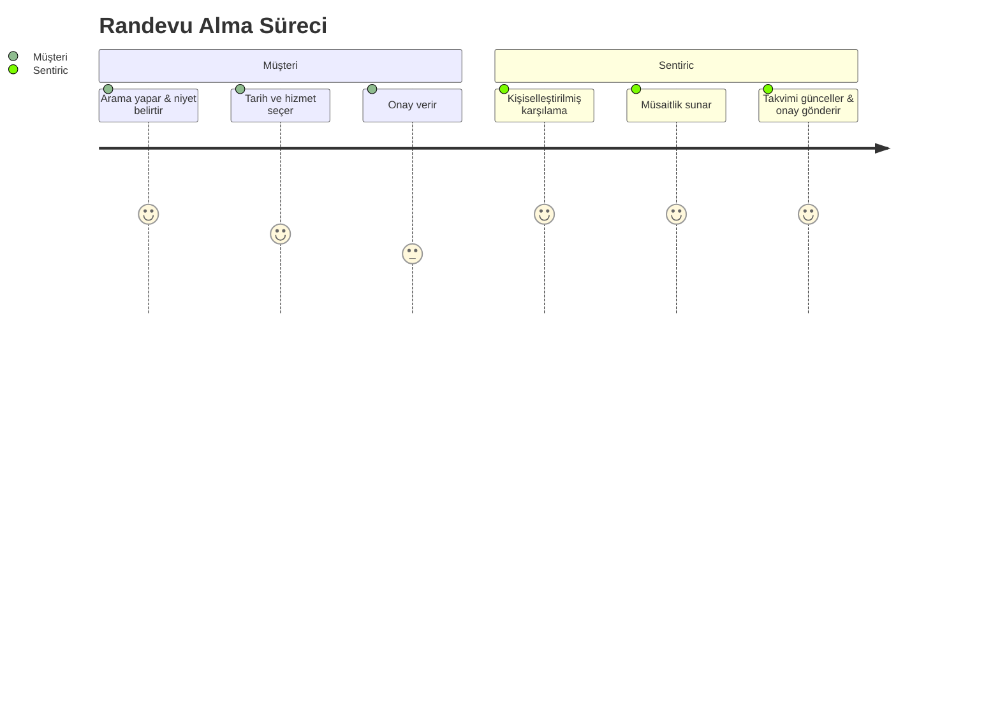

# 🎯 Kullanım Senaryosu: Randevu Yönetimi

Bu doküman, Sentiric platformunun standart, acil, ön ödemeli ve ön rezervasyon gibi farklı türdeki randevu taleplerini nasıl yönettiğini bütünsel olarak açıklar.

## 1. Genel Akış

Kullanıcı randevu almak istediğinde, sistem aşağıdaki temel adımları izler:



## 2. Senaryo Çeşitleri ve Diyaloglar

### 2.1. Standart Randevu
Bu en yaygın senaryodur.

> **Örnek Diyalog:**
> **Müşteri:** "Diş kontrolü için randevu almak istiyorum."
> **Sentiric:** "Elbette. Hangi gün ve saat sizin için uygun olur?"
> **Müşteri:** "Yarın öğleden sonra."
> **Sentiric:** "Yarın öğleden sonra için 14:30 ve 16:00 saatleri müsait. Hangisini tercih edersiniz?"
> **Müşteri:** "14:30 olsun."
> **Sentiric:** "Harika. Adınıza yarın 14:30 için diş kontrolü randevunuz oluşturulmuştur. Onay SMS'i telefonunuza gönderildi. ✔️"

### 2.2. Acil Randevu
Sistem "acil", "ağrım var", "çok kötü durumdayım" gibi anahtar kelimeleri algılayarak bu akışı tetikler.

> **Örnek Diyalog:**
> **Müşteri:** "*Acil* diş ağrım var, hemen gelmem lazım!"
> **Sentiric:** "Durumunuzun aciliyetini anlıyorum. Sizi hemen sıkıştırabilmek için takvimi kontrol ediyorum... Bugün için en yakın 17:15'te bir boşluk görünüyor. Sizin için uygun mu?"
> **Müşteri:** "Evet, lütfen!"
> **Sentiric:** "Acil randevunuz oluşturuldu. Doktor sizi bekliyor olacak. Geçmiş olsun. 🚨"

### 2.3. Ön Rezervasyon (Pre-Reservation)
Kullanıcı net bir tarih vermek istemediğinde veya esneklik aradığında kullanılır.

> **Örnek Diyalog:**
> **Müşteri:** "Gelecek hafta için bir ön rezervasyon yaptırmak istiyorum."
> **Sentiric:** "Tabii ki. Gelecek hafta için adınıza bir yer ayırıyoruz. Kesin tarih ve saati belirlemek için sizi 48 saat içinde aramamızı ister misiniz?"
> **Müşteri:** "Evet, harika olur."
> **Sentiric:** "Ön rezervasyonunuz alınmıştır. Ekibimiz sizi en kısa sürede arayacaktır."

### 2.4. Ödemeli Rezervasyon (Paid Reservation)
Belirli hizmetler için ön ödeme veya kapora alınması gerektiğinde bu akış devreye girer.

> **Örnek Diyalog:**
> **Müşteri:** "VIP cilt bakımı seansı almak istiyorum."
> **Sentiric:** "Memnuniyetle. VIP seanslarımız için 250₺'lik bir ön ödeme gerekmektedir. Devam etmek isterseniz, ödeme linkini SMS ile telefonunuza gönderebilirim."
> **Müşteri:** "Tamam, gönderin."
> **Sentiric:** "Güvenli ödeme linki telefonunuza gönderildi. Ödemeyi tamamladığınızda randevunuz otomatik olarak onaylanacaktır. 💳"

## 3. Özel Yetenekler
- **Doğal Dil Anlama:** "Yarın öğlen", "haftaya salı sabah" gibi ifadeleri anlar ve somut saat önerilerine dönüştürür.
- **Tek Tıkla İptal:** Onay SMS'i içinde yer alan link ile kullanıcılar randevularını kolayca iptal edebilir.


---

## 🔧 Gelişmiş Rezervasyon Senaryoları

### Ön Rezervasyon (Pre-Reservation)
Müşteri net bir tarih belirtmediğinde, sistem esnek bir ön rezervasyon oluşturabilir.

- **Akış:** Müşteri "ön rezervasyon" istediğinde, sistem bir yer ayırır ve kesinleştirme için daha sonra geri arama veya SMS gönderme seçeneği sunar.
- **Dikkat Edilecekler:** Bu tür rezervasyonların 48 saat içinde kesinleştirilmesi gerekir.

### Ödemeli Rezervasyon (Paid Reservation)
Kapora veya ön ödeme gerektiren hizmetler için bu akış kullanılır.

- **Akış:** Sistem, hizmetin ücretli olduğu bilgisini paylaşır ve "50₺ depozito alınacaktır" gibi bir bilgilendirme yapar. Müşteri onaylarsa, güvenli ödeme linki SMS ile gönderilir. Ödeme tamamlandığında randevu kesinleşir.
- **Teknik Akış:**
  ```mermaid
  sequenceDiagram
      participant Müşteri
      participant Sentiric
      participant Banka
      Müşteri->>Sentiric: "Ödeme yapmak istiyorum"
      Sentiric->>Banka: Ödeme linki oluştur
      Banka-->>Sentiric: Güvenli link
      Sentiric-->>Müşteri: SMS gönderir
      Müşteri->>Banka: Ödemeyi tamamlar
      Banka-->>Sentiric: Onay bilgisi
      Sentiric-->>Müşteri: "Ödemeniz alındı, randevunuz onaylandı!"
  ```

---