# 🏨 Otel Rezervasyonu: Herkes İçin Basit Anlatım

## 📞 1. Arama Başlıyor
- **Müşteri**: Telefonunu açar, Sentiric'in otel rezervasyon hattını arar  
*(Tıpkı normal bir oteli arar gibi)*
- **Sistem**: "Ah şu an biri otel rezervasyonu için arıyor!" diyerek hazırlık yapar  
*(Like a hotel receptionist picking up the phone)*

## 👋 2. Akıllı Karşılama
- **Sistem**: "Merhaba! Otel rezervasyonu için nasıl yardımcı olabilirim?" diye sorar  
*(Daha önce aradıysanız: "Hoş geldiniz Sayın [Soyadı]!")*
- **Müşteri**: "İstanbul'da bu haftasonu için oda arıyorum" der  
*(Just like talking to a human receptionist)*

## 🧠 3. Anlayıp Yönlendirme
- **Sistem**:  
  1. Konuşmayı anında analiz eder  
  2. "İstanbul", "haftasonu" ve "oda" kelimelerini yakalar  
  3. Rezervasyon sistemine bağlar  
*(Like a smart hotel concierge who knows all options)*

## 🛏️ 4. Rezervasyon Süreci
1. **Sistem**: "Kaç kişilik ve hangi tarihlerde?"  
   *(Görünmez bir şekilde otel veritabanını kontrol eder)*  
2. **Müşteri**: "2 yetişkin, 1 çocuk. Cuma-pazar"  
3. **Sistem**:  
   - Tüm otelleri tarar  
   - "Deniz manzaralı 4 yıldızlı X Otel'de aile odası 2.500₺/gece. Uygun mu?" diye sorar  
   *(Boş odaları ve fiyatları gerçek zamanlı bilir)*  
4. **Müşteri**: "Evet, kabul ediyorum"  
5. **Sistem**: "Rezervasyonunuz tamamlandı! Onay SMS'i gönderdim"  

## ✅ 5. İşlem Tamam
- **Sistem**:  
  - Rezervasyonu otel sistemine işler  
  - Müşteriye e-posta ve SMS ile onay gönderir  
  - "Girişte 'Sentiric ile rezerve ettim' demeniz yeterli. Başka yardımcı olabileceğim bir şey var mı?" diye sorar  
*(Like a perfect travel agent who handles everything)*

## 💡 Ekstra Özellikler
- **Önceki Tercihler**: Daha önce kaldığınız otel türünü hatırlar  
*("Geçen sefer beğendiğiniz butik otel tarzında önerilerim var")*
- **Son Dakika Fırsatları**: "Acil oda lazım" dediğinizde en iyi fırsatları sunar  
- **24/7 Destek**: Tatil gününde bile rezervasyon değişikliği yapabilirsiniz

---

### 🏨 Otel İşletmecileri İçin:
- **Doluluk Yönetimi**: Boş odaları anında doldurur  
- **Ücret Optimizasyonu**: Mevsime göre otomatik fiyat ayarlama  
- **Müşteri Profili**: Konuk tercihlerini öğrenip özelleştirilmiş hizmet sunma  

### 👨‍💼 Resepsiyon Personeli İçin:
- **Otomatik Check-in**: Konuk gelmeden ön hazırlık tamamlanır  
- **Özel Notlar**: "Yüksek kat istemişti" gibi bilgiler otomatik iletilir  
- **Dil Desteği**: Yabancı konuklara anadilinde hizmet  

### ✈️ Müşteriler İçin:
- **Karşılaştırmalı Seçenekler**: Aynı anda 50+ otel fiyatını kontrol eder  
- **Anlık Onay**: Telefon konuşması bitmeden rezervasyon garantisi  
- **Ekstra İndirimler**: "Daha uygun var mı?" diye sorunca alternatif sunar  

*(Sistem arka planda karmaşık otel yönetim yazılımları ve fiyat karşılaştırma motorlarıyla çalışır ama sizin için sadece "telefonla oda ayırtan süper asistan" gibi davranır!)*

---

**Örnek Diyalog:**  
> Müşteri: "Havuzlu ve spa'lı bir otel arıyorum"  
> Sentiric: "Sizin için 5 seçenek buldum: 1) Y Spa Hotel - jakuzili suit 3.200₺ 2) Aqua Resort - aile paketi 2.800₺..."  
> Müşteri: "2. seçenek iyi görünüyor"  
> Sentiric: "Rezervasyonunuz yapıldı! Not: Çocuk havuzu ve ücretsiz çocuk kulübü var 😊"  

**VIP Senaryo:**  
> Müşteri: "*VIP* müşteriyim, yükseltme mümkün mü?"  
> Sentiric: "Sayın [Ünvan], sizin için süit odaya ücretsiz yükselttim. Özel karşılama hazır!"  


# 🏨 Otel Rezervasyon Kılavuzu

## 🌟 Genel Akış

```mermaid
journey
    title Otel Rezervasyon Süreci
    section Müşteri
      Tarih belirler: 5: Müşteri
      Oda seçer: 4: Müşteri
      Ödeme yapar: 3: Müşteri
    section Sentiric
      Seçenek sunar: 5: Sentiric
      Onay alır: 4: Sentiric
      Rezervasyon yapar: 5: Sentiric
```


## 🔄 Adım Adım Tam Akış

### 1. Rezervasyon Başlatma

```mermaid
sequenceDiagram
    participant Müşteri
    participant Sentiric
    Müşteri->>Sentiric: "Otel rezervasyonu yapmak istiyorum"
    Sentiric->>Müşteri: "Hangi şehir ve tarihler için?"
```


### 2. Tarih ve Lokasyon Seçimi
> **Örnek Diyalog**:  
> Müşteri: "İstanbul için 15-20 Temmuz"  
> Sentiric: "15-20 Temmuz İstanbul için 42 otel bulundu. *Bütçeniz nedir?*"

### 3. Filtreleme ve Seçim

```mermaid
flowchart TD
    A[Filtreleme] --> B{Bütçe?}
    A --> C{Yıldız?}
    A --> D{Olanaklar?}
    B --> E[100-200₺]
    C --> F[4 yıldız+]
    D --> G[Yüzme havuzu]
```


### 4. Oda ve Konaklama Detayları
| Seçenek          | Açıklama                     |
|------------------|------------------------------|
| Standart Oda     | 2 yetişkin, kahvaltı dahil   |
| Aile Odası       | 2+2, deniz manzarası         |
| Süit Oda         | Jakuzi, özel check-in        |

> **Sistem Yanıtı**:  
> "4 yıldızlı X Otel'de aile odası: 2.500₺/gece. Uygun mu?"

### 5. Ödeme İşlemleri

```mermaid
sequenceDiagram
    Müşteri->>Sentiric: "Kredi kartıyla ödeyeceğim"
    Sentiric->>Ödeme Sistemi: Güvenli bağlantı kur
    Ödeme Sistemi-->>Sentiric: Onay kodu
    Sentiric-->>Müşteri: "Rezervasyon #TRX12345 onaylandı!"
```


### 6. Rezervasyon Sonrası
- **Anında**: E-posta/SMS onayı
- **24 Saat Önce**: Hatırlatma mesajı
- **Giriş Günü**: Check-in bilgileri

## 🔧 Özel Senaryolar

### ✏️ Rezervasyon Değişikliği
> Müşteri: "Rezervasyonumu 1 gün uzatmak istiyorum"  
> Sentiric: "18-21 Temmuz olarak güncellendi. Fark: 500₺. Onaylıyor musunuz?"

### ❌ Rezervasyon İptali

```mermaid
flowchart LR
    A[İptal Talebi] --> B{48 saat önce?}
    B -->|Evet| C[Tam iade]
    B -->|Hayır| D[%50 iade]
```


### 💰 Ödeme Sorunları
| Sorun               | Çözüm                     |
|---------------------|---------------------------|
| Kart reddedildi      | 3 deneme hakkı + alternatif ödeme |
| Eksik ödeme         | SMS ile tamamlama linki   |
| Çift ödeme          | Otomatik iade süreci      |

## 🌐 Entegrasyon Akışı
```mermaid
graph TD
    Sentiric -->|API| OtelSistemi
    Sentiric -->|XML| RezervasyonPlatformu
    Sentiric -->|SSL| ÖdemeAğGeçidi
    OtelSistemi -->|Müsaitlik| Sentiric
```

## 📞 Örnek Diyaloglar

### Standart Rezervasyon
> **Müşteri**: "Antalya'da 10-15 Ağustos deniz manzaralı otel arıyorum"  
> **Sentiric**: "Mavi Deniz Resort önerilir: 1.750₺/gece, havuz, spa. Detaylar SMS'te 📲"

### Grup Rezervasyonu
> **Müşteri**: "20 kişilik düğün grubu için"  
> **Sentiric**: "Özel fiyat teklifi hazır. Yetkili sizi 10 dk içinde arayacak 👰"

### Son Dakika Rezervasyon
> **Müşteri**: "*Acil* bu gece İstanbul'da oda lazım!"  
> **Sentiric**: "Şişli'de 4 yıldızlı otel: 1.200₺. Hemen rezerve edeyim mi? ⏱️"

## 📌 Önemli Notlar
1. **İptal Politikası**: 48 saat öncesine kadar ücretsiz
2. **Ödeme Seçenekleri**: Kredi kartı/Havale/Dijital cüzdan
3. **Müşteri Desteği**: *0 tuşuyla 7/24 ulaşım
4. **Vize Desteği**: Rezervasyon onayı vize başvurularında kullanılabilir

> 💡 Sistem otomatik olarak en iyi fiyat garantisi sunar. "Daha uygun var mı?" diye sorabilirsiniz!


## 🌟 Ek Özellikler

### 1. Sadakat Programı Entegrasyonu

```mermaid
pie
    title Sadakat Kullanımı
    "Puan Kullanımı" : 45
    "Hediye Gece" : 30
    "Ücretsiz Yükseltme" : 25
```


### 2. Oda Yükseltme Senaryosu
> **Müşteri**: "Daha lüks oda mümkün mü?"  
> **Sentiric**: "Süit odaya 500₺ ek ücretle geçiş yapabilirsiniz. İlginizi çeker mi?"

### 3. Grup İndirimi Hesaplama
| Kişi Sayısı | İndirim Oranı |
|-------------|---------------|
| 5-10        | %10           |
| 10-20       | %15           |
| 20+         | %20 + ücretsiz oda |

Bu kapsamlı rehber:
- Tüm rezervasyon türlerini kapsar
- Özel durumlar için çözüm önerileri sunar
- Gerçek diyalog örnekleri içerir
- Teknik ve teknik olmayan tüm kullanıcılar için uygundur
- Otel işletmecileri için entegrasyon detaylarını gösterir
