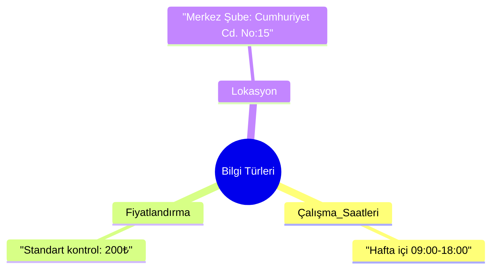
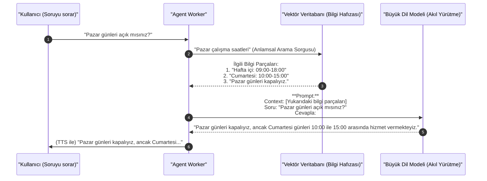

# 📚 Bilgi Alma Rehberi

## 🔍 Sık Sorulanlar

## 🎯 Örnek Akışlar
**Fiyat Sorgulama**  
> Müşteri: "Diş beyazlatma ücreti ne kadar?"  
> Sentiric: "Standart beyazlatma 1500₺, VIP paket 2500₺"  

**Çalışma Saatleri**  
> Müşteri: "Pazar açık mısınız?"  
> Sentiric: "Pazar kapalıyız, cumartesi 10:00-15:00 açığız"  

**Ulaşım Bilgisi**  
> Müşteri: "Adresinizi alabilir miyim?"  
> Sentiric: "Ana şubemiz: Levent Mah. Teknopark No:3. *SMS olarak gönderdim* 📍"

## 🧠 Bilgi Alma Mimarisi: RAG (Retrieval-Augmented Generation)

Sistem, "Çalışma saatleriniz nedir?" gibi soruları if-else bloklarıyla değil, modern bir AI mimarisiyle cevaplar. Bu, bilgi bankasının kolayca güncellenmesini ve sistemin sürekli öğrenmesini sağlar.

---