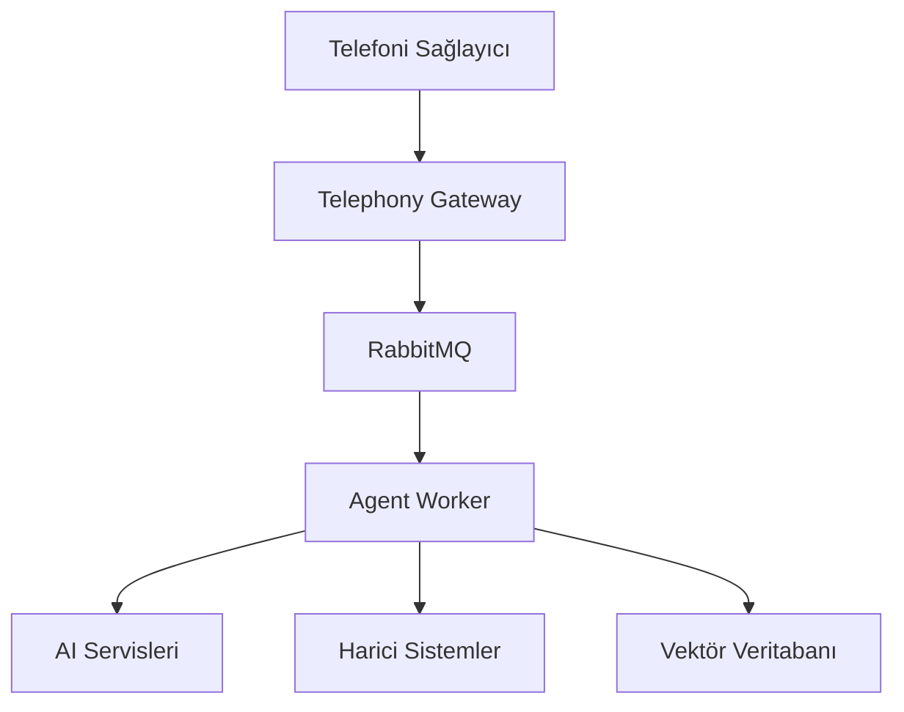
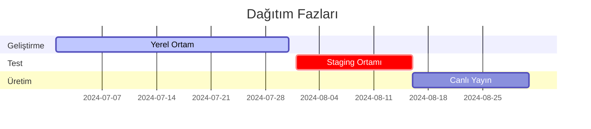
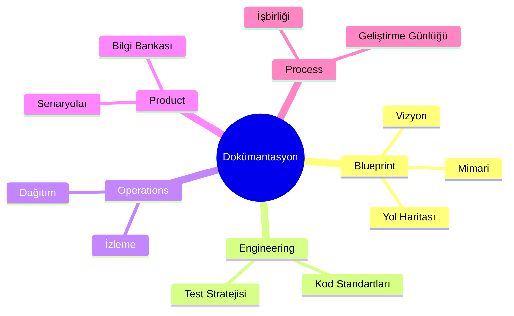

# 🧩 Sentiric Proje Analizi ve Özeti

## 1. Proje Genel Bakış
Sentiric, insan-makine sesli etkileşimini akışkan ve bağlam farkındalığına sahip bir platforma dönüştürmeyi hedefleyen bir **"Konuşan İşlem Platformu"** (Conversational Workflow Platform) projesidir. Temel amaç, geliştiricilerin herhangi bir iş sürecini gerçek zamanlı, akışkan ve insan benzeri sesli diyaloglarla otomatize edebilmesini sağlamaktır.

### Temel Özellikler:
- **Tak-Çıkar Lego Seti** mimarisi
- **Gerçek Zamanlı AI Diyaloğu**
- **Çoklu dil desteği** (Türkçe ve İngilizce)
- **Geliştirici dostu** adaptör sistemi
- **Kurumsal düzeyde güvenlik** ve uyumluluk

**Hedef Kitle:**
- Geliştiriciler ve startup'lar
- KOBİ'ler ve kurumsal departmanlar

## 2. Mimari Yapı ve Tasarım Desenleri
### Temel Mimarı Yaklaşım:

### Önemli Tasarım Desenleri:
1. **Soyutla ve Fethet (Abstract and Conquer):**
   - `BaseLLM`, `BaseTTS` gibi soyut arayüzler
   - Teknoloji bağımsızlığı

2. **Adaptör Tabanlı Mimari:**
   - Harici servisler için adaptörler (GoogleGeminiAdapter, TwilioAdapter)
   - Kolay teknoloji değişimi

3. **Görev Odaklı Orkestrasyon:**
   - `ReservationTask`, `InformationRequestTask` gibi görevler
   - Dinamik görev yönlendirme

## 3. Ana Bileşenler ve Sorumlulukları
| Bileşen | Sorumluluk | Teknoloji |
|---------|------------|-----------|
| **Telephony Gateway** | Ses akışını yönetme | Python, WebSockets |
| **Agent Worker** | Diyalog ve görev orkestrasyonu | Python, FastAPI |
| **Knowledge Indexer** | Bilgi bankasını indeksleme | Python, RAG |
| **API Server** | Dashboard için REST API | Python, FastAPI |
| **Dashboard** | Yönetim paneli | React, TypeScript |
| **Core Interfaces** | Adaptör arayüzleri | Python |

## 4. Teknoloji Yığını
### Çekirdek Teknolojiler:
- **Programlama Dilleri:** Python (Backend), TypeScript (Frontend)
- **Veritabanları:** PostgreSQL (SQLModel), Redis
- **Mesajlaşma:** RabbitMQ
- **AI Entegrasyonları:** Gemini, Whisper, ElevenLabs
- **Containerizasyon:** Docker, Docker Compose

### Destekleyici Araçlar:
- **Formatlama:** Black (Python), Prettier (TS/JS)
- **Linting:** Ruff (Python), ESLint (TS/JS)
- **Test:** Pytest, Vitest
- **CI/CD:** GitHub Actions

## 5. Geliştirme ve Dağıtım Stratejisi
### Geliştirme Yaklaşımı:
- **GitFlow** ilhamlı branch yönetimi
- **Conventional Commits** standardı
- **Modüler repo** yapısı (sentiric-* repoları)
- **Katmanlı test** stratejisi (Birim, Entegrasyon, E2E)

### Dağıtım Modeli:

## 6. Güvenlik ve Uyumluluk
### Temel Güvenlik Önlemleri:
- **Veri Maskeleme:** PII (Kişisel Tanımlayıcı Bilgiler) redaksiyonu
- **Şifreleme:** Veritabanı şifreleme (bekleme ve aktarım halinde)
- **Erişim Kontrolü:** JWT tabanlı kimlik doğrulama
- **Sır Yönetimi:** Ortam değişkenleri ve secret manager'lar

### Uyumluluk Standartları:
- **GDPR:** "Unutulma hakkı" desteği
- **PCI-DSS:** Ham kredi kartı bilgisi işlememe
- **Veri Saklama:** Sınırlı saklama politikaları

## 7. Yol Haritası ve Gelecek Planları
### Fazlar:
1. **Faz 1 (Çekirdek Platform):**
   - Temel iskelet oluşturma
   - GenericReservationTask ile kanıtlanmış çalışma

2. **Faz 2 (Platformlaşma):**
   - Geliştirici deneyimi iyileştirme
   - Self-servis konfigürasyon

3. **Faz 3 (Zeka ve Optimizasyon):**
   - In-house motor entegrasyonu
   - Model kademelendirme (Model Cascading)

### Stratejik Optimizasyonlar:
- **mTLS** ile dahili iletişim güvenliği
- **Protobuf** serileştirme ile performans artışı
- **WebAssembly** tabanlı adaptör çalıştırma
- **Dağıtık İzleme** ile gözlemlenebilirlik

## 8. Proje Yönetimi ve İşbirliği
### Çalışma Modeli:
- **AI İşbirliği Manifestosu** ile Proje Sahibi ve AI Mimar işbirliği
- **Stratejik Gözden Geçirme Döngüsü** (5 adımlı süreç)
- **Kanban** tabanlı görev yönetimi

### Dokümantasyon Yapısı:

## Sonuç ve Değerlendirme
Sentiric, geleneksel IVR sistemlerini aşan ve gerçek diyalog temelli bir sesli etkileşim platformu olma potansiyeline sahip. Projenin en güçlü yanları:

1. **Modüler ve Genişletilebilir** mimari
2. **Gerçek zamanlı diyalog** yönetimi
3. **Kurumsal düzeyde** güvenlik yaklaşımı
4. **Açık ve şeffaf** dokümantasyon kültürü

Önümüzdeki dönemde Faz 1'in tamamlanması ve çekirdek platformun işlevsel hale getirilmesi kritik öncelik olarak öne çıkmaktadır.