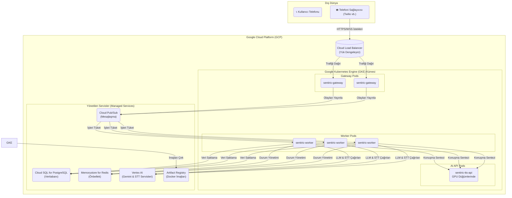
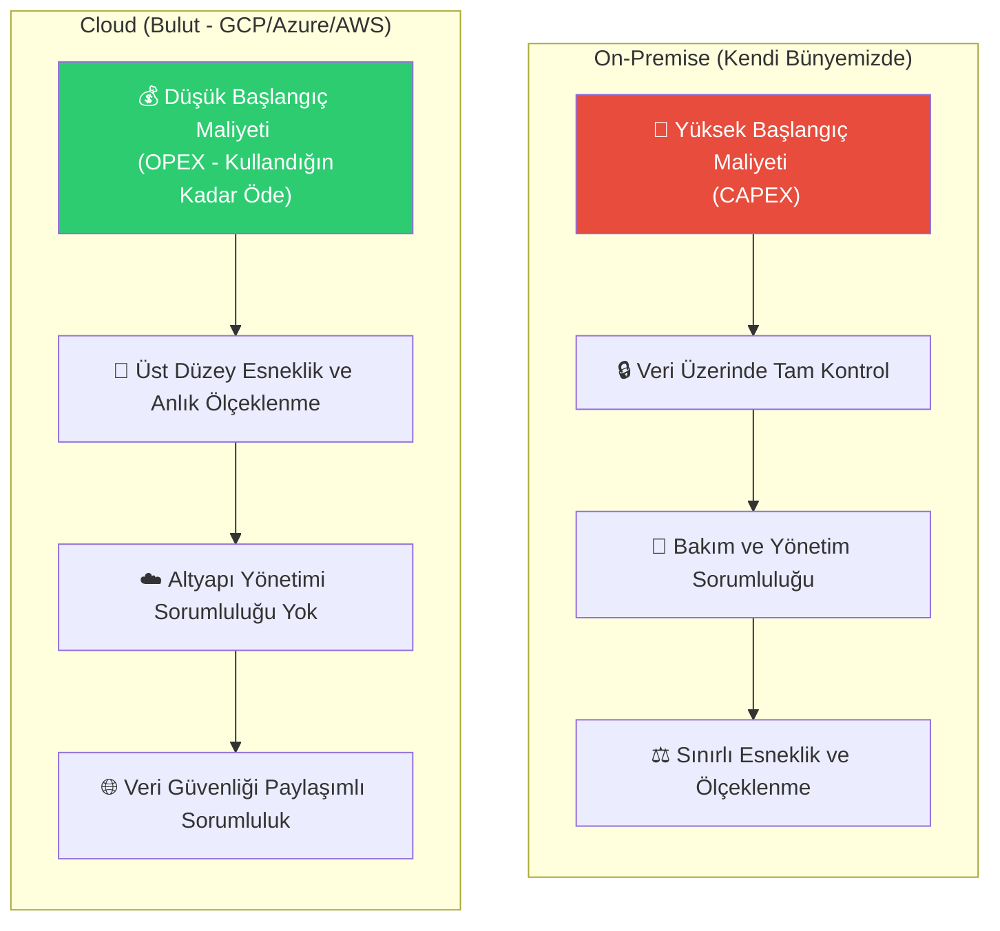
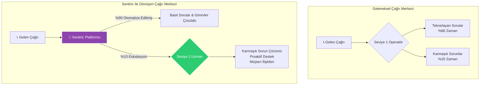
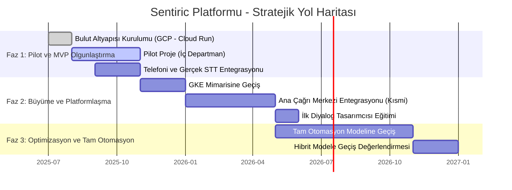

# 📈 Sentiric Platformu: Stratejik Değerlendirme ve İş Modeli Analizi (v1.0)

**Tarih:** 14.07.2025
**Belge Durumu:** Taslak
**Hazırlayan:** Proje Sahibi & AI Baş Mimar

## 1. Yönetici Özeti (Executive Summary)

Bu rapor, "Sentiric: Konuşan İşlem Platformu" projesinin mevcut teknik kapasitesini, gelecekteki ölçeklenme potansiyelini, pazar değerini ve operasyonel etkilerini bütünsel bir bakış açısıyla analiz etmektedir. Sentiric, standart bir "sesli asistandan" öte, insan benzeri diyaloglar kurarak karmaşık iş süreçlerini (rezervasyon, bilgi sorgulama, şikayet yönetimi) 7/24 otomatize edebilen, modüler ve yapay zeka tabanlı bir platformdur.

**Temel Değer Önerisi:** Müşteri etkileşim maliyetlerini radikal bir şekilde düşürürken, hizmet kalitesini ve müşteri memnuniyetini standartlaştırarak artırmak.

**Stratejik Sonuç:** Platform, hem kendi bünyemizde (on-premise) hem de bulut altyapısında çalışabilecek esnekliğe sahiptir. Başlangıç aşamasında, **hibrit bir bulut modeli** (AI modelleri için bulut servisleri, ana mantık için daha uygun maliyetli sunucular) en uygun maliyet/performans dengesini sunmaktadır. Platform, mevcut çağrı merkezi operasyonlarını dönüştürme, operasyonel verimliliği %70-80 oranında artırma ve insan kaynağını katma değeri düşük, tekrarlayan görevlerden, katma değeri yüksek, problem çözme odaklı rollere kaydırma potansiyeline sahiptir.

---

## 2. Mevcut Durum ve Teknik Kapasite (MVP v1.0)

Mevcut prototip (`sentiric-mvp`), platformun çekirdek yeteneklerini başarıyla kanıtlamıştır:
*   **Diyalog Yönetimi:** Kullanıcı niyetini anlama ve çok adımlı diyalogları (otel rezervasyonu) bağlamı koruyarak yönetebilme.
*   **Modüler Mimari:** LLM (Gemini/Ollama) ve TTS (Coqui-TTS) motorlarının "Tak-Çıkar" adaptörler aracılığıyla değiştirilebilirliği.
*   **Dayanıklılık:** Harici servis (LLM) hatalarını yönetebilme ve kullanıcıya anlamlı geri bildirim sunabilme.
*   **Performans:** Sık kullanılan TTS yanıtları için önbellekleme mekanizması.

**Mevcut Sınırlar:** Platform henüz gerçek telefon (telefoni) entegrasyonuna ve eş zamanlı çoklu arama yönetimine sahip değildir. STT (Ses-Metin Çevirme) işlemi tarayıcı tabanlıdır.

---

## 3. Altyapı ve Ölçeklenme Senaryoları

Platformun büyüme potansiyelini karşılamak için iki ana altyapı senaryosu değerlendirilmiştir: **Kendi Bünyemizde (On-Premise)** ve **Bulut (Cloud).**

### 3.1. Kendi Bünyemizde Barındırma (On-Premise)

Bu model, veri üzerinde tam kontrol ve uzun vadede potansiyel maliyet avantajı sunar.

| Müşteri/Arama Kapasitesi | Gerekli Altyapı | Tahmini Başlangıç Maliyeti (Donanım) | Operasyonel Zorluk |
| :--- | :--- | :--- | :--- |
| **Faz 1: 1-10 Eş Zamanlı Arama** (Küçük Ekip/Departman) | - 1x **Uygulama Sunucusu** (CPU-yoğun, 32GB+ RAM) - 1x **AI Sunucusu** (NVIDIA RTX 3060/4060, 12GB+ VRAM) - Docker Compose ile yönetim | €4,000 - €7,000 | Orta |
| **Faz 2: 10-50 Eş Zamanlı Arama** (Orta Ölçekli Çağrı Merkezi) | - 2+ **Uygulama Sunucusu** (Yük Dengeleyici arkasında) - 1-2x **AI Sunucusu** (NVIDIA RTX 4090, 24GB+ VRAM) - Ayrı Veritabanı/Redis/RabbitMQ Sunucusu - Kubernetes (K8s) ile orkestrasyon | €15,000 - €25,000 | Yüksek |
| **Faz 3: 50+ Eş Zamanlı Arama** (Büyük Kurumsal) | - Sunucu çiftlikleri (server farms) - Çoklu GPU kümelemesi - 10Gbps+ iç ağ, yedekli internet - Tam otomatize CI/CD ve izleme altyapısı | €50,000+ | Çok Yüksek |

### 3.2. Bulut Üzerinde Barındırma (Cloud - GCP Önerisi)

Bu model, hızlı başlangıç, esneklik ve kullandığın kadar öde avantajı sunar. Bakım ve altyapı yönetimi yükünü ortadan kaldırır.

| Müşteri/Arama Kapasitesi | Gerekli Mimarisi (GCP Servisleri) | Tahmini Aylık Maliyet (Kullanıma Bağlı) | Operasyonel Zorluk |
| :--- | :--- | :--- | :--- |
| **Faz 1: 1-10 Eş Zamanlı Arama** | - **Cloud Run:** Uygulama servisleri için (worker, gateway) - **Vertex AI:** STT ve LLM (Gemini) için - **Cloud SQL/Memorystore:** Veritabanı/Redis - **Cloud Pub/Sub:** Mesajlaşma | €50 - €300 / ay | Düşük |
| **Faz 2: 10-50 Eş Zamanlı Arama** | - **Google Kubernetes Engine (GKE):** Otomatik ölçeklenen pod'lar - **Cloud Load Balancer** - GKE üzerinde çalışan **sentiric-tts-api** (GPU düğümü ile) - Yönetilen veritabanı ve mesajlaşma servisleri | €400 - €2,000 / ay | Orta |
| **Faz 3: 50+ Eş Zamanlı Arama** | - Çok bölgeli (multi-region) GKE kümesi - Global Load Balancing - Optimize edilmiş AI servis kullanımı ve maliyet yönetimi - BigQuery ile derinlemesine analiz | €2,500+ / ay | Yüksek |

**Stratejik Öneri:** Projeye, **Faz 1 Bulut Mimarisi** ile başlamak en mantıklısıdır. Bu, düşük başlangıç maliyetiyle hızlıca pazara çıkmamızı ve ürünümüzü test etmemizi sağlar. Platform gelir üretmeye başladıkça ve iş yükü arttıkça, Faz 2 mimarisine geçiş planlanabilir.

---

---

## 4. Maliyet-Fayda ve Gelir-Gider Analizi

### 4.1. Gider Kalemleri

*   **Personel Giderleri:**
    *   **Başlangıç (MVP+):** 1x DevOps/Backend Mühendisi, 1x AI/ML Mühendisi (veya bu yetkinliklere sahip 1 tam zamanlı geliştirici).
    *   **Büyüme:** Müşteri desteği, proje yönetimi, ek geliştiriciler.
*   **Altyapı Giderleri:**
    *   **On-Premise:** Yüksek başlangıç donanım maliyeti + elektrik, soğutma, bakım.
    *   **Bulut:** Aylık, kullanıma dayalı abonelik ücretleri (tahminler yukarıdaki tabloda).
*   **API Lisans Giderleri:**
    *   **Telefoni:** Twilio gibi sağlayıcılara arama başına/dakika başına ücret.
    *   **Harici AI Servisleri:** (Eğer bulut modeli seçilirse) Google Vertex AI, OpenAI vb. servislere kullanım bazlı ödemeler.

### 4.2. Gelir Potansiyeli ve Faydalar (Getiriler)

Sentiric, geleneksel çağrı merkezi modeline kıyasla radikal bir verimlilik artışı sunar.

| Metrik | Geleneksel Çağrı Merkezi (Tahmini) | Sentiric Platformu (Hedef) | Sağlanan Fayda / ROI |
| :--- | :--- | :--- | :--- |
| **Arama Başına Maliyet** | €1.5 - €3.0 (operatör maaşı, altyapı vb. dahil) | €0.10 - €0.40 (altyapı + API maliyeti) | **%80-95 Maliyet Azaltımı** |
| **Hizmet Süresi (7/24)** | Vardiyalı, 8-16 saat/gün | **7 gün / 24 saat, kesintisiz** | **Maksimum Erişilebilirlik** |
| **Ort. Çözüm Süresi** | 3-5 dakika | 1-2 dakika (basit görevler için) | **%50+ Hız Artışı** |
| **Hizmet Kalitesi** | Operatörün moduna/tecrübesine bağlı, değişken. | Her zaman standart, sabırlı ve tutarlı. | **Standart ve Yüksek Kalite** |
| **Veri Analizi** | Manuel raporlama, sınırlı. | Her arama otomatik olarak metne dökülür, etiketlenir ve analiz edilebilir. | **Derinlemesine Müşteri İçgörüsü** |

---

## 5. İnsan Kaynakları ve Operasyonel Dönüşüm

Sentiric, çağrı merkezi operatörlerinin "işinden olacağı" bir platform değil, onların **rolünü dönüştüren** bir platformdur.

#### **Avantajlar ve Rol Değişimleri:**

*   **Tekrarlayan Görevlerin Eliminasyonu:** "Randevu saati nedir?", "Adresiniz nerede?" gibi Seviye 1 (Tier 1) soruları tamamen Sentiric tarafından karşılanır. Bu, operatörlerin zamanının **%70-80'ini serbest bırakır.**
*   **Operatörlerin Değerli Uzmanlara Dönüşmesi:**
    *   **Mevcut Rol:** Gelen çağrıya cevap veren, form dolduran.
    *   **Yeni Rol:** Sentiric'in çözemediği **karmaşık, istisnai ve duygusal zeka gerektiren** sorunları çözen bir "vaka yöneticisi" veya "uzman problem çözücü". Müşteriyi geri arayarak proaktif destek sunan bir "müşteri başarı temsilcisi".
*   **Yeni Roller ve Gereksinimler:**
    *   **Diyalog Tasarımcısı/AI Eğitmeni:** Çağrı metinlerini analiz ederek Sentiric'in diyalog akışlarını ve `knowledge_base`'i iyileştiren, teknik olmayan bir rol. Mevcut tecrübeli çağrı merkezi liderleri bu role mükemmel bir şekilde adapte olabilir.
    *   **Veri Analisti:** Toplanan arama verilerinden müşteri trendlerini, en sık sorulan soruları, hizmet darboğazlarını analiz ederek iş stratejisine yön veren kişi.

#### **Dezavantajlar ve Risk Yönetimi:**

*   **Değişime Direnç:** Mevcut personelin yeni rollere ve teknolojiye adaptasyonu zaman alabilir. Kapsamlı bir eğitim ve geçiş süreci planlanmalıdır.
*   **Teknoloji Bağımlılığı:** Sistemin çökmesi durumunda tüm çağrı akışı durabilir. Bu nedenle, bulut mimarisindeki yedeklilik (redundancy) ve yüksek erişilebilirlik (high availability) kritik öneme sahiptir. Acil durumlar için çağrıları doğrudan operatörlerin cep telefonlarına yönlendirecek bir "felaket kurtarma planı" oluşturulmalıdır.

---

## 6. Sonuç ve Stratejik Yol Haritası

Sentiric, doğru bir altyapı ve iş modeli ile uygulandığında, müşteri hizmetleri operasyonlarında bir devrim yaratma potansiyeline sahiptir.

**Önerilen Yol Haritası:**
1.  **Faz 1 (İlk 3-6 Ay):** Projeyi **GCP Faz 1 (Cloud Run)** mimarisiyle hayata geçirin. İlk olarak kendi içimizdeki bir departman için (örn: IT destek, İK soruları) pilot proje olarak kullanın. Bu süreçte teknolojiyi olgunlaştırın ve ilk yatırım maliyetini düşük tutun.
2.  **Faz 2 (6-12 Ay):** Pilot projenin başarısıyla birlikte, platformu ana çağrı merkezinin belirli görevlerini (örn: sadece randevu alma) otomatize etmek için kullanın. GKE mimarisine geçişi planlayın. İlk "Diyalog Tasarımcısı"nı eğitin.
3.  **Faz 3 (12+ Ay):** Platformun tüm Seviye 1 çağrıları karşıladığı, operatörlerin ise "uzman" rollerine geçtiği tam otomasyon modeline geçin. Bu aşamada, maliyetleri daha da düşürmek için kendi STT motorumuzu veya açık kaynak bir LLM'i kendi altyapımızda (on-premise AI sunucusu) çalıştırmayı değerlendirin (Hibrit Model).

Bu rapor, projenin sadece teknik bir çaba olmadığını, aynı zamanda şirketin operasyonel verimliliğini ve stratejik konumunu temelden değiştirecek bir yatırım olduğunu ortaya koymaktadır.