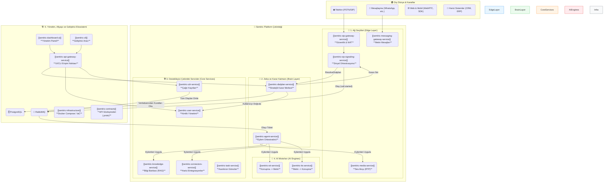

### **Sentiric Platformu: Bütünleşik Vizyon ve Teknik Anayasa Raporu (v9.0 "Genesis")**

**Belge Sürümü:** 3.0
**Tarih:** 28 Temmuz 2025
**Durum:** AKTİF VE BAĞLAYICI

#### **1. Yönetici Özeti: Biz Ne İnşa Ediyoruz?**

Sentiric, bir ürün değil, bir **ekosistemdir**. Geleneksel PBX sistemlerinin kararlılığını, modern VoIP'nin esnekliğini, yapay zekanın anlama ve konuşma yeteneğini ve iş akışı otomasyon platformlarının gücünü tek bir çatı altında birleştiren, **yeni nesil bir İletişim İşletim Sistemi (Communication OS)** inşa ediyoruz.

**Misyonumuz:** Her türlü insan-makine etkileşimini (ses, metin, video) akıllı, otomatize edilebilir ve geliştiriciler tarafından sonsuz şekilde genişletilebilir bir platforma dönüştürmek.

**Temel Değer Önerimiz:** Müşterilerimize "kiralık" bir çözüm sunmak yerine, onlara kendi iletişim geleceklerinin **tapusunu** veriyoruz. Platform, hem bulutta bir hizmet (SaaS) olarak hem de müşterinin kendi sunucularında (On-Premise) çalışarak mutlak veri egemenliği ve esneklik sağlar.

#### **2. "Genesis Bloğu" Mimarisi: Felsefemiz**

Platformumuzun kalbinde, tüm kararları koddan ayıran ve her şeyi dinamik, veritabanı tabanlı kurallarla yöneten bir felsefe yatar:

1.  **Sıfır Hard-Code:** Hiçbir telefon numarası, anons metni veya iş kuralı kodun içinde yer almaz. Her şey bir UI aracılığıyla yönetilebilir.
2.  **Tek Sorumluluk Prensibi:** Her mikroservis sadece tek bir işi mükemmel bir şekilde yapar. `sip-signaling` sadece sinyali taşır, `dialplan-service` sadece karar verir, `agent-service` sadece uygular.
3.  **Kendi Kendini Başlatma (Self-Bootstrapping):** Sistem, boş bir veritabanıyla bile, çalışması için gereken temel "sistem" ve "misafir" kurallarını otomatik olarak oluşturur. Tak ve çalıştır.
4.  **Genişletilebilirlik:** Yeni bir iletişim kanalı (WhatsApp) veya yeni bir iş akışı eklemek, kodun çekirdeğini değiştirmeyi değil, veritabanına yeni "eylem" (action) ve "yönlendirme" (route) kuralları eklemeyi gerektirir.

#### **3. Ekosistem Mimarisi ve Servislerin Nihai Rolleri (26 Repo)**

Bu şema, platformun bütünleşik yapısını ve servislerin birbiriyle olan etkileşimini gösterir.

#### **4. Tüm Repoların Rolleri ve Ekosistemdeki Yeri**

##### **Kategori A: Çekirdek İletişim ve AI Servisleri (Platformun Kalbi ve Beyni)**

| Repo Adı | **Nihai Teknoloji** | Temel Sorumluluk |
| :--- | :--- | :--- |
| `sentiric-sip-signaling-service` | **Rust** | Gelen SIP sinyallerini alır, `dialplan-service`'e ne yapacağını sorar ve sonucu `agent-service`'e iletir. |
| `sentiric-media-service` | **Rust** | Gerçek zamanlı ses (RTP) akışlarını yönetir, portları tahsis eder, ses dosyalarını çalar. |
| `sentiric-agent-service` | **Python** | **Eylem Orkestratörü.** `dialplan-service`'ten gelen komutları (`START_AI_CONVERSATION` vb.) uygular. AI motorlarını ve diğer servisleri yönetir. |
| `sentiric-tts-service` | **Python** | Metin girdilerini doğal insan sesine dönüştürür (Text-to-Speech). |
| `sentiric-stt-service` | **Python** | Ses girdilerini metne dönüştürür (Speech-to-Text). |
| `sentiric-knowledge-service` | **Python** | AI ajanları için RAG mimarisiyle yapılandırılmış, sorgulanabilir bir bilgi tabanı sunar. |

##### **Kategori B: Veri, Karar ve Destek Servisleri (gRPC Tabanlı Uzmanlar)**

| Repo Adı | **Nihai Teknoloji** | Temel Sorumluluk |
| :--- | :--- | :--- |
| `sentiric-dialplan-service` | **Go** | **Stratejik Karar Merkezi.** Bir çağrıya ne yapılacağına dair nihai kararı veritabanındaki kurallara göre verir. |
| `sentiric-user-service` | **Go** | Kullanıcı, agent ve yönetici kimliklerini ve varlıklarını yönetir (CRUD operasyonları). |
| `sentiric-cdr-service` | **Go/Python** | `RabbitMQ`'dan gelen tüm çağrı yaşam döngüsü olaylarını dinler ve veritabanına kalıcı olarak kaydeder. |
| `sentiric-connectors-service` | **Python** | Harici iş sistemleri (CRM, ERP, Takvim) ile entegrasyon için spesifik API adaptörlerini barındırır. |
| `sentiric-task-service` | **Python (Celery)** | Uzun süren, asenkron veya zamanlanmış görevleri (rapor oluşturma, data işleme) yönetir. |

##### **Kategori C: Ağ Geçitleri ve Dış Dünya Bağlantıları**

| Repo Adı | **Nihai Teknoloji** | Temel Sorumluluk |
| :--- | :--- | :--- |
| `sentiric-sip-gateway-service` | **Rust/Go** | Platformun zırhlı ön kapısı. Güvenlik, DDoS koruması ve NAT problemlerini çözen bir Session Border Controller (SBC) görevi görür. |
| `sentiric-messaging-gateway-service` | **Node.js** | WhatsApp, Telegram gibi harici metin tabanlı kanalları platforma bağlar. |
| `sentiric-api-gateway-service` | **Go/Node.js** | Tüm yönetim arayüzleri (`dashboard-ui`, `cli`) için tek ve güvenli bir API giriş noktası sağlar. |
| `sentiric-telephony-gateway-service` | **Go/C++** | Platformu geleneksel telefon şebekesi (PSTN, TDM) ile entegre eder. (İleri seviye) |

##### **Kategori D: Yönetim, Geliştirici ve Kullanıcı Arayüzleri**

| Repo Adı | **Nihai Teknoloji** | Temel Sorumluluk |
| :--- | :--- | :--- |
| `sentiric-dashboard-ui` | **React/TypeScript** | Yöneticiler için platformu izleme, yönetme (numara/dialplan atama) ve raporlama arayüzü. |
| `sentiric-web-agent-ui` | **React/TypeScript** | İnsan agent'ların çağrıları devraldığı, müşteri bilgilerini gördüğü tarayıcı tabanlı arayüz. |
| `sentiric-cli` | **Python/Go** | Geliştiriciler ve yöneticiler için platformu komut satırından yönetme ve otomatik testler yapma aracı. |

##### **Kategori E: Altyapı, Kütüphaneler ve Paylaşılan Kaynaklar**

| Repo Adı | **Tür** | Temel Sorumluluk |
| :--- | :--- | :--- |
| `sentiric-infrastructure` | **IaC (Kod Olarak Altyapı)**| `Docker Compose` ile tüm platformun yerel ve üretim ortamlarında ayağa kaldırılmasını sağlar. |
| `sentiric-contracts` | **Kütüphane** | **(Kritik)** Tüm mikroservisler arasında paylaşılan API sözleşmelerini (`.proto` dosyaları) barındırır. |
| `sentiric-db-models` | **Kütüphane** | (Gelecekte) Python servisleri tarafından paylaşılan veritabanı ORM modellerini barındırır. |
| `sentiric-assets` | **Veri Deposu** | Anons sesleri, UI ikonları gibi platform genelindeki statik dosyaları depolar. |
| `sentiric-governance` | **Yönetim** | Projenin anayasası; vizyon, mimari, standartlar ve bu raporun kendisi. |
| `sentiric-sip-client-sdk` | **SDK** | Web (WebRTC), mobil (iOS/Android) gibi istemcilerin platforma SIP üzerinden bağlanmasını sağlayan kütüphane. |
| `sentiric-embeddable-voice-widget-sdk` | **SDK** | Web sitelerine kolayca entegre edilebilen "bize sesle ulaşın" widget'ı. |
| `sentiric-marketplace-service` | **Servis (Gelecek Vizyonu)** | Üçüncü parti geliştiricilerin kendi görev ve adaptörlerini sunabileceği pazar yeri. |

---

#### **5. Uçtan Uca Senaryo: "Misafir Arayan" Yaşam Döngüsü**

Bu yeni mimarinin gücünü en iyi anlatan senaryo:

1.  **İlk Temas:** Sistemin hiç tanımadığı bir `0555...` numarası, `90212...`'yi arar.
2.  **Karar:** `sip-signaling`, bu bilgiyi `dialplan-service`'e sorar. `dialplan-service`, `inbound_routes`'da numarayı bulur ama `users` tablosunda `0555...`'i bulamaz. Bu yüzden **`DP_GUEST_ENTRY`** planını geri döner.
3.  **Olay:** `sip-signaling`, `call.started` olayını `dialplan` bilgisiyle birlikte RabbitMQ'ya atar.
4.  **Eylem:** `agent-service` olayı alır. `action`'ın `PROCESS_GUEST_CALL` olduğunu görür.
5.  **Orkestrasyon:**
    *   `agent-service`, `ANNOUNCE_GUEST_WELCOME` anonsunu `media-service`'e çaldırır.
    *   **Ardından, `user-service`'in `CreateUser` metodunu çağırarak `0555...` numarasını veritabanına yeni bir `caller` olarak kaydeder.**
    *   Son olarak, bu yeni kullanıcı için varsayılan `START_AI_CONVERSATION` akışını tetikler.
6.  **Sonuç:** Çağrı bittiğinde, bu "misafir" artık sistem için tanınan bir kullanıcıdır. Bir sonraki aramasında, `dialplan-service` onu tanıyacak ve doğrudan kiracıya özel karşılama planını uygulayacaktır. Sistem, **kendi kendine öğrenmiş ve büyümüştür.**

#### **6. Sonuç ve Gelecek Vizyonu**

Bu rapor, Sentiric platformunun sadece teknik olarak sağlam değil, aynı zamanda stratejik olarak da esnek ve geleceğe dönük bir vizyona sahip olduğunu ortaya koymaktadır. "Genesis Bloğu" mimarisi, başlangıç için gereken tüm varsayılan davranışları (misafir karşılama, hata yönetimi) sisteme "doğuştan" kazandırırken, gelecekteki karmaşık ihtiyaçları (çoklu kiracılık, omnichannel, mobil uygulamalar, bankacılık, sağlık...) destekleyecek modüler ve dinamik bir temel sunar.

Bu, paydaşlara sunulacak nihai plandır. Bu temel üzerinde anlaştığımız takdirde, ekosistemin her bir parçasını bu vizyon doğrultusunda güvenle inşa etmeye başlayabiliriz.